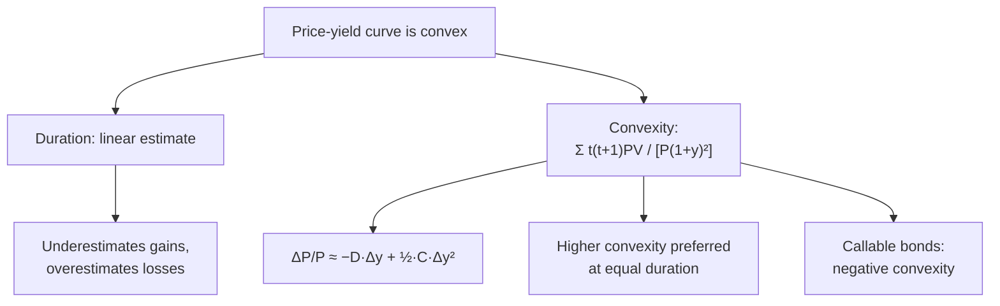

# BV-4: Convexity

Covers: why duration alone is not enough, the convexity formula computed step by step, the duration-plus-convexity price estimate compared with the actual price, why higher convexity is desirable, and what drives convexity. **(syllabus)**

## Where this fits in the ESE

Convexity follows duration in the same 10-mark sum ("compute duration and convexity and estimate the price change for a 3% move") and is the reason behind Malkiel's theorem 4. Unit 4's barbell and stress-testing results rest on it.

## Why convexity

Duration treats the price-yield relationship as a **straight line**. The real curve is **convex** (bowed towards the origin). So for large yield changes duration alone:
- **underestimates** the price **rise** when yields fall;
- **overestimates** the price **fall** when yields rise.
Convexity is the **correction for the curve**.

## Formula

**Convexity = Σ [t(t + 1) × PV(CFₜ)] ÷ [P × (1 + y)²]**

**ΔP/P ≈ −D_mod × Δy + ½ × Convexity × (Δy)²**

The convexity term is **always positive** (Δy² > 0), so it adds to the price whether yields rise or fall.

## Worked example, laid out as the exam answer

**Question (illustrative):** the 3-year 8% bond at 10% (price ₹950.26, D_mod 2.52 from BV-3). Compute convexity and estimate the price change for yield changes of +1% and +3% and −3%; compare with the actual prices.

| t | PV | t(t + 1) | t(t + 1) × PV |
|---|---|---|---|
| 1 | 72.73 | 2 | 145.45 |
| 2 | 66.12 | 6 | 396.69 |
| 3 | 811.42 | 12 | 9,737.04 |
| **Total** | **950.26** | | **10,279.18** |

**Convexity** = 10,279.18 ÷ (950.26 × 1.21) = 10,279.18 ÷ 1,149.81 = **8.94**.

| Δy | Duration term | Convexity term ½ × 8.94 × Δy² | Estimate | Actual price change |
|---|---|---|---|---|
| +1% | −2.52% | +0.04% | **−2.48%** | −2.48% |
| +3% | −7.57% | +0.40% | **−7.17%** | −7.19% |
| −3% | +7.57% | +0.40% | **+7.98%** | +8.00% |

**Interpretation:** for 1% the duration estimate alone (−2.52%) is already close; for 3% the convexity term (0.40%) matters, and duration + convexity lands within 0.02 points of the actual price. The −3% gain (+8.0%) exceeds the +3% loss (−7.2%): Malkiel's theorem 4.

## Why higher convexity is desirable

Between two bonds with the **same duration**, prefer the one with **higher convexity**: it gains more when yields fall and loses less when they rise. In practice the market prices this in (higher-convexity bonds often yield slightly less).

## What drives convexity

| Factor | Effect on convexity |
|---|---|
| Longer maturity / duration | Higher |
| Lower coupon | Higher |
| Lower yield | Higher |
| Cash flows spread out (barbell) vs concentrated (bullet) | Spread out → higher (Unit 4) |
| Callable bonds at low yields | Can turn **negative** (price capped near the call price) |

## What to remember

- Duration = straight line; convexity = curve correction.
- Convexity = Σ t(t + 1)·PV ÷ [P(1 + y)²]; ΔP/P ≈ −D_mod·Δy + ½·C·Δy².
- Example: convexity 8.94; +3% → −7.17% (actual −7.19%); −3% → +7.98% (actual +8.00%).
- Higher convexity is desirable at equal duration.
- Callable bonds can have negative convexity.

## Concept map

## Flashcards
Q: Why is duration alone inaccurate for large yield changes?
A: It treats the convex price-yield curve as a straight line, underestimating gains and overestimating losses.

Q: Write the price-change formula with convexity.
A: ΔP/P ≈ −D_mod × Δy + ½ × Convexity × (Δy)².

Q: Why is the convexity term always positive?
A: It multiplies (Δy)², which is positive whether yields rise or fall.

Q: D_mod 2.52, convexity 8.94, yields fall 3%. Estimated price change?
A: +7.57% + 0.40% = +7.98%.

Q: Two bonds have the same duration. Which do you prefer?
A: The one with higher convexity.

Q: Which bonds can have negative convexity?
A: Callable bonds when yields are low (price capped near the call price).

## Sources
- Split of [[Bond Market Unit 2 - How Bond Valuation Actually Works]] (section 3) and [[Bond Market Unit 2 - Cheat Sheet]] (convexity, traps 4–5)
- BBA303F-5 course plan, Unit 2 (convexity)
- Previous: [[Bond Market Unit 2 - BV-3 Duration and Modified Duration]] · Next: [[Bond Market Unit 2 - BV-5 Credit Interest Rate and Reinvestment Risk]]
- [[Bond Market Unit 2 - Bond Valuation MOC (Node Map)]]
