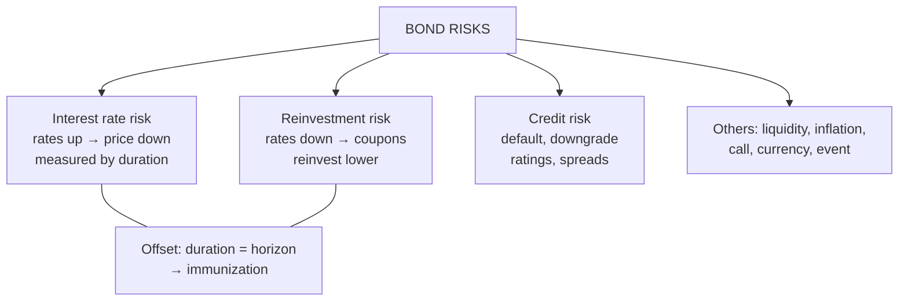

# BV-5: Bond Risk Analysis: Credit, Interest Rate and Reinvestment Risk

Covers: the three bond risks in the syllabus, how each is measured and managed, the offsetting relationship between interest rate and reinvestment risk, credit ratings and spreads, and other bond risks in brief. **(syllabus)**

## Where this fits in the ESE

"Explain the risks of investing in bonds" is a near-certain 5- or 10-marker; the trade-off between interest rate and reinvestment risk is the bridge to immunization (Unit 4).

## 1. Interest rate (price) risk

Bond prices **fall when market interest rates rise**. The longer the **duration**, the bigger the fall (BV-3).
- *Measure:* modified duration, DV01, convexity.
- *Example:* modified duration 6.8 and a 50-bp rise: ΔP/P ≈ −6.8 × 0.005 = **−3.4%**.
- *Higher for:* long maturity, low coupon, low yield.
- *Manage:* shorten duration, floating rate bonds, hedging with interest rate futures or swaps, hold to maturity (price changes don't matter if you never sell).

## 2. Reinvestment risk

YTM assumes every coupon is reinvested **at the YTM**. If rates **fall** after purchase, coupons are reinvested at lower rates and the **realised return falls below the YTM**.
- *Higher for:* high coupons, long holding periods, callable bonds (called when rates fall, forcing reinvestment of principal too).
- *Zero-coupon bonds have no reinvestment risk* (nothing to reinvest).
- *Manage:* zero-coupon bonds, matching cash-flow timing to needs, immunization.

## The offset (trap 6)

| When rates... | Interest rate risk | Reinvestment risk |
|---|---|---|
| Rise | Price falls (bad) | Coupons reinvest higher (good) |
| Fall | Price rises (good) | Coupons reinvest lower (bad) |

The two move in **opposite directions**, so they partly cancel. When duration equals the holding period, they offset almost exactly: this is **immunization** (Unit 4).

**Coupon trade-off (trap 7):** a low coupon means **more** interest rate risk but **less** reinvestment risk; a zero is the extreme (maximum rate risk, zero reinvestment risk).

## 3. Credit (default) risk

The issuer may **fail to pay coupons or principal on time**.
- G-secs: near-zero credit risk (the government can tax and RBI manages its debt). Corporate bonds: risk depends on the issuer's financial health.
- **Credit ratings** (CRISIL, ICRA, CARE, India Ratings): AAA (highest safety) → AA → A → BBB (lowest investment grade) → BB and below (speculative) → D (default).
- **Credit spread** = corporate yield − G-sec yield of the same maturity: the compensation for credit (and liquidity) risk. Lower ratings carry wider spreads.
- **Downgrade risk:** even without default, a rating cut widens the spread and lowers the price.
- *Example:* a 5-year AAA corporate bond yields 7.6% when the 5-year G-sec yields 6.9%: spread **70 bps**. If it is downgraded to AA and the spread widens to 120 bps, with modified duration 4.2, its price falls by about 4.2 × 0.005 = **2.1%**.
- *Manage:* credit analysis, diversification across issuers, covenants and security, staying with high ratings.
- *Indian lesson:* the IL&FS default (2018) showed AAA-rated paper can fail quickly and freeze a market.

## Other bond risks (one line each)

- **Liquidity risk:** can't sell quickly at a fair price (most corporate bonds rarely trade).
- **Inflation (purchasing power) risk:** fixed coupons lose real value.
- **Call risk:** the issuer redeems early when rates fall.
- **Currency risk:** for foreign-currency bonds.
- **Event risk:** mergers, regulation or disasters hit the issuer.

## What to remember

- Interest rate risk: price falls when rates rise; measured by duration (6.8 × 0.5% = 3.4%).
- Reinvestment risk: coupons reinvested below YTM when rates fall; zero for zero-coupon bonds.
- They offset; matching duration to horizon (immunization) neutralises them.
- Credit risk: ratings AAA → D; spread = corporate − G-sec yield; downgrades widen spreads (70 → 120 bps costs ~2.1% at duration 4.2).

## Concept map

## Flashcards
Q: What is interest rate risk in bonds?
A: The risk that bond prices fall when market interest rates rise; larger for higher-duration bonds.

Q: What is reinvestment risk?
A: The risk that coupons must be reinvested at lower rates than the YTM, so the realised return falls short.

Q: Which bond has no reinvestment risk?
A: A zero-coupon bond.

Q: How do interest rate risk and reinvestment risk relate?
A: They move in opposite directions and partly offset; they cancel when duration equals the holding period.

Q: What is a credit spread?
A: The yield difference between a corporate bond and a G-sec of the same maturity: compensation for credit and liquidity risk.

Q: Modified duration 4.2; spread widens by 50 bps. Price change?
A: About −2.1%.

Q: What is the lowest investment-grade rating?
A: BBB.

## Sources
- Split of [[Bond Market Unit 2 - How Bond Valuation Actually Works]] (section 4) and [[Bond Market Unit 2 - Cheat Sheet]] (three risks, traps 1, 6, 7)
- BBA303F-5 course plan, Unit 2 (bond risk analysis: credit, interest rate and reinvestment risk)
- Previous: [[Bond Market Unit 2 - BV-4 Convexity]] · Next: [[Bond Market Unit 2 - BV-6 Unit 2 Exam Answers]]
- [[Bond Market Unit 2 - Bond Valuation MOC (Node Map)]]
