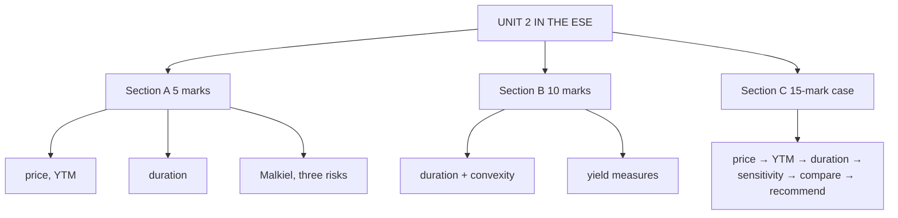

# BV-6: Unit 2 Exam Answers

Covers: what the ESE will ask from Unit 2, 5-mark and 10-mark skeletons, and the 15-mark bond analysis case layout with a model answer. Numbers come from BV-1 to BV-5.

## What the test will ask

ESE: Section A 3 × 5 (internal choice), Section B 2 × 10 (internal choice), Section C one compulsory 15-mark question; no phone calculators. Unit 2 is CO2 (bond valuation and risk assessment), which carried 25 marks in CIA2 and 5 in the ESE CO table, but its tools are needed for Units 3 and 4 too. Expect at least one sum (price, YTM, duration) and one theory answer (Malkiel or risks).

## Five-mark answer skeletons

**1. Bond price (BV-1).** Formula → table of cash flows and discount factors → price → premium/discount comment.

**2. YTM by interpolation (BV-2).** Bracket two rates → PV at each → interpolate → compare with CY → reinvestment assumption.

**3. Macaulay and modified duration (BV-3).** t × PV table → D → D_mod → price-change estimate.

**4. Malkiel's theorems (BV-3).** Five theorems, one line each, + duration theorem.

**5. Three bond risks (BV-5).** Interest rate, reinvestment, credit: definition, measure, management; the offset line.

## Ten-mark answer skeletons

**A. Duration and convexity (BV-3, BV-4).** Why duration → Macaulay table → modified → estimate → why convexity → convexity table → combined estimate vs actual → drivers → why higher convexity is preferred.

**B. Bond yields (BV-2).** CY, YTM (interpolation), YTC and yield to worst, with numbers → assumptions → price-yield relationship → pull to par table.

## Fifteen-mark case layout (from the cheat sheet checklist)

1. Identify what is asked: price, yield, duration, or risk.
2. **Price** the bond (state inputs; semi-annual adjustments).
3. **YTM** by interpolation if a price is given.
4. **Duration** (t × PV table), **modified duration**.
5. **Price sensitivity:** ΔP/P ≈ −D_mod·Δy (+ convexity for large moves).
6. **Compare bonds** using Malkiel.
7. **Conclude / recommend.**

### Model answer, laid out as the exam answer

**Data (illustrative):** an investor compares Bond X (8% annual, 3 years, ₹1,000) at a 10% yield with a 3-year zero-coupon bond at the same yield, expecting yields to rise by 3%.

1. **Price of X** = 72.73 + 66.12 + 811.42 = **₹950.26** (discount bond). Zero = 1,000 ÷ 1.331 = **₹751.31**.
2. **Duration:** X Macaulay **2.78**, modified **2.52**; zero Macaulay **3.00**, modified 3 ÷ 1.10 = **2.73**.
3. **Convexity:** X = **8.94**.
4. **Yields +3%:** X ≈ −2.52 × 0.03 + ½ × 8.94 × 0.0009 = −7.57% + 0.40% = **−7.17%** (≈ ₹882). The zero falls more (higher duration): ≈ −8.2% on duration alone.
5. **Malkiel:** the zero is more sensitive (theorem 5: lower coupon); the gain from an equal fall in yields would exceed the loss (theorem 4).
6. **Recommendation:** with yields expected to rise, prefer **Bond X** (lower duration) over the zero, or shorten maturity further; X's coupons also reinvest at the higher rates, softening the loss.

## Time rule

If short of time: price, Macaulay duration table, modified duration and the price-change estimate. These carry most marks.

## What to remember

- Model numbers: price ₹950.26; YTM 11.37% (10% coupon at ₹950); D 2.78, D_mod 2.52; convexity 8.94; +3% → −7.17%.
- Malkiel and the three risks are the theory staples.
- Show every step; no phone calculators.

## Concept map

## Flashcards
Q: Steps of the Unit 2 bond case?
A: Identify the question, price, YTM by interpolation, duration and modified duration, price sensitivity (with convexity), compare with Malkiel, recommend.

Q: Expecting yields to rise, should you prefer lower- or higher-duration bonds?
A: Lower duration: they lose less.

Q: Price and modified duration of a 3-year zero at 10%?
A: ₹751.31; modified duration 3 ÷ 1.10 = 2.73.

## Sources
- Split of [[Bond Market Unit 2 - Cheat Sheet]] (case checklist, traps) and [[Bond Market Unit 2 - How Bond Valuation Actually Works]]
- BBA303F-5 course plan, Unit 2 and ESE pattern
- [[Bond Market Unit 2 - Bond Valuation MOC (Node Map)]]
