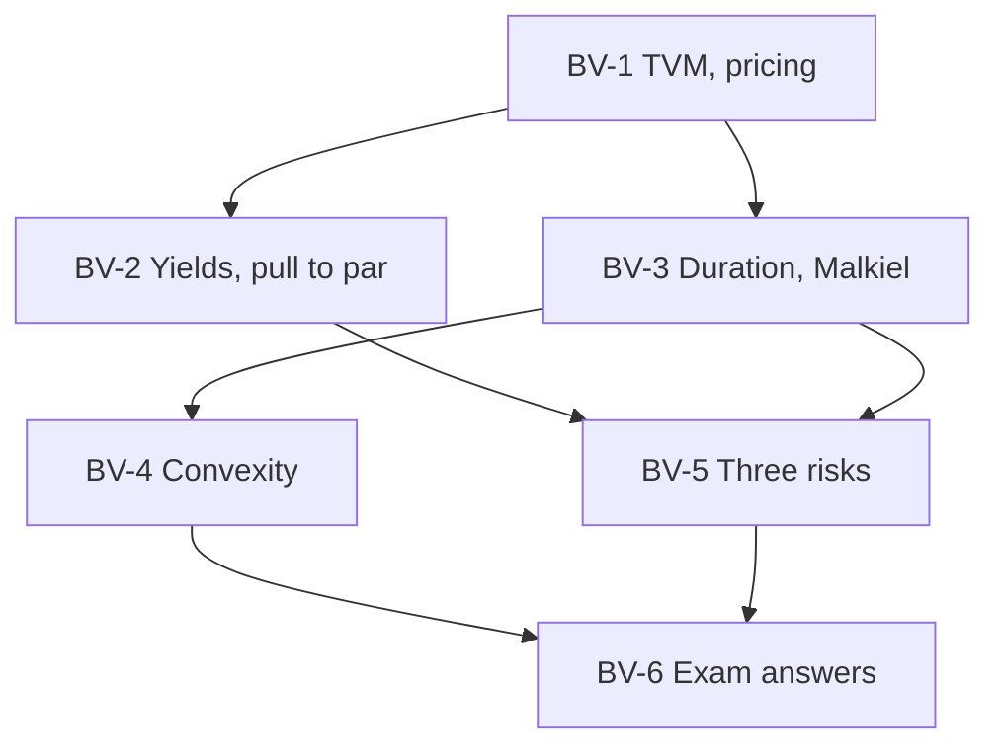

# Bond Market Unit 2: The Mathematics of Bond Valuation, node map

ESE: 50 marks, Section A 3 × 5, Section B 2 × 10, Section C one compulsory 15-mark question; no phone calculators. These nodes split [[Bond Market Unit 2 - How Bond Valuation Actually Works]] and [[Bond Market Unit 2 - Cheat Sheet]] into study-sized pieces and add worked numbers. Examples are **illustrative**.

## Nodes

| Node | Topic | Deps | Minutes | Exam focus |
|---|---|---|---|---|
| BV-1 | TVM and Bond Pricing | none | 35 | yes |
| BV-2 | Yield Measures and Price-Yield Relationship | BV-1 | 45 | yes |
| BV-3 | Duration and Modified Duration | BV-1 | 45 | yes |
| BV-4 | Convexity | BV-3 | 35 | yes |
| BV-5 | Credit, Interest Rate and Reinvestment Risk | BV-2, BV-3 | 30 | yes |
| BV-6 | Unit 2 Exam Answers | BV-1 to BV-5 | 30 | yes |

Total reading time: about 220 minutes.

## Dependency graph

## Headline numbers to know

- 8% annual, 3 years, at 10%: price ₹950.26; Macaulay 2.78; modified 2.52; convexity 8.94.
- Yield +1% → −2.48%; +3% → −7.17% (actual −7.19%); −3% → +7.98% (actual +8.00%).
- 9% semi-annual, 5 years, at 8%: ₹1,040.55. 5-year zero at 8%: ₹680.58.
- 10% coupon, 5 years, price ₹950: CY 10.53%; YTM 11.37% (PV 963.04 at 11%, 927.90 at 12%).
- Callable (10%, 5y, call in 2y at ₹1,050, price ₹1,080): YTM 8.00%, YTC 7.92% = yield to worst.
- Duration of 10-year bonds at 8%: 4% coupon 8.12 years, 10% coupon 6.97 years.

## Links
- [[Bond Market MOC]]
