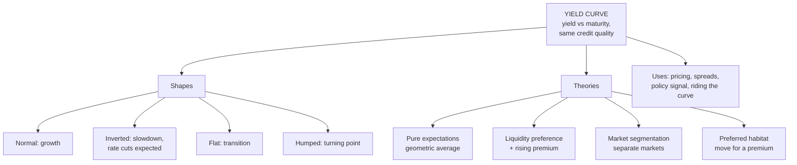

# YC-1: Yield Curve Shapes and Theories

Covers: what a yield curve is, the normal, inverted, flat and humped shapes, what each says about the economy and policy, the four term-structure theories (pure expectations, liquidity preference, market segmentation, preferred habitat), and how the Indian G-sec curve is read. **(syllabus)** shapes; theories are **(textbook)** background the unit's CO3 ("implications for market trends and policy decisions") needs.

## Where this fits in the ESE

The ESE is 50 marks: Section A three 5-mark questions (internal choice), Section B two 10-mark questions (internal choice), Section C one compulsory 15-mark case. Unit 3 is CO3, which carried 20 ESE marks in the plan's CO table. A "types of yield curves with diagrams" answer is a near-certain 5- or 10-marker; the theories make a natural 10-mark pair.

## What a yield curve is

A **yield curve** plots the yields of bonds of the **same credit quality** (usually government securities) against their **maturity**. Holding credit risk constant isolates the effect of time. In India the benchmark is the G-sec curve from 91-day T-bills to 40-year bonds; FBIL publishes the official zero-coupon curve.

- **Par yield curve**: yields on bonds priced at par.
- **Spot (zero) curve**: yields on zero-coupon bonds, one rate per maturity (YC-2 builds it).
- **Forward curve**: implied future one-period rates (YC-2).

## The shapes

| Shape | What it looks like | What it usually signals |
|---|---|---|
| **Normal (upward-sloping)** | Long yields above short yields | Healthy growth expected; investors want a premium for lending longer; inflation expected to stay or rise |
| **Inverted (downward-sloping)** | Short yields above long yields | Markets expect rates to fall: slowdown or recession ahead, or very tight current policy. The US curve inverted before most post-war recessions |
| **Flat** | Short and long yields about equal | Transition: the economy is between expansion and slowdown; policy outlook uncertain |
| **Humped (bell-shaped)** | Medium yields above both ends | Rates expected to rise in the near term, then fall; often a turning point |
| **Steep** | Long yields far above short | Early recovery: policy rates low now, growth and inflation expected to pick up |

**Draw each** with yield on the y-axis and maturity on the x-axis. Label two points (e.g. 1-year and 10-year) on each curve.

## Reading the curve: policy and markets

- **The short end follows the central bank.** RBI's repo rate anchors overnight and T-bill yields. A repo cut pulls the short end down and steepens the curve.
- **The long end follows growth and inflation expectations** plus the government's borrowing programme (a larger fiscal deficit means more G-sec supply and higher long yields).
- **Slope (term spread)** = 10-year yield − 2-year (or 91-day) yield. A positive, widening spread signals expansion; a shrinking or negative spread signals slowdown.
- **Uses:** pricing every bond (discount each cash flow at its own spot rate); a benchmark for corporate bonds (spread over the G-sec of the same maturity); signal for monetary policy and recession risk; deciding where on the curve to invest (riding the curve, BP-2).

**Riding the yield curve** (the unit's title): on an upward-sloping curve, buy a bond with a longer maturity than your holding period and sell it before maturity. As time passes, its remaining maturity shortens, it is valued at a lower yield, and its price rises, giving a return above the yield at purchase, **if the curve doesn't shift up**.

## The four theories of the term structure

### 1. Pure (unbiased) expectations theory
Long rates are the **geometric average of expected future short rates**. Investors are indifferent between a 2-year bond and two successive 1-year bonds.

(1 + ₀R₂)² = (1 + ₀R₁)(1 + E(₁r₁))

- Upward curve means short rates are expected to rise; inverted means they are expected to fall.
- **Example:** 1-year rate 6%, expected 1-year rate next year 8%. 2-year rate = √(1.06 × 1.08) − 1 = **6.995%**, about 7%.
- **Weakness:** can't explain why curves are upward-sloping most of the time (rates can't be expected to rise forever).

### 2. Liquidity preference (liquidity premium) theory — Hicks
Investors prefer short-term bonds (less price risk, more liquidity). To lend long they demand a **liquidity premium** that increases with maturity.

Long rate = average of expected short rates + liquidity premium.

- Explains why the normal curve is upward-sloping even when rates are expected to stay flat.
- An inverted curve then signals a **strong** expectation of falling rates (strong enough to beat the premium).

### 3. Market segmentation theory
The market is split into **separate segments by maturity**, each with its own investors who don't move between them: banks at the short end (asset-liability matching), insurers and pension funds at the long end. Each segment's yield is set by its own demand and supply.

- Explains kinks and humps in the curve.
- **Weakness:** ignores the arbitrage that links segments in practice.

### 4. Preferred habitat theory — Modigliani and Sutch
Investors have **preferred** maturity segments but **will move** to another if paid a big enough premium. A compromise between segmentation and expectations.

- Explains any shape: humps where a segment is short of supply, steepness where long-end investors demand a premium.

## Comparison table (the 10-mark answer)

| Theory | Long rate determined by | Explains normal curve? | Explains inverted curve? |
|---|---|---|---|
| Pure expectations | Expected future short rates | Only if rates expected to rise | Yes, rates expected to fall |
| Liquidity preference | Expectations + rising premium | Yes, even with flat expectations | Yes, if a fall is expected strongly |
| Market segmentation | Supply and demand in each segment | Yes, if long demand is weak | Yes, if short demand is weak |
| Preferred habitat | Expectations + premiums to leave a habitat | Yes | Yes |

## What to remember

- Yield curve = yield vs maturity for the same credit quality.
- Normal = growth; inverted = expected slowdown and rate cuts; flat = transition; humped = turning point.
- Short end tracks RBI's repo rate; long end tracks growth, inflation and government borrowing.
- Expectations: long rate = geometric average of expected short rates (6% and 8% give 6.995%).
- Liquidity preference adds a premium that rises with maturity, which explains why curves usually slope up.
- Segmentation: separate markets; preferred habitat: preferred markets that investors will leave for a premium.

## Concept map

## Flashcards
Q: What is a yield curve?
A: A plot of yields of bonds of the same credit quality against their maturity.

Q: What does an inverted yield curve usually signal?
A: Markets expect interest rates to fall, often because a slowdown or recession is expected.

Q: Which end of the Indian curve does RBI's repo rate anchor?
A: The short end (overnight rates and T-bills).

Q: State the pure expectations theory.
A: Long-term rates are the geometric average of current and expected future short-term rates.

Q: 1-year rate 6%, expected 1-year rate next year 8%. 2-year rate under pure expectations?
A: √(1.06 × 1.08) − 1 = 6.995%.

Q: Why does liquidity preference theory explain an upward-sloping curve?
A: Investors demand a premium for lending longer, and the premium rises with maturity.

Q: What is the difference between market segmentation and preferred habitat?
A: Under segmentation, investors never leave their maturity segment; under preferred habitat, they will if paid a large enough premium.

Q: What is riding the yield curve?
A: Buying a bond longer than the holding period on an upward curve and selling it early, gaining as its yield falls with shorter remaining maturity.

## Sources
- BBA303F-5 course plan, Unit 3 (types of yield curves: normal, inverted, flat)
- Fabozzi et al., *Bond Markets, Analysis and Strategies*; Reilly & Brown
- Next node: [[Bond Market Unit 3 - YC-2 Spot Forward Rates and Bootstrapping]]
- [[Bond Market Unit 3 - Yield Curve MOC (Node Map)]]
