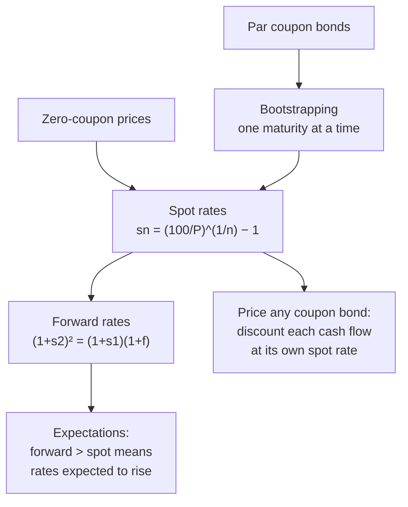

# YC-2: Spot Rates, Forward Rates and Bootstrapping

Covers: spot (zero-coupon) rates, why coupon bonds should be priced off spot rates, spot rates from zero-coupon prices, bootstrapping the spot curve from par yields, implied forward rates, and pricing a coupon bond with spot rates. **(syllabus)** "Construction of yield curves using bootstrapping techniques"; method **(textbook)**.

## Where this fits in the ESE

Bootstrapping is the numerical heart of Unit 3, and the most likely 10-mark sum or the core of the 15-mark case. The faculty bans phone calculators, so every step below is shown in a form a basic calculator can follow: one division, one root.

## Spot rates

The **spot rate** for maturity n (written ₀Rₙ or sₙ) is the yield on a **zero-coupon** bond maturing in n years: the rate for money lent today and repaid in one lump sum at n.

From a zero's price P for face value 100:
**sₙ = (100 ÷ P)^(1/n) − 1**

*Example:* 1-year zero at ₹94.34 gives s₁ = 100 ÷ 94.34 − 1 = **6.00%**; 2-year zero at ₹88.00 gives s₂ = √(100 ÷ 88) − 1 = **6.60%**; 3-year zero at ₹81.60 gives s₃ = (100 ÷ 81.6)^(1/3) − 1 = **7.01%**.

## Why spot rates, not one YTM

A 3-year coupon bond is really a bundle of three zero-coupon payments: coupon in year 1, coupon in year 2, coupon plus principal in year 3. Each should be discounted at **its own** spot rate. Using one YTM for all three assumes a flat curve. If two bonds of the same maturity have different coupons, a single YTM misprices one of them; spot-rate pricing removes the arbitrage.

## Bootstrapping

Real markets have few liquid zero-coupon bonds, but plenty of coupon bonds trading near par. **Bootstrapping** extracts spot rates one maturity at a time from coupon-bond prices: solve for the 1-year spot, use it to strip the first coupon from the 2-year bond, solve for the 2-year spot, and so on.

**Rule for an n-year par bond (price 100, annual coupon c):**
100 = c/(1+s₁) + c/(1+s₂)² + … + (100 + c)/(1+sₙ)ⁿ
so (1+sₙ)ⁿ = (100 + c) ÷ [100 − PV of earlier coupons at known spot rates].

## Worked example, laid out as the exam answer

**Question (illustrative):** par yields on annual-coupon G-secs are 1 year 6.0%, 2 years 6.5%, 3 years 7.0%. Bootstrap the spot rates, find the implied forward rates, and price a 3-year 8% bond.

**Step 1: 1-year spot.** The 1-year bond pays 106 in one year and costs 100.
s₁ = 106 ÷ 100 − 1 = **6.00%**.

**Step 2: 2-year spot.** The 2-year par bond pays 6.5, then 106.5.
- PV of year-1 coupon at s₁ = 6.5 ÷ 1.06 = 6.1321
- Remaining value = 100 − 6.1321 = 93.8679 = 106.5 ÷ (1+s₂)²
- (1+s₂)² = 106.5 ÷ 93.8679 = 1.134574
- s₂ = √1.134574 − 1 = **6.516%**

**Step 3: 3-year spot.** The 3-year par bond pays 7, 7, 107.
- PV of coupons = 7 ÷ 1.06 + 7 ÷ 1.134574 = 6.6038 + 6.1698 = 12.7735
- Remaining value = 100 − 12.7735 = 87.2265 = 107 ÷ (1+s₃)³
- (1+s₃)³ = 107 ÷ 87.2265 = 1.226689
- s₃ = 1.226689^(1/3) − 1 = **7.048%**

| Maturity | Par yield | Spot rate |
|---|---|---|
| 1 | 6.00% | 6.000% |
| 2 | 6.50% | 6.516% |
| 3 | 7.00% | 7.048% |

On an upward-sloping curve, **spot rates lie above par yields**, because the par yield is a blend of the lower early spot rates and the higher final one.

## Forward rates

A **forward rate** ₜfₙ is the rate, implied today, for lending from year t to year t + n. No-arbitrage: investing for two years at s₂ must equal investing for one year at s₁ and rolling over at the 1-year forward rate.

**(1 + s₂)² = (1 + s₁)(1 + ₁f₁)** → ₁f₁ = (1+s₂)² ÷ (1+s₁) − 1
**General:** ₜf₁ = (1+sₜ₊₁)^(t+1) ÷ (1+sₜ)ᵗ − 1

**Continuing the example:**
- ₁f₁ (year 1 to 2) = 1.134574 ÷ 1.06 − 1 = **7.035%**
- ₂f₁ (year 2 to 3) = 1.226689 ÷ 1.134574 − 1 = **8.119%**

Forward rates above spot rates mean the market (under pure expectations) expects short rates to rise: consistent with the normal curve.

## Pricing a coupon bond off the spot curve

**3-year 8% annual coupon, face 100:**
- Year 1: 8 ÷ 1.06 = 7.5472
- Year 2: 8 ÷ 1.134574 = 7.0511
- Year 3: 108 ÷ 1.226689 = 88.0417
- **Price = ₹102.64**

Its YTM (the single rate that gives 102.64) is about **6.99%**, slightly below the 3-year spot of 7.048% because the early coupons are discounted at lower spot rates. If the market price were above ₹102.64, the bond would be expensive relative to the curve: sell it and buy the replicating zeros.

## Traps

- **Using the par yield as the spot rate** beyond year 1. Only s₁ equals the 1-year par yield.
- **Discounting all coupons at the new spot rate.** Earlier coupons use the earlier spot rates already found.
- **Forgetting the root.** (1+s₂)² gives s₂ only after the square root.
- **Mixing up forward and spot.** The spot is from today; the forward starts in the future.

## What to remember

- Spot sₙ = (100/P)^(1/n) − 1 for a zero.
- Bootstrap: strip earlier coupons at known spots, solve (1+sₙ)ⁿ = (100 + c) ÷ remaining value.
- Example: par 6 / 6.5 / 7% give spots 6.000 / 6.516 / 7.048%.
- Forward ₜf₁ = (1+sₜ₊₁)^(t+1) ÷ (1+sₜ)ᵗ − 1: 7.035% and 8.119%.
- 3-year 8% bond priced off spots = ₹102.64; YTM ≈ 6.99%.

## Concept map

## Flashcards
Q: What is a spot rate?
A: The yield on a zero-coupon bond for a given maturity: the rate for money lent today and repaid in one lump sum.

Q: Why price coupon bonds off spot rates instead of one YTM?
A: Each cash flow is a separate zero-coupon payment and should be discounted at its own maturity's rate; one YTM assumes a flat curve.

Q: What is bootstrapping?
A: Extracting spot rates one maturity at a time from coupon-bond prices, stripping earlier coupons at the spot rates already found.

Q: Par yields 6%, 6.5%. What is the 2-year spot rate?
A: (1+s₂)² = 106.5 ÷ (100 − 6.5/1.06) = 106.5 ÷ 93.8679 = 1.134574, so s₂ = 6.516%.

Q: Formula for the one-year forward rate starting in one year?
A: ₁f₁ = (1+s₂)² ÷ (1+s₁) − 1.

Q: On an upward-sloping curve, are spot rates above or below par yields?
A: Above.

Q: Spots 6%, 6.516%, 7.048%. Price of a 3-year 8% bond?
A: 8/1.06 + 8/1.134574 + 108/1.226689 = ₹102.64.

## Sources
- BBA303F-5 course plan, Unit 3 (construction of yield curves using bootstrapping)
- Fabozzi et al., *Bond Markets, Analysis and Strategies*, term structure chapter
- Previous: [[Bond Market Unit 3 - YC-1 Yield Curve Shapes and Theories]] · Next: [[Bond Market Unit 3 - YC-3 Yield Curve Analytics in Excel]]
- [[Bond Market Unit 3 - Yield Curve MOC (Node Map)]]
