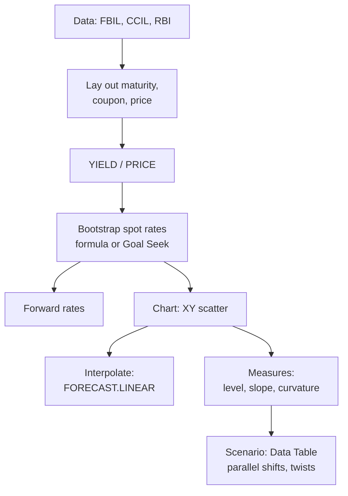

# YC-3: Yield Curve Analytics in Excel

Covers: the Excel bond functions and what each argument means, T-bill yields, how to build and chart a yield curve in a spreadsheet, linear interpolation for missing maturities, slope and curvature measures, bootstrapping with Goal Seek, and scenario analysis with data tables. **(syllabus)** "Yield curve analytics using Excel"; function details **(textbook / Excel reference)**.

## Where this fits in the ESE

The exam is handwritten, so you won't run Excel, but you can be asked to "explain how you would construct and analyse a yield curve in Excel" (5 or 10 marks), to interpolate a yield, or to compute a slope or butterfly spread. Know the functions by name and argument, and the steps of the workflow.

## The functions to know

| Function | Returns | Key arguments |
|---|---|---|
| `PRICE(settlement, maturity, rate, yld, redemption, frequency, [basis])` | Clean price per 100 face | rate = coupon rate; yld = YTM; frequency 1, 2 or 4 |
| `YIELD(settlement, maturity, rate, pr, redemption, frequency, [basis])` | YTM | pr = clean price |
| `DURATION(settlement, maturity, coupon, yld, frequency, [basis])` | Macaulay duration (years) | |
| `MDURATION(...)` | Modified duration | same arguments |
| `ACCRINT(issue, first_interest, settlement, rate, par, frequency)` | Accrued interest | dirty price = clean + accrued |
| `PV(rate, nper, pmt, [fv])` | Present value of an annuity plus lump sum | price a bond on a coupon date: `=-PV(ytm, n, coupon, 100)` |
| `RATE(nper, pmt, pv, [fv])` | Rate per period | YTM on a coupon date |
| `NPV`, `XNPV`, `XIRR` | Value and return of irregular cash flows | XIRR for real settlement dates |
| `TBILLPRICE`, `TBILLYIELD` | T-bill price and yield | use a 360-day year (US convention) |
| `FORECAST.LINEAR(x, known_y, known_x)` | Linear interpolation | yield at a missing maturity |

`basis` is the day-count: 0 = 30/360, 1 = actual/actual. Indian G-secs use 30/360 for coupon accrual; T-bills use actual/365.

## T-bill yield (Indian convention)

**Yield = (100 − P) ÷ P × 365 ÷ d**

*Example:* 91-day T-bill at ₹98.30: (1.70 ÷ 98.30) × 365 ÷ 91 = **6.94%**. Excel's `TBILLYIELD` uses 360 days, so for an Indian T-bill compute it with the formula above.

## Workflow: building and analysing a curve

1. **Collect data:** G-sec yields by maturity from FBIL, CCIL or RBI (or a Bloomberg export, YC-4), all for the same date.
2. **Lay out columns:** maturity (years), coupon, price, YTM (via `YIELD`), and later spot and forward rates.
3. **Bootstrap spot rates** (YC-2): 1-year spot from the 1-year bond; for each later maturity put the formula `=((100+c)/(100-SUMPRODUCT(coupons, discount factors)))^(1/n)-1`, or use **Goal Seek** to set the bond's model price equal to market price by changing the spot rate cell.
4. **Forward rates:** `=((1+s_next)^(n+1)/(1+s_n)^n)-1`.
5. **Chart:** XY scatter with smooth lines, maturity on the x-axis, yield on the y-axis; plot par, spot and forward curves together.
6. **Interpolate** missing maturities with `FORECAST.LINEAR` (or a cubic spline add-in).
7. **Measure** slope and curvature (below) and compare with last month's curve.
8. **Scenario analysis:** Data Table (What-If Analysis) to reprice a bond under parallel shifts (+/−50, 100 bps) and twists.

## Linear interpolation

**y = y₁ + (y₂ − y₁) × (x − x₁) ÷ (x₂ − x₁)**

*Example:* 5-year yield 6.80%, 7-year 7.10%. The 6-year yield = 6.80 + (0.30) × (1 ÷ 2) = **6.95%**.

## Shape measures

- **Level:** average yield across maturities (moves with policy and inflation).
- **Slope (term spread):** 10-year − 2-year. 2-year 6.20%, 10-year 7.00% gives **+80 bps**: normal, upward-sloping.
- **Curvature (butterfly):** 2 × medium − short − long. With 2-year 6.20, 5-year 6.80, 10-year 7.00: 2(6.80) − 6.20 − 7.00 = **+0.40 = 40 bps**: the middle is high relative to the ends, a concave (humped) belly.

Tracking these three numbers over time is how analysts describe curve moves: **parallel shift** (level changes), **steepening/flattening** (slope changes), **butterfly** (curvature changes).

## Advantages and limitations of Excel analysis

- **Advantages:** transparent formulas; quick scenario tests; free and universal; links to data exports.
- **Limitations:** manual data entry errors; linear interpolation produces kinks; no real-time data; large models get slow and hard to audit. This is where Bloomberg (YC-4) adds value.

## What to remember

- PRICE, YIELD, DURATION, MDURATION, ACCRINT, PV/RATE, XIRR, FORECAST.LINEAR.
- T-bill yield (India) = (100 − P)/P × 365/d: 98.30 for 91 days gives 6.94%.
- Workflow: collect, lay out, bootstrap (formula or Goal Seek), forwards, chart, interpolate, measure, scenario.
- Interpolation 5y 6.80 / 7y 7.10 gives 6y 6.95%.
- Slope 10y − 2y = 80 bps; butterfly 2(5y) − 2y − 10y = 40 bps.

## Concept map

## Flashcards
Q: Which Excel function returns a bond's YTM from its price?
A: YIELD(settlement, maturity, rate, pr, redemption, frequency, basis).

Q: Which Excel function returns modified duration?
A: MDURATION.

Q: Formula for an Indian T-bill yield?
A: (100 − P) ÷ P × 365 ÷ days to maturity.

Q: 91-day T-bill at ₹98.30. Yield?
A: 1.70 ÷ 98.30 × 365 ÷ 91 = 6.94%.

Q: 5-year yield 6.80%, 7-year 7.10%. Interpolated 6-year yield?
A: 6.95%.

Q: How is the butterfly (curvature) measure computed?
A: 2 × medium yield − short yield − long yield.

Q: How can Goal Seek be used to bootstrap?
A: Set the bond's model price (discounted at spot rates) equal to its market price by changing the unknown spot rate cell.

## Sources
- BBA303F-5 course plan, Unit 3 (yield curve analytics using Excel spreadsheet practice)
- Microsoft Excel function reference (PRICE, YIELD, DURATION, MDURATION, TBILLYIELD)
- Previous: [[Bond Market Unit 3 - YC-2 Spot Forward Rates and Bootstrapping]] · Next: [[Bond Market Unit 3 - YC-4 Bloomberg Bond Analytics]]
- [[Bond Market Unit 3 - Yield Curve MOC (Node Map)]]
