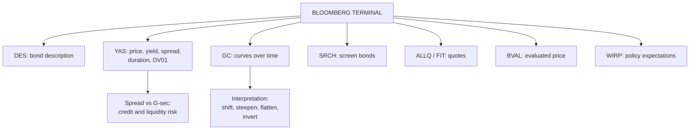

# YC-4: Bloomberg Analytics for Bond Pricing and Data Interpretation

Covers: what the Bloomberg terminal offers for fixed income, the core bond functions (DES, YAS, GC/GY, FIT, SRCH, ALLQ, BVAL, WIRP), how to read a yield-analysis screen, and how to interpret curve data. Also Bloomberg Market Concepts (BMC), the self-paced course the plan names. **(syllabus)**; function names are standard Bloomberg mnemonics.

## Where this fits in the ESE

Expect at most a 5-mark "explain how Bloomberg is used in bond analysis", or a case line asking how you would check a bond's relative value. Learn six functions and what each tells you; then the data-interpretation logic carries over from YC-1 to YC-3.

## The terminal in one paragraph

The Bloomberg Professional terminal is a real-time data, analytics and messaging system used by traders, fund managers and central banks. For bonds it gives live and historical prices and yields, issuer details, curves, relative-value tools and news. You type a security (e.g. a G-sec ticker), a yellow market-sector key (**Govt**, **Corp**, **Mtge**), then a function mnemonic and `<GO>`.

## Core fixed-income functions

| Function | What it does | Use in analysis |
|---|---|---|
| **DES** (Description) | Issuer, coupon, maturity, issue size, rating, call schedule, day-count | First check of what the bond is |
| **YAS** (Yield and Spread Analysis) | Price ↔ yield, YTM, YTC, yield to worst, spreads (G-spread, I-spread, Z-spread), duration, convexity, risk per 1 bp | The main pricing screen |
| **GC / GY** (Graph Curves / Govt yield) | Plots government yield curves, current and historical, for comparison | Curve shape and shifts over time |
| **FIT** (Fixed Income Trading) | Live quotes across a market sector | Trading levels and liquidity |
| **SRCH** (Bond Search) | Screens bonds by issuer, rating, maturity, coupon, currency | Building a shortlist for a portfolio |
| **ALLQ** (All Quotes) | Dealer bid/ask quotes for one bond | Liquidity and best execution |
| **BVAL** | Bloomberg's evaluated price for thinly traded bonds | Valuing illiquid corporate bonds |
| **WIRP** (World Interest Rate Probability) | Market-implied probability of central bank rate moves | Linking the curve to policy expectations |
| **CRVF / WCRS** | Curve finder; world sovereign curves | Cross-country comparison |
| **PORT** | Portfolio analytics: duration, attribution, risk | Portfolio-level checks (Unit 4) |

## Reading a YAS screen (what to interpret)

1. **Price and yield**: the yield the market price implies (YC-2 logic).
2. **Spread** over the benchmark G-sec curve: credit and liquidity premium. A widening spread means the market sees more risk.
3. **Modified duration and risk (DV01)**: price change for a 1-bp yield move, e.g. a risk of 0.065 means ₹0.065 per ₹100 per bp.
4. **Convexity**: curvature correction (Unit 2).
5. **Yield to worst** for callable bonds: the lower of YTM and YTC.

## Interpreting curve data

- **Compare today's curve with one month and one year ago** (GC): has it shifted in parallel, steepened, flattened or inverted? Tie each to policy and growth (YC-1).
- **Spread analysis**: corporate yield minus same-maturity G-sec yield; compare across ratings (AAA vs AA) and over time.
- **Policy link**: WIRP-implied rate cuts should show up as a lower short end and possibly a flatter curve.
- **Data hygiene**: check the pricing source (BVAL vs dealer quote), the date, and whether the bond is liquid before trusting a yield.

## Bloomberg Market Concepts (BMC)

A self-paced e-learning course (about 8 to 10 hours) in four modules: **Economic Indicators, Currencies, Fixed Income, Equities**. The Fixed Income module covers bond basics, yield curves, central bank policy and credit spreads, linking directly to Units 2 and 3. Completion gives a certificate.

## Bloomberg vs Excel

| Basis | Excel (YC-3) | Bloomberg |
|---|---|---|
| Data | Manual import | Live, historical, all markets |
| Cost | Low | Very high subscription |
| Analytics | Build yourself | Built-in (YAS, spreads, OAS) |
| Transparency | Full (you see every formula) | Partly a black box |
| Best for | Learning, custom models | Professional pricing and trading |

## What to remember

- DES = what it is; YAS = price, yield, spreads, duration; GC = curves over time; SRCH = screen; ALLQ = quotes; BVAL = evaluated price; WIRP = implied policy moves.
- A YAS reading: yield, spread over G-sec, modified duration, DV01, convexity, yield to worst.
- Interpret curves by comparing over time and linking to policy (YC-1).
- BMC modules: economics, currencies, fixed income, equities.

## Concept map

## Flashcards
Q: Which Bloomberg function gives price, yield, spreads and duration for a bond?
A: YAS (Yield and Spread Analysis).

Q: Which function describes a bond's issuer, coupon, maturity and rating?
A: DES.

Q: Which function plots government yield curves over time?
A: GC (Graph Curves).

Q: What is BVAL?
A: Bloomberg's evaluated price, used for thinly traded bonds.

Q: What does a widening spread over the G-sec curve signal?
A: The market sees more credit or liquidity risk in the bond.

Q: Name the four BMC modules.
A: Economic Indicators, Currencies, Fixed Income, Equities.

Q: What does WIRP show?
A: Market-implied probabilities of central bank rate changes.

## Sources
- BBA303F-5 course plan, Unit 3 (introduction to Bloomberg analytics for bond pricing and data interpretation; Bloomberg Market Concepts)
- Bloomberg terminal function mnemonics (DES, YAS, GC, FIT, SRCH, ALLQ, BVAL, WIRP)
- Previous: [[Bond Market Unit 3 - YC-3 Yield Curve Analytics in Excel]] · Next: [[Bond Market Unit 3 - YC-5 Unit 3 Exam Answers]]
- [[Bond Market Unit 3 - Yield Curve MOC (Node Map)]]
