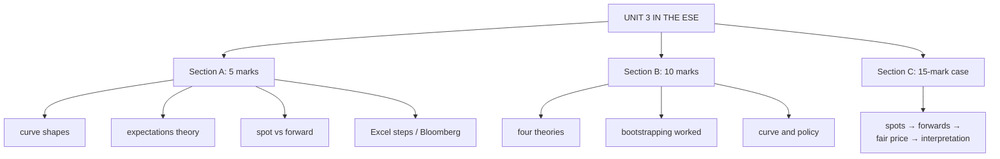

# YC-5: Unit 3 Exam Answers

Covers: what the ESE will ask from Unit 3, 5-mark and 10-mark answer skeletons, and a 15-mark case layout with a model answer. Numbers come from YC-1 to YC-4.

## What the test will ask

The ESE pattern is in the course plan: Section A 3 × 5 (1a or 1b, 2a or 2b, 3a or 3b), Section B 2 × 10 (4a or 4b, 5a or 5b), Section C one compulsory 15-mark question. No phone calculators. Unit 3 (CO3) is where the plan puts the yield-curve marks; expect one theory question (shapes or theories) and one bootstrapping or forward-rate sum.

## Five-mark answer skeletons

**1. Types of yield curves (YC-1).** Definition (yield vs maturity, same credit quality). Four shapes, each with a mini-diagram and a one-line signal: normal (growth), inverted (expected slowdown), flat (transition), humped (turning point).

**2. Pure expectations theory (YC-1).** Statement; formula (1 + ₀R₂)² = (1 + ₀R₁)(1 + E(₁r₁)); example 6% and 8% give 6.995%; one weakness (can't explain persistent upward slope).

**3. Spot vs forward rates (YC-2).** Define each; formula ₁f₁ = (1+s₂)²/(1+s₁) − 1; example 7.035%; one line on why forwards above spots mean rising expected rates.

**4. Steps to construct a yield curve in Excel (YC-3).** Collect same-date G-sec data → YIELD for each bond → bootstrap spots (formula or Goal Seek) → forwards → XY chart → interpolate → slope and curvature.

**5. Bloomberg in bond analysis (YC-4).** Five functions with one line each (DES, YAS, GC, SRCH, BVAL), then what YAS tells you (yield, spread, duration, DV01).

## Ten-mark answer skeletons

**A. Theories of the term structure (YC-1).** Pure expectations (formula, example) → liquidity preference (premium rises with maturity; explains upward slope) → market segmentation (separate markets; humps) → preferred habitat (move for a premium) → comparison table → which one best explains the Indian G-sec curve (liquidity preference / preferred habitat: upward-sloping most of the time, kinks where banks' SLR demand concentrates).

**B. Bootstrapping with a worked example (YC-2).** Why spot rates (each cash flow is a zero) → method → three-maturity worked table → forward rates → price a coupon bond off the spots → interpretation.

**C. Yield curve and monetary policy (YC-1).** Short end follows repo rate; long end follows growth, inflation, government borrowing; how a repo cut steepens the curve; inversion as a recession signal; riding the curve.

## Fifteen-mark case layout (yield curve analysis)

1. **Assumptions (1):** annual coupons, face 100, par bonds, no default risk (G-secs).
2. **Bootstrap spot rates (5):** table with each step shown.
3. **Forward rates (3).**
4. **Price a given bond off the spot curve, compare with market price (3).**
5. **Interpretation (3):** curve shape, what the forwards imply about expected rates under the expectations theory, policy reading, rich/cheap verdict on the bond.

### Model answer, laid out as the exam answer

**Data (illustrative):** par yields 1 year 6.0%, 2 years 6.5%, 3 years 7.0%; a 3-year 8% G-sec trades at ₹103.20.

1. **Assumptions:** annual coupons; face 100; bonds priced at par; G-secs have no default risk.
2. **Spot rates:**
   - s₁ = 6.000%.
   - 2-year: 100 − 6.5/1.06 = 93.8679; (1+s₂)² = 106.5/93.8679 = 1.134574; s₂ = **6.516%**.
   - 3-year: 100 − 7/1.06 − 7/1.134574 = 87.2265; (1+s₃)³ = 107/87.2265 = 1.226689; s₃ = **7.048%**.
3. **Forwards:** ₁f₁ = 1.134574/1.06 − 1 = **7.035%**; ₂f₁ = 1.226689/1.134574 − 1 = **8.119%**.
4. **Fair price of the 8% bond:** 8/1.06 + 8/1.134574 + 108/1.226689 = 7.5472 + 7.0511 + 88.0417 = **₹102.64**. Market ₹103.20 is **₹0.56 rich**: the bond is overpriced relative to the curve, so sell it (or don't buy) and buy the equivalent zeros.
5. **Interpretation:** the curve is normal and upward-sloping (6.0 → 7.0%). Forward rates rise to 8.1%, so under pure expectations the market expects short rates to rise; under liquidity preference part of the rise is a term premium. For policy, the curve is consistent with a central bank on hold or tightening and steady growth expectations.

Close with: *the verdict holds only if the par yields are from the same date and the bond has the same (sovereign) credit quality.*

## Time rule

If time is short, finish the spot-rate table and the fair price; one line of interpretation (shape + rich/cheap) earns more than an unfinished forward-rate section.

## What to remember

- Theory pair for Section B: shapes, then the four theories with the comparison table.
- Numbers: spots 6.000 / 6.516 / 7.048%; forwards 7.035 / 8.119%; 8% bond fair value ₹102.64; expectations 6% and 8% give 6.995%.
- Show every division and root: no phone calculators.
- End every sum with a sentence on what the curve says.

## Concept map

## Flashcards
Q: What are the steps of the 15-mark yield curve case?
A: Assumptions, bootstrap spots, forward rates, price the bond off the spots and compare with market, interpretation.

Q: Fair value of a 3-year 8% bond with spots 6 / 6.516 / 7.048% is ₹102.64; market price ₹103.20. Verdict?
A: Rich (overpriced) by ₹0.56: sell or avoid.

Q: Skeleton for a 10-mark answer on term-structure theories?
A: Expectations, liquidity preference, segmentation, preferred habitat, comparison table, which fits the Indian curve.

Q: What should every yield curve sum end with?
A: A sentence on what the curve's shape and forwards say about expected rates and policy.

Q: What is the ESE pattern for Bond Market?
A: Section A 3 × 5 with internal choice, Section B 2 × 10 with internal choice, Section C one compulsory 15-mark question.

## Sources
- BBA303F-5 course plan, Unit 3 and ESE question paper pattern
- [[Bond Market Unit 3 - Yield Curve MOC (Node Map)]]
