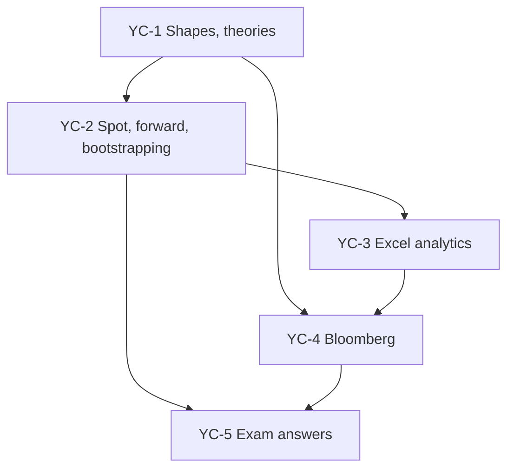

# Bond Market Unit 3: Riding the Yield Curve, node map

ESE: 50 marks, Section A 3 × 5 (internal choice), Section B 2 × 10 (internal choice), Section C one compulsory 15-mark question. No phone calculators. Unit 3 is CO3 (yield curves and their implications for markets and policy). All examples are **illustrative textbook numbers**, not class material.

## Nodes

| Node | Topic | Deps | Minutes | Exam focus |
|---|---|---|---|---|
| YC-1 | Yield Curve Shapes and Theories | none | 40 | yes |
| YC-2 | Spot, Forward Rates and Bootstrapping | YC-1 | 50 | yes |
| YC-3 | Yield Curve Analytics in Excel | YC-2 | 35 | no |
| YC-4 | Bloomberg Bond Analytics | YC-1, YC-3 | 25 | no |
| YC-5 | Unit 3 Exam Answers | YC-1 to YC-4 | 30 | yes |

Total reading time: about 180 minutes.

## Dependency graph

## Headline numbers to know

- Pure expectations: 1-year 6%, expected next-year 1-year 8%, 2-year rate 6.995%.
- Bootstrapping par 6.0 / 6.5 / 7.0%: spots 6.000 / 6.516 / 7.048%; forwards ₁f₁ 7.035%, ₂f₁ 8.119%.
- 3-year 8% bond off the spot curve: ₹102.64 (YTM about 6.99%).
- Zero prices 94.34 / 88.00 / 81.60 give spots 6.00 / 6.60 / 7.01%.
- 91-day T-bill at 98.30: 6.94%. Interpolated 6-year (5y 6.80, 7y 7.10): 6.95%.
- Slope 10y − 2y = 80 bps; butterfly 2(6.80) − 6.20 − 7.00 = 40 bps.

## Links
- [[Bond Market MOC]]
