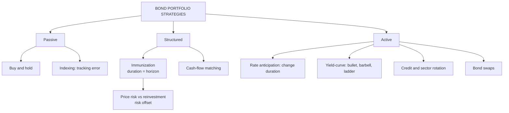

# BP-1: Bond Portfolio Strategies, Active vs Passive, and Immunization

Covers: the spectrum of bond portfolio strategies (passive, structured, active), buy-and-hold and indexing, immunization and cash-flow matching, the main active strategies (interest-rate anticipation, yield-curve strategies, credit and sector rotation, bond swaps), and how to choose. **(syllabus)** "Bond portfolio strategies – active vs passive approaches"; immunization is the **(textbook)** core of the structured approach.

## Where this fits in the ESE

ESE: 3 × 5, 2 × 10, one compulsory 15-mark question; no phone calculators. Unit 4 is CO4 ("develop and evaluate bond portfolio strategies"). A 10-mark "active vs passive bond strategies" is very likely, and an immunization sum fits a 5-mark slot or the case.

## The spectrum

| Approach | Aim | Typical users |
|---|---|---|
| **Passive** | Earn the market's return at low cost; no forecasts | Retail investors, index funds, conservative trusts |
| **Structured (semi-active)** | Meet a known liability regardless of rate moves | Insurers, pension funds, banks (ALM) |
| **Active** | Beat a benchmark by forecasting rates, curves or credit | Bond mutual funds, treasuries, hedge funds |

The choice depends on the investor's **objective** (income vs total return vs funding a liability), **beliefs about market efficiency**, **cost**, and **constraints** (regulation, liquidity).

## Passive strategies

1. **Buy and hold:** buy good-quality bonds and hold to maturity. Price swings don't matter if you never sell; return ≈ YTM at purchase (if coupons are reinvested at that yield). Low cost, low turnover.
2. **Indexing:** replicate a bond index (CRISIL Composite Bond Index, NSE G-sec indices, Bharat Bond ETF's target-maturity index). Measured by **tracking error**. Full replication is costly because bond indices hold thousands of issues, so managers use **sampling** (match the index's duration, sector and credit mix with fewer bonds).

## Structured: immunization

**Immunization** protects a portfolio's value at a target date from interest-rate changes, so a known future liability can be paid.

**Why it works:** a rate change hits a bond two ways in opposite directions:
- **Price risk:** rates up → bond prices fall.
- **Reinvestment risk:** rates up → coupons are reinvested at a higher rate.
When the portfolio's **Macaulay duration equals the investment horizon**, the two effects offset (approximately), and the portfolio earns about its starting yield whatever rates do.

**Conditions (Redington):**
1. PV of assets = PV of the liability.
2. Duration of assets = duration (horizon) of the liability.
3. Convexity of assets ≥ convexity of the liability (so a rate move leaves a surplus, not a shortfall).

**Rebalancing:** duration falls more slowly than calendar time passes, and changes when rates move, so an immunized portfolio must be rebalanced periodically.

### Worked example: immunizing a liability

**Question (illustrative):** a pension fund must pay ₹10,00,000 in 5 years. The yield is 7%. It can buy Bond A (duration 3 years) and Bond B (duration 8 years). How should it invest?

1. PV of the liability = 10,00,000 ÷ 1.07⁵ = 10,00,000 ÷ 1.40255 = **₹7,12,986**. Invest this amount.
2. Match duration: w_A × 3 + (1 − w_A) × 8 = 5 → 8 − 5w_A = 5 → **w_A = 0.6**, w_B = 0.4.
3. Invest **₹4,27,792 in A** and **₹2,85,194 in B**.

**Interpretation:** if rates rise, B's price falls more, but coupons reinvest at higher rates; if rates fall, prices rise but reinvestment earns less. With portfolio duration = 5, these roughly cancel at the 5-year date. Rebalance as time passes and rates move.

**Cash-flow matching (dedication):** buy bonds whose coupons and principal exactly match each liability date. No reinvestment risk at all, but usually costlier than immunization.

**Contingent immunization:** manage actively while the portfolio is comfortably above the amount needed; switch to immunization if it falls to a safety floor.

## Active strategies

1. **Interest-rate anticipation:** forecast rates and adjust duration. Expect rates to fall → lengthen duration (buy long bonds) to gain most; expect rates to rise → shorten duration (move to short bonds or cash). Riskiest active strategy.
2. **Yield-curve strategies:** position for changes in the curve's shape: bullet, barbell, ladder (BP-2); **riding the yield curve** (Unit 3).
3. **Credit (spread) strategies:** buy corporate bonds when spreads are expected to narrow (economy improving, upgrades expected); move to G-secs when spreads may widen.
4. **Sector rotation:** shift between G-secs, SDLs, PSU, corporate and bank bonds by relative value.
5. **Bond swaps:**
   - *Substitution swap:* swap into an identical bond trading at a higher yield.
   - *Inter-market spread swap:* swap between sectors when the spread is out of line.
   - *Rate anticipation swap:* change duration based on a rate forecast.
   - *Pure yield pickup swap:* move to a higher-yield bond for more income.
   - *Tax swap:* realise a loss to offset taxable gains.

## Active vs passive (comparison)

| Basis | Passive | Active |
|---|---|---|
| Objective | Match the market / fund a liability | Beat the benchmark |
| Forecasting | None | Rates, curve, credit |
| Duration | Fixed to index or horizon | Changes with view |
| Turnover and cost | Low | High |
| Risk | Tracking error / reinvestment | Wrong forecasts |
| Evaluated by | Tracking error | Alpha, Sharpe, information ratio (BP-4) |

## What to remember

- Passive (buy-and-hold, indexing), structured (immunization, cash-flow matching), active (rate anticipation, curve, credit, sector, swaps).
- Immunization: match PV and Macaulay duration to the liability; convexity ≥ liability's; rebalance.
- Example: PV ₹7,12,986; 60% in duration-3, 40% in duration-8.
- Rates expected to fall → lengthen duration; to rise → shorten.

## Concept map

## Flashcards
Q: Name the three broad approaches to bond portfolio management.
A: Passive, structured (immunization, cash-flow matching) and active.

Q: What is immunization?
A: Setting a portfolio's PV and duration equal to a liability's so that its value at the target date is protected from rate changes.

Q: Why does matching duration to the horizon immunize a portfolio?
A: Price risk and reinvestment risk move in opposite directions and offset when duration equals the horizon.

Q: Liability in 5 years; bonds of duration 3 and 8. Weights to immunize?
A: 60% in the duration-3 bond, 40% in the duration-8 bond.

Q: State Redington's three immunization conditions.
A: PV of assets = PV of liabilities; duration of assets = duration of liabilities; convexity of assets ≥ convexity of liabilities.

Q: A manager expects rates to fall. What should she do to duration?
A: Lengthen it, to gain the most from rising prices.

Q: What is a substitution swap?
A: Swapping a bond for an identical one trading at a higher yield.

Q: How is an index bond fund judged?
A: By tracking error against its index.

## Sources
- BBA303F-5 course plan, Unit 4 (bond portfolio strategies: active vs passive approaches)
- Reilly & Brown, bond portfolio management chapter; Fabozzi; Redington (1952)
- Next node: [[Bond Market Unit 4 - BP-2 Ladder Barbell Bullet and Buy-and-Hold]]
- [[Bond Market Unit 4 - Bond Portfolio MOC (Node Map)]]
