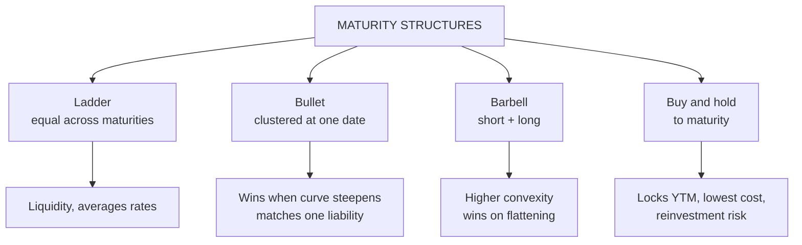

# BP-2: Laddering, Barbell, Bullet and Buy-and-Hold Strategies

Covers: how each maturity structure is built, its return, risk and liquidity profile, when each wins (curve shifts and twists), the barbell vs bullet convexity trade-off with numbers, and buy-and-hold in detail. **(syllabus)**

## Where this fits in the ESE

The plan pairs these with "problem-based learning, simulation" and "scenario analysis", so expect a 10-mark compare-and-recommend question or a case where you choose a structure for an investor and defend it under a rate scenario.

## The four structures

### Ladder
Spread the money **equally across maturities** (e.g. 1, 2, 3, 4, 5 years). As each bond matures, reinvest at the long end of the ladder.

*Example:* ₹10,00,000 → ₹2,00,000 each in 1-, 2-, 3-, 4- and 5-year bonds. Average maturity 3 years. Every year ₹2,00,000 matures and is rolled into a new 5-year bond.

- **Pros:** steady liquidity (something matures every year); averages out reinvestment rates over time (no need to forecast); simple.
- **Cons:** won't outperform when you have a strong rate view; more bonds to manage.

### Bullet
Concentrate maturities **around one point** (e.g. all bonds maturing in 4 to 6 years).

- **Pros:** matches a single known liability date (e.g. a payment in year 5); does well when the **curve steepens** (long yields up more than medium) relative to a barbell.
- **Cons:** concentrated reinvestment risk at one date; less convexity than a barbell of the same duration.

### Barbell
Concentrate in **very short and very long** maturities, little in between (e.g. 2-year and 10-year bonds).

- **Pros:** **higher convexity** than a bullet of the same duration (gains more when rates fall, loses less when they rise for large parallel moves); short end gives liquidity; does well when the **curve flattens**.
- **Cons:** loses to the bullet if the curve **steepens**; usually a slightly lower yield (investors pay for convexity); needs active rolling of the short end.

### Buy and hold
Buy bonds and hold them to maturity regardless of rate moves.

- **Return:** if the issuer doesn't default, the investor gets the promised coupons and principal; realised return ≈ YTM at purchase if coupons are reinvested at that yield.
- **Pros:** cheapest strategy; no forecasting; price volatility irrelevant if not forced to sell; locks in today's yield.
- **Cons:** reinvestment risk on coupons; opportunity loss if rates rise; credit risk must be screened at purchase (it can't be traded away later without selling).
- **Suits:** investors with a known horizon and income needs: retirees, trusts, banks' held-to-maturity books, target-maturity funds.

## Worked example: barbell vs bullet with equal duration

**Question (illustrative):** yields are 7% across the curve. Compare a **bullet** of 5-year zero-coupon bonds with a **barbell** of 2-year and 10-year zeros having the same duration.

1. A zero's Macaulay duration = its maturity. Barbell: w × 2 + (1 − w) × 10 = 5 → **w = 0.625** in the 2-year, 0.375 in the 10-year.
2. Convexity of an annual zero ≈ n(n + 1) ÷ (1 + y)².
   - 5-year: 5 × 6 ÷ 1.1449 = **26.20**
   - 2-year: 2 × 3 ÷ 1.1449 = 5.24; 10-year: 10 × 11 ÷ 1.1449 = 96.08
   - Barbell = 0.625 × 5.24 + 0.375 × 96.08 = 3.28 + 36.03 = **39.30**
3. **Barbell convexity 39.30 > bullet 26.20** at the same duration of 5.

**Interpretation:** for a large **parallel** shift either way, the barbell's price behaves better (more gain, less loss). But that convexity is not free: in practice the barbell often yields less, and if the curve **steepens** (10-year yield rises more than the 5-year), the barbell's long leg loses more and the bullet wins.

## Which structure when (scenario table)

| Scenario | Best structure | Why |
|---|---|---|
| Large parallel move, either direction | Barbell | Higher convexity |
| Curve flattens (long yields fall vs short) | Barbell | Long leg gains |
| Curve steepens (long yields rise vs short) | Bullet | No exposure to the long end |
| Uncertain rates, need steady cash | Ladder | Averages reinvestment, regular liquidity |
| Known horizon, income focus | Buy and hold / bullet at horizon | Locks yield, matches liability |

## What to remember

- Ladder = equal across maturities; bullet = clustered at one maturity; barbell = short + long.
- Barbell has more convexity than an equal-duration bullet (39.30 vs 26.20 in the example).
- Barbell wins on flattening and large parallel moves; bullet wins on steepening.
- Ladder = liquidity and averaging; buy-and-hold = lock in YTM, lowest cost.
- ₹10 lakh ladder: ₹2 lakh in each of 1–5 years, average maturity 3 years.

## Concept map

## Flashcards
Q: What is a ladder strategy?
A: Investing equal amounts across a range of maturities and reinvesting maturing bonds at the long end.

Q: What is a barbell strategy?
A: Concentrating holdings in very short and very long maturities with little in between.

Q: What is a bullet strategy?
A: Concentrating maturities around a single point in time.

Q: Same duration: which has more convexity, barbell or bullet?
A: The barbell.

Q: Which structure wins if the yield curve steepens?
A: The bullet.

Q: Barbell of 2- and 10-year zeros matching a 5-year duration. Weight in the 2-year?
A: 0.625.

Q: What return does a buy-and-hold investor earn if there's no default?
A: Approximately the YTM at purchase, if coupons are reinvested at that yield.

Q: Main advantage of a ladder?
A: Steady liquidity and averaging of reinvestment rates without forecasting.

## Sources
- BBA303F-5 course plan, Unit 4 (laddering, barbell, buy-and-hold strategies)
- Fabozzi, *Bond Markets, Analysis and Strategies*
- Previous: [[Bond Market Unit 4 - BP-1 Active vs Passive and Immunization]] · Next: [[Bond Market Unit 4 - BP-3 Stress Testing]]
- [[Bond Market Unit 4 - Bond Portfolio MOC (Node Map)]]
