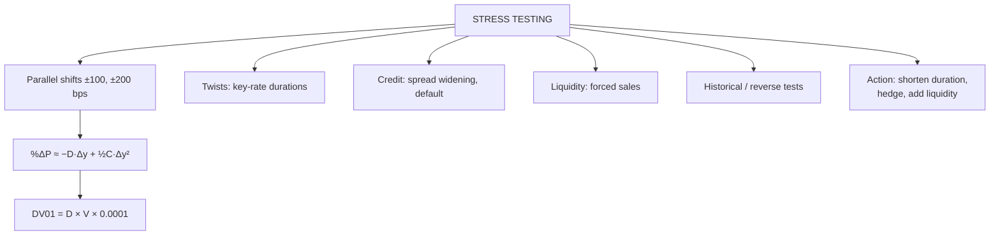

# BP-3: Stress Testing Bond Portfolios

Covers: what stress testing and scenario analysis are, the duration-plus-convexity estimate of portfolio loss, DV01, parallel shifts vs twists, credit and liquidity stresses, and how the results feed decisions. **(syllabus)** "Stress testing"; uses the duration and convexity tools from Unit 2.

## Where this fits in the ESE

A 5-mark "estimate the loss under a +200 bps shock" or part of the 15-mark case ("the board asks what happens if rates rise 2%"). This node joins Unit 2's mathematics to Unit 4's portfolio decisions.

## What stress testing is

**Stress testing** estimates how much a portfolio would lose under **severe but plausible** shocks, so that managers and regulators know whether capital and liquidity are enough. **Scenario analysis** is the broader version: it runs several possible futures (base, bull, bear) and compares outcomes.

RBI requires banks to stress-test their investment books (interest rate risk in the banking book, and the trading book) for parallel shifts such as ±200 bps, and SEBI requires debt mutual funds to stress-test for interest rate, credit and liquidity risk.

## The estimate (from Unit 2)

**%ΔP ≈ −D_mod × Δy + ½ × C × (Δy)²**

- D_mod: portfolio modified duration (value-weighted average of the bonds' modified durations).
- C: portfolio convexity.
- Δy: yield change in decimals (200 bps = 0.02).

**DV01 (PV01)** = rupee change in value for a 1-bp move = D_mod × Value × 0.0001.

## Worked example: a parallel-shift stress test

**Question (illustrative):** a ₹50 crore G-sec portfolio has modified duration 6 and convexity 50. Estimate the change in value for +100, +200, −100 and −200 bps, and its DV01.

| Shock | Duration effect −6Δy | Convexity effect ½ × 50 × Δy² | Total % | ₹ crore |
|---|---|---|---|---|
| +100 bps | −6.00% | +0.25% | **−5.75%** | **−2.875** |
| +200 bps | −12.00% | +1.00% | **−11.00%** | **−5.50** |
| −100 bps | +6.00% | +0.25% | **+6.25%** | **+3.125** |
| −200 bps | +12.00% | +1.00% | **+13.00%** | **+6.50** |

DV01 = 6 × 50 crore × 0.0001 = **₹3 lakh per bp**.

**Interpretation:** a 200-bp rise would cost about ₹5.5 crore (11%). Convexity softens the loss (by 1 point) and boosts the gain: price behaviour is asymmetric in the investor's favour. If the fund's risk limit is a 10% loss, the portfolio fails the +200 bps test; the manager should shorten duration (sell long bonds, buy short ones) or hedge with interest rate futures or swaps.

## Beyond parallel shifts

1. **Twists:** steepening (long yields up more than short) hurts long-duration holdings and barbells' long legs; flattening hurts bullets relative to barbells (BP-2). Test with **key-rate durations**: sensitivity to each maturity point separately.
2. **Credit stress:** widen corporate spreads by, say, 100–300 bps, or assume a downgrade or default of the largest issuer (the IL&FS default in 2018 and the Franklin Templeton fund closures in 2020 are the Indian lessons).
3. **Liquidity stress:** assume heavy redemptions force sales at a discount (bid-ask widening), especially for lower-rated paper.
4. **Historical scenarios:** replay a past episode (the 2013 taper tantrum, when the 10-year G-sec yield rose from about 7.1% to over 9% between May and August; March 2020).
5. **Reverse stress test:** ask which shock would breach the loss limit, and judge whether it is plausible.

## Using the results

- Compare losses with risk limits and capital.
- Adjust duration, convexity, credit mix and liquidity buffers.
- Hedge with interest rate futures, swaps or by holding more G-secs and cash.
- Report to the board / investment committee with assumptions stated.

**Limits:** duration-convexity is an approximation (less accurate for very large moves or bonds with options); scenarios are judgment calls; correlations between rate, credit and liquidity shocks rise in a crisis.

## What to remember

- %ΔP ≈ −D_mod × Δy + ½C(Δy)²; DV01 = D_mod × V × 0.0001.
- Example: D 6, C 50, ₹50 crore: +200 bps → −11% (−₹5.5 crore); −200 bps → +13%; DV01 ₹3 lakh.
- Stress parallel shifts, twists (key-rate durations), credit spreads, liquidity, historical replays, reverse tests.
- Act on results: shorten duration, hedge, add liquidity, diversify credit.

## Concept map

## Flashcards
Q: What is a stress test?
A: An estimate of portfolio loss under a severe but plausible shock, to check whether limits, capital and liquidity are enough.

Q: Formula for estimating % price change with duration and convexity?
A: %ΔP ≈ −D_mod × Δy + ½ × C × (Δy)².

Q: D_mod 6, convexity 50, rates up 200 bps. Estimated change?
A: −12% + 1% = −11%.

Q: Formula for DV01?
A: Modified duration × portfolio value × 0.0001.

Q: Why is the loss for +200 bps smaller than the gain for −200 bps?
A: Positive convexity adds to value in both directions.

Q: Name three stresses beyond parallel rate shifts.
A: Curve twists, credit spread widening or default, liquidity (forced sales); also historical and reverse stress tests.

Q: A portfolio fails a +200 bps stress test. Two actions?
A: Shorten duration; hedge with interest rate futures or swaps (also raise cash or G-sec share).

## Sources
- BBA303F-5 course plan, Unit 4 (stress testing, scenario analysis)
- Fabozzi; RBI guidelines on stress testing and interest rate risk in the banking book; SEBI stress-testing norms for debt schemes
- Previous: [[Bond Market Unit 4 - BP-2 Ladder Barbell Bullet and Buy-and-Hold]] · Next: [[Bond Market Unit 4 - BP-4 Sharpe Alpha and Beta for Bond Portfolios]]
- [[Bond Market Unit 4 - Bond Portfolio MOC (Node Map)]]
