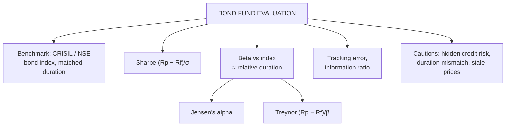

# BP-4: Performance Metrics for Bond Portfolios, Sharpe, Alpha and Beta

Covers: why bond portfolios need risk-adjusted evaluation, the Sharpe ratio, beta against a bond index, Jensen's alpha and the Treynor ratio applied to bond funds, tracking error and the information ratio, and how to interpret them. **(syllabus)** "Performance metrics – Sharpe ratio, alpha, beta"; method mirrors SAPM's portfolio evaluation.

## Where this fits in the ESE

The plan's activity is "numerical interpretation tasks", so expect a 5-mark sum (compute Sharpe and alpha for a fund and the index, and interpret) or the evaluation step in the 15-mark case.

## The benchmark

Equity funds use Nifty; bond funds use a **bond index**: CRISIL Composite Bond Index, CRISIL Short-Term or Gilt indices, NSE G-sec indices. The benchmark should match the fund's duration and credit profile, or the comparison is unfair.

## The measures

| Measure | Formula | Risk used | Read as |
|---|---|---|---|
| **Sharpe ratio** | (R_p − R_f) ÷ σ_p | Total volatility | Excess return per unit of total risk |
| **Beta** | Cov(R_p, R_index) ÷ Var(R_index) | Sensitivity to the bond index | β > 1: more rate sensitive than the index (usually longer duration) |
| **Jensen's alpha** | R_p − [R_f + β(R_index − R_f)] | Index-related risk | Return above what the fund's beta deserved |
| **Treynor ratio** | (R_p − R_f) ÷ β | Index-related risk | Excess return per unit of beta |
| **Tracking error** | SD of (R_p − R_index) | Active risk | How far the fund deviates from the index |
| **Information ratio** | (R_p − R_index) ÷ tracking error | Active risk | Active return per unit of active risk |

**Beta in bonds** mostly reflects **duration relative to the index**: a fund with twice the index's duration will have a beta near 2 for rate-driven moves. Credit-heavy funds may show low beta to a G-sec index yet carry large credit risk, so always read beta alongside the credit profile.

R_f for Indian bond funds is usually the 91-day T-bill yield.

## Worked example, laid out as the exam answer

**Question (illustrative):** last year a corporate bond fund returned 8.6% with an SD of 3.2% and a beta of 1.1 against the CRISIL Composite Bond Index. The index returned 7.8% with an SD of 2.8%. The 91-day T-bill yield was 6.5%. Evaluate the fund.

1. **Sharpe:** fund = (8.6 − 6.5) ÷ 3.2 = **0.656**; index = (7.8 − 6.5) ÷ 2.8 = **0.464**. The fund delivered more excess return per unit of total risk.
2. **Jensen's alpha:** required = 6.5 + 1.1 × (7.8 − 6.5) = 6.5 + 1.43 = 7.93%; α = 8.6 − 7.93 = **+0.67%**.
3. **Treynor:** fund = 2.1 ÷ 1.1 = **1.91**; index = 1.3 ÷ 1 = **1.30**.
4. **Beta 1.1:** the fund is slightly more rate-sensitive than the index (somewhat longer duration).

**Interpretation:** the fund beat the index on every measure: a higher Sharpe (0.656 vs 0.464) and a positive alpha of 0.67%. Part of the extra return may come from **credit risk** (corporate bonds) that neither beta nor SD fully captures in a calm year, so check the portfolio's ratings and concentration before calling it skill.

## Cautions specific to bonds

- **Credit risk hides in calm years:** a fund holding lower-rated paper shows high returns and low volatility until a default (IL&FS 2018, Franklin Templeton 2020).
- **Duration mismatch:** a long-duration fund beats a short-term index when rates fall; that's beta, not alpha. Use a duration-matched benchmark.
- **Mark-to-market and liquidity:** illiquid bonds may be valued stale, understating volatility and flattering Sharpe.

## What to remember

- Sharpe = (R_p − R_f)/σ; Treynor = (R_p − R_f)/β; α = R_p − [R_f + β(R_index − R_f)].
- Bond beta ≈ duration relative to the index.
- Tracking error and information ratio judge active vs benchmark.
- Example: Sharpe 0.656 vs 0.464; α +0.67%; Treynor 1.91 vs 1.30.
- Check credit risk and duration match before calling outperformance skill.

## Concept map

## Flashcards
Q: What benchmark should an Indian bond fund be judged against?
A: A bond index matched to its duration and credit profile, e.g. CRISIL Composite Bond Index or a gilt index.

Q: What does a bond fund beta of 1.3 usually indicate?
A: It is about 30% more sensitive to rate moves than the index, usually because of longer duration.

Q: Fund 8.6%, β 1.1, index 7.8%, R_f 6.5%. Jensen's alpha?
A: 8.6 − (6.5 + 1.1 × 1.3) = +0.67%.

Q: Formula for the information ratio?
A: (R_p − R_index) ÷ tracking error.

Q: Why can a credit-heavy bond fund look excellent on Sharpe in a calm year?
A: Credit risk shows up only when spreads widen or defaults hit, so volatility understates the true risk.

Q: A long-duration fund beats a short-term index after rates fall. Is that alpha?
A: Mostly not: it is beta (duration) exposure; use a duration-matched benchmark.

## Sources
- BBA303F-5 course plan, Unit 4 (performance metrics: Sharpe ratio, alpha, beta)
- Reilly & Brown; Prasanna Chandra, *Investment Analysis and Portfolio Management*
- Previous: [[Bond Market Unit 4 - BP-3 Stress Testing]] · Next: [[Bond Market Unit 4 - BP-5 Unit 4 Exam Answers]]
- [[Bond Market Unit 4 - Bond Portfolio MOC (Node Map)]]
