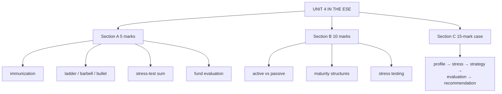

# BP-5: Unit 4 Exam Answers

Covers: what the ESE will ask from Unit 4, 5-mark and 10-mark skeletons, and the 15-mark portfolio-strategy case layout with a model answer. Numbers come from BP-1 to BP-4.

## What the test will ask

ESE: Section A 3 × 5 (internal choice), Section B 2 × 10 (internal choice), Section C one compulsory 15-mark question; no phone calculators. Unit 4 is CO4 (develop and evaluate bond portfolio strategies), which carried 15 ESE marks in the plan's CO table: roughly one 10-marker plus a share of the case. The case most likely gives a portfolio and asks you to stress-test it, choose a strategy, and evaluate performance.

## Five-mark answer skeletons

**1. Immunization (BP-1).** Definition; price vs reinvestment risk offset; Redington's three conditions; worked weights (60% duration-3, 40% duration-8 for a 5-year liability); need to rebalance.

**2. Ladder vs barbell vs bullet (BP-2).** One line each on construction; one line on when each wins; barbell's convexity advantage (39.30 vs 26.20).

**3. Stress test sum (BP-3).** Formula; table for ±100 and ±200 bps; DV01; one action if a limit is breached.

**4. Bond fund evaluation (BP-4).** Sharpe for fund and index; alpha via beta; interpretation with the credit-risk caveat.

**5. Buy-and-hold (BP-2).** Definition; return ≈ YTM; pros (cost, no forecasting); cons (reinvestment, opportunity cost, credit screening); who it suits.

## Ten-mark answer skeletons

**A. Active vs passive bond portfolio strategies (BP-1).** Spectrum (passive, structured, active) → passive: buy-and-hold, indexing (tracking error) → structured: immunization with conditions and an example → active: rate anticipation, yield-curve strategies, credit/sector rotation, swaps (four types) → comparison table → which suits whom.

**B. Maturity structures (BP-2).** Ladder, bullet, barbell, buy-and-hold with diagrams of the maturity profile → equal-duration convexity comparison → scenario table (parallel, flattening, steepening) → recommendation logic.

**C. Stress testing a bond portfolio (BP-3).** Why → parallel-shift estimate with formula and table → twists and key-rate durations → credit and liquidity stresses with Indian examples (IL&FS, Franklin Templeton) → actions → limitations.

## Fifteen-mark case layout (portfolio strategy)

1. **Portfolio profile (2):** value-weighted modified duration and convexity, DV01.
2. **Stress test (4):** ±100 and ±200 bps table; compare with the loss limit.
3. **Strategy decision (4):** given the rate view and liabilities, choose duration and structure (immunize, ladder, barbell or bullet); compute weights.
4. **Performance evaluation (3):** Sharpe and alpha against the benchmark.
5. **Recommendation (2):** what to change, with one risk caveat.

### Model answer, laid out as the exam answer

**Data (illustrative):** a ₹50 crore bond portfolio has modified duration 6 and convexity 50; the board's loss limit is 10% for a 200-bp shock. The fund's liabilities fall due in about 5 years. Available: Bond A (duration 3, convexity 12) and Bond B (duration 8, convexity 75). Last year: fund 8.6%, SD 3.2%, β 1.1; index 7.8%, SD 2.8%; T-bill 6.5%.

1. **Profile:** D_mod 6, C 50, DV01 = 6 × 50 crore × 0.0001 = ₹3 lakh/bp.
2. **Stress test:** +200 bps → −12% + 1% = **−11% (−₹5.5 crore)**, breaching the 10% limit; −200 bps → +13%.
3. **Strategy:** cut duration to the 5-year horizon and immunize: w_A × 3 + (1 − w_A) × 8 = 5 → **60% A, 40% B**. New convexity = 0.6 × 12 + 0.4 × 75 = 37.2. New +200 bps loss ≈ −5 × 0.02 + ½ × 37.2 × 0.0004 = −10% + 0.74% = **−9.26% (−₹4.63 crore)**, inside the 10% limit. (Durations are treated as modified durations here for the stress estimate; with Macaulay durations the loss would be slightly smaller.)
4. **Evaluation:** Sharpe fund 0.656 vs index 0.464; α = 8.6 − (6.5 + 1.1 × 1.3) = **+0.67%**: good risk-adjusted performance, partly from credit exposure.
5. **Recommendation:** cut duration to 5 and immunize against the liability (60/40 in A and B); this brings the 200-bp loss inside the limit; review the credit book because part of the alpha likely comes from credit risk; rebalance quarterly.

Close with: *results depend on parallel shifts; a curve twist or credit event needs its own test.*

## Time rule

If time is short: the stress-test table and the duration-matching weights earn most of the marks; then one sentence of recommendation.

## What to remember

- Immunize: 60/40 for durations 3 and 8 at a 5-year horizon; PV ₹7,12,986 for ₹10 lakh at 7%.
- Barbell 39.30 vs bullet 26.20 convexity at duration 5.
- Stress: D 6, C 50 → −11% at +200 bps; DV01 ₹3 lakh on ₹50 crore.
- Evaluation: Sharpe 0.656 vs 0.464; α +0.67%.

## Concept map

## Flashcards
Q: Steps of the Unit 4 portfolio case?
A: Portfolio profile (duration, convexity, DV01), stress test, strategy decision with weights, performance evaluation, recommendation.

Q: Skeleton for a 10-mark active vs passive answer?
A: Spectrum; passive (buy-and-hold, indexing); structured (immunization); active (rate anticipation, curve, credit, swaps); comparison table; suitability.

Q: What caveat should every bond fund evaluation include?
A: Part of the excess return may come from credit or duration exposure rather than skill.

Q: A portfolio breaches its stress-test limit. Two fixes?
A: Shorten duration (or immunize to the horizon) and hedge with interest rate futures or swaps.

## Sources
- BBA303F-5 course plan, Unit 4 and ESE question paper pattern
- [[Bond Market Unit 4 - Bond Portfolio MOC (Node Map)]]
