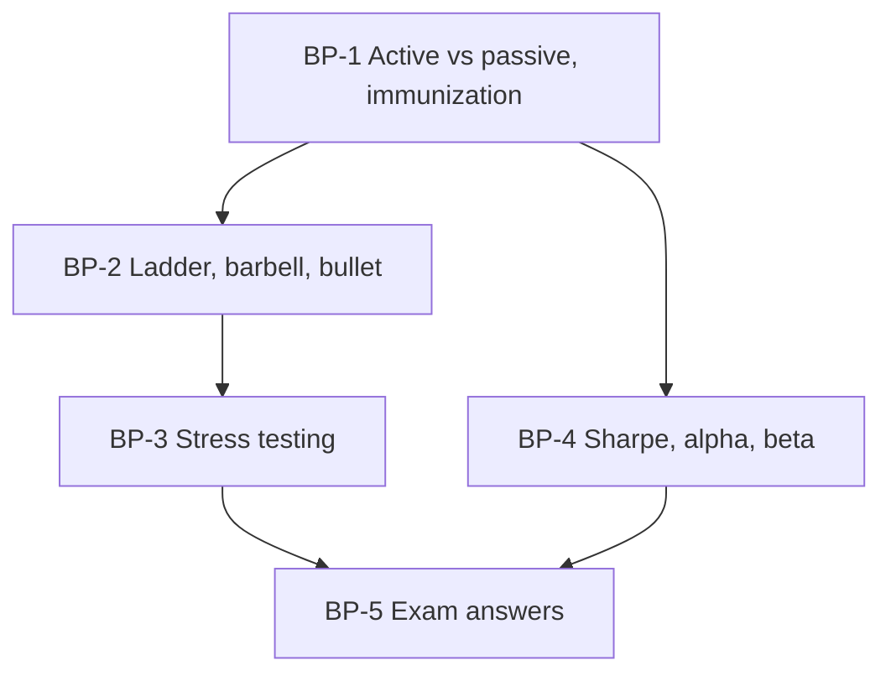

# Bond Market Unit 4: Strategic Bond Portfolio Management, node map

ESE: 50 marks, Section A 3 × 5, Section B 2 × 10, Section C one compulsory 15-mark question; no phone calculators. Unit 4 is CO4 (develop and evaluate bond portfolio strategies). The case most likely asks you to stress-test a portfolio, pick a strategy and evaluate performance. All examples are **illustrative textbook numbers**.

## Nodes

| Node | Topic | Deps | Minutes | Exam focus |
|---|---|---|---|---|
| BP-1 | Active vs Passive and Immunization | none | 40 | yes |
| BP-2 | Ladder, Barbell, Bullet and Buy-and-Hold | BP-1 | 40 | yes |
| BP-3 | Stress Testing | BP-2 | 35 | yes |
| BP-4 | Sharpe, Alpha and Beta for Bond Portfolios | BP-1 | 35 | yes |
| BP-5 | Unit 4 Exam Answers | BP-1 to BP-4 | 30 | yes |

Total reading time: about 180 minutes.

## Dependency graph

## Headline numbers to know

- Immunize ₹10 lakh due in 5 years at 7%: invest ₹7,12,986; 60% in duration-3, 40% in duration-8.
- Barbell (2y + 10y zeros, 62.5/37.5) vs 5-year bullet at 7%: convexity 39.30 vs 26.20.
- Stress test (₹50 crore, D 6, C 50): +100 bps −5.75%, +200 bps −11% (−₹5.5 crore), −200 bps +13%; DV01 ₹3 lakh.
- Bond fund (8.6%, σ 3.2%, β 1.1; index 7.8%, σ 2.8%; T-bill 6.5%): Sharpe 0.656 vs 0.464; α +0.67%; Treynor 1.91 vs 1.30.

## Links
- [[Bond Market MOC]]
