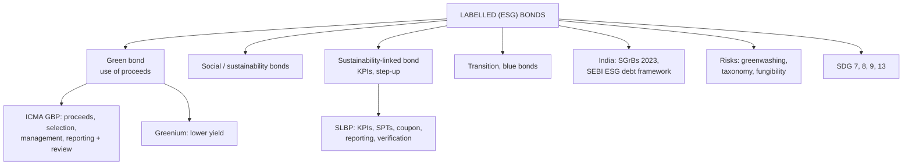

# FB-1: Green Bonds and Sustainability-Linked Bonds

Covers: the family of labelled (ESG) bonds, green bonds (use of proceeds, the ICMA Green Bond Principles, external review), sustainability-linked bonds (KPIs, targets, coupon step-ups), the "greenium" with a worked example, India's sovereign green bonds and SEBI's framework, global developments, benefits, risks (greenwashing) and the SDG link. **(syllabus)**

## Where this fits in the ESE (and CIA3)

ESE: 3 × 5, 2 × 10, one compulsory 15-mark question. Unit 5 is CO5 (emerging trends: green bonds and fintech). Expect a 5- or 10-marker on green vs sustainability-linked bonds. The CIA3 group presentation is also on a Unit 5 theme ("Green Bonds in India", "Sustainability-Linked Bonds"), so these notes double as presentation material.

## The labelled bond family

| Type | What is tied to sustainability | Example use |
|---|---|---|
| **Green bond** | **Use of proceeds**: only green projects | Solar, wind, metro rail, energy efficiency |
| **Social bond** | Use of proceeds: social projects | Affordable housing, healthcare, MSME lending |
| **Sustainability bond** | Use of proceeds: mix of green and social | Combined programmes |
| **Sustainability-linked bond (SLB)** | **The issuer's performance**: coupon linked to KPIs; proceeds for general purposes | Cut emissions intensity 30% by 2030 or pay more |
| **Transition bond** | Financing a high-emission firm's shift to lower emissions | Steel, cement decarbonisation |
| **Blue bond** | Ocean and water projects | Marine conservation, water management |

The key exam distinction: **green bonds are about what the money funds; SLBs are about what the issuer achieves.**

## Green bonds

A **green bond** is a regular bond (same seniority and credit risk as the issuer's other bonds) whose proceeds are **ring-fenced for eligible environmental projects**.

**ICMA Green Bond Principles (2014, voluntary)**: four core components:
1. **Use of proceeds:** eligible green categories (renewable energy, clean transport, energy efficiency, pollution control, sustainable water, green buildings, climate adaptation).
2. **Process for project evaluation and selection:** how the issuer decides which projects qualify.
3. **Management of proceeds:** tracking the money in a separate account or sub-portfolio.
4. **Reporting:** annual allocation reports (where the money went) and impact reports (tonnes of CO₂ avoided, MW installed).
Plus **external review**: second-party opinion, verification or certification (e.g. Climate Bonds Standard).

**History:** the European Investment Bank's Climate Awareness Bond (2007) and the World Bank's first green bond (2008) started the market; it has grown to trillions of dollars of cumulative issuance. The EU Green Bond Standard (a voluntary "gold standard" aligned to the EU Taxonomy) applies from December 2024.

## Sustainability-linked bonds

- Proceeds can be used for **any purpose**.
- The issuer commits to **Key Performance Indicators (KPIs)** and **Sustainability Performance Targets (SPTs)** by a date (e.g. renewable share of power 50% by 2030).
- **Coupon step-up** (typically 25 bps) if the target is missed (occasionally a step-down if met).
- **ICMA Sustainability-Linked Bond Principles (2020)**: five components: selection of KPIs, calibration of SPTs, bond characteristics (the coupon change), reporting, verification.
- *Strength:* lets firms without enough "green projects" (e.g. heavy industry) raise ESG-linked money and commit to company-wide change. *Criticism:* weak or easy targets, small step-ups, and targets timed after the bond's call date can make the penalty meaningless.

### Worked example: SLB step-up

A company issues ₹500 crore of 5-year SLBs at 8% with a **25 bps step-up** from year 4 if its emissions-intensity target is missed at the end of year 3.
- Extra coupon if missed = 0.25% × 500 crore = **₹1.25 crore a year** for years 4 and 5 = **₹2.5 crore** in total.
- Investors receive 8.25% instead of 8%; the issuer pays a visible penalty for missing its target.

## The greenium

A **greenium** (green premium) exists when a green bond trades at a **lower yield (higher price)** than an otherwise identical conventional bond of the same issuer, because investors with ESG mandates compete for green paper.

### Worked example

India's sovereign green bonds were priced a few basis points below comparable conventional G-secs in their first auctions. Illustration: a 10-year green G-sec yields **7.24%** while a conventional 10-year G-sec yields **7.30%**.
- Greenium = **6 bps**.
- Annual interest saving to the government on ₹8,000 crore = 0.06% × 8,000 crore = **₹4.8 crore a year**.
- Price effect (modified duration ≈ 7): the green bond is worth about 7 × 0.06% ≈ **0.42%** more (₹0.42 per ₹100).
A greenium lowers the issuer's cost but means investors accept slightly lower returns for the green label; in India it has been small, and thin later demand has narrowed it.

## India

- **Sovereign Green Bonds (SGrBs):** the Government's **Sovereign Green Bond Framework (November 2022)** defines eligible projects (renewable energy, clean transport, energy efficiency, climate adaptation, sustainable water, pollution control, green buildings) and excludes fossil fuel, nuclear and large hydro (above 25 MW). RBI auctioned the first SGrBs in **January–February 2023 (₹16,000 crore in two tranches)**; proceeds go to the Consolidated Fund and are allocated to eligible public projects, with annual reporting.
- **SEBI:** green debt securities guidelines (2017), widened in 2023 into a framework for **ESG debt securities** (green, social, sustainability and sustainability-linked) with initial and continuous disclosure, third-party review, and **"do's and don'ts" against greenwashing**.
- **Issuers:** renewable energy companies, PSUs and financial institutions (e.g. IREDA, power and rail financiers), banks, and some corporates through foreign-currency and masala green bonds.
- **RBI:** permits banks to accept green deposits (2023 framework).
- **Challenges:** limited investor base, small greenium, lack of a fully operational national green taxonomy (work under way), verification costs, thin secondary liquidity.

## Benefits

- **Issuers:** access to a wider ESG investor base; possible lower cost (greenium); reputational benefit; aligns finance with strategy.
- **Investors:** meet ESG mandates; transparency through impact reporting; same credit risk as the issuer's normal bonds.
- **Economy and society:** channels capital to climate goals; supports India's net-zero 2070 target and **SDG 7 (clean energy), 9 (industry, innovation and infrastructure), 11, 13 (climate action)**, plus SDG 8 through green jobs.

## Risks and criticisms

1. **Greenwashing:** labelling projects green without real impact.
2. **Lack of standard taxonomy:** what counts as green varies by country.
3. **Verification and reporting costs**, burdensome for small issuers.
4. **Fungibility:** money is fungible, so ring-fencing may not change the issuer's overall behaviour.
5. **SLB design flaws:** weak KPIs, small step-ups, late or easily met targets.
6. **Liquidity:** small issues trade rarely.

## What to remember

- Green = use of proceeds (four GBP components + external review); SLB = issuer's KPIs with coupon step-up (five SLBP components).
- Social, sustainability, transition, blue bonds complete the family.
- Greenium example: 7.24% vs 7.30% = 6 bps; ₹4.8 crore a year on ₹8,000 crore.
- SLB example: 25 bps step-up on ₹500 crore = ₹1.25 crore a year.
- India: SGrB framework Nov 2022; first auctions Jan–Feb 2023 (₹16,000 crore); SEBI ESG debt framework with anti-greenwashing rules.
- Risks: greenwashing, taxonomy, verification costs, fungibility, weak SLB targets.

## Concept map

## Flashcards
Q: What is the key difference between a green bond and a sustainability-linked bond?
A: A green bond's proceeds must fund green projects; an SLB's proceeds are general, but its coupon depends on the issuer meeting sustainability targets.

Q: Name the four core components of the ICMA Green Bond Principles.
A: Use of proceeds, project evaluation and selection, management of proceeds, reporting.

Q: What is a coupon step-up in an SLB?
A: An increase in the coupon (often 25 bps) if the issuer misses its sustainability performance target.

Q: What is a greenium?
A: The lower yield (higher price) of a green bond compared with an otherwise identical conventional bond.

Q: Green 10-year yield 7.24%, conventional 7.30%, issue ₹8,000 crore. Annual saving?
A: 6 bps × ₹8,000 crore = ₹4.8 crore a year.

Q: When did India first issue sovereign green bonds?
A: January–February 2023, ₹16,000 crore in two tranches, under the November 2022 framework.

Q: What is greenwashing?
A: Presenting a bond or project as environmentally beneficial without real environmental impact.

Q: Which SDGs do green bonds support most directly?
A: SDG 7 (clean energy), 9 (industry, innovation, infrastructure) and 13 (climate action), plus SDG 8 through green jobs.

## Sources
- BBA303F-5 course plan, Unit 5 (green bonds and sustainability-linked bonds); CIA3 suggested themes
- ICMA Green Bond Principles (2014, updated) and Sustainability-Linked Bond Principles (2020)
- Ministry of Finance, Sovereign Green Bond Framework (Nov 2022); RBI auction notices (Jan–Feb 2023); SEBI ESG debt securities framework (2023)
- Next node: [[Bond Market Unit 5 - FB-2 Digital and Tokenized Bonds]]
- [[Bond Market Unit 5 - Future of Bond Markets MOC (Node Map)]]
