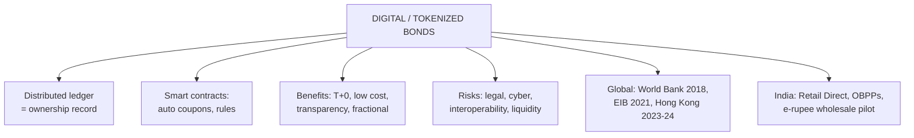

# FB-2: Digital and Tokenized Bonds

Covers: what digital (DLT-native) and tokenized bonds are, how their life cycle differs from a conventional bond, global landmark issues, Indian developments (digital access platforms, the wholesale e-rupee pilot), benefits, risks and regulatory issues, and fintech platforms for bond investing. **(syllabus)**

## Where this fits in the ESE (and CIA3)

A 5-mark "what are tokenized bonds; benefits and risks" or a 10-mark "digital transformation of bond markets". "Blockchain and Tokenized Bonds" and "Digital Bond Platforms" are suggested CIA3 themes.

## Definitions

- **Digital bond (DLT-native):** a bond **issued, recorded and settled on a distributed ledger** (blockchain). The ledger entry *is* the legal record of ownership.
- **Tokenized bond:** a **digital token** on a blockchain that represents ownership of a bond (either a native digital bond, or a conventional bond held in custody and mirrored as tokens).
- **Smart contract:** self-executing code on the ledger that automatically pays coupons, redeems principal and enforces transfer rules (e.g. only KYC-approved wallets).
- **Distributed ledger technology (DLT):** a shared, synchronised database maintained by several parties, with entries that are hard to alter.

## Conventional vs tokenized life cycle

| Stage | Conventional bond | Tokenized / digital bond |
|---|---|---|
| Issuance | Arrangers, registrar, depository, days of paperwork | Tokens minted on the ledger; investors' wallets credited directly |
| Record of ownership | Depository and registrar books, reconciled | Single shared ledger, updated in real time |
| Settlement | T+1 or T+2 via clearing corporation | Near-instant (T+0), atomic delivery-versus-payment when cash is also on-chain |
| Coupon payments | Paying agent, manual processes | Automated by smart contract |
| Secondary trading | OTC or exchange, business hours | Potentially 24×7, peer-to-peer within rules |
| Minimum ticket | Often large (₹1 lakh+ for corporate bonds) | Fractional ownership possible |

## Global landmark issues

- **World Bank "bond-i" (2018):** the first bond created, allocated, transferred and managed through its life cycle on blockchain, with the Commonwealth Bank of Australia (A$110 million).
- **European Investment Bank (2021):** €100 million two-year digital bond on the Ethereum public blockchain, with major banks; later issues on other platforms.
- **Hong Kong SAR Government (2023 and 2024):** tokenized green bonds (HK$800 million in 2023, then a larger multi-currency digital green bond issue in 2024): combining Unit 5's two themes.
- **Swiss SIX Digital Exchange** and other regulated DLT exchanges for digital bonds; many banks run tokenized repo and collateral platforms.
- **BIS projects** (e.g. Project Agorá, 2024) explore tokenized commercial-bank money and central bank money on shared ledgers for settlement.

## India

- **Digital access (not tokenization):** RBI Retail Direct (2021) lets individuals open G-sec accounts with RBI and bid online; SEBI-regulated **Online Bond Platform Providers (OBPPs)** (2022) sell listed corporate bonds to retail; SEBI has repeatedly cut the minimum face value of privately placed corporate bonds (from ₹10 lakh to ₹1 lakh in 2022, and lower since) to widen retail access.
- **Wholesale CBDC pilot (e₹-W, November 2022):** RBI's pilot used the digital rupee to **settle secondary-market G-sec trades** between banks: a first step towards on-ledger settlement.
- **Regulation:** tokenized securities have no full legal framework yet in India; GIFT City's regulator (IFSCA) has studied tokenization of real-world assets. SEBI and RBI remain cautious about crypto assets while exploring DLT for market infrastructure.

## Benefits

1. **Faster settlement** (T+0, atomic DvP) and lower counterparty risk.
2. **Lower costs:** fewer intermediaries and reconciliations.
3. **Transparency and auditability:** one shared record.
4. **Fractional ownership** and wider retail access.
5. **Programmability:** automatic coupons, compliance checks, ESG reporting linked to green bonds.
6. **Collateral mobility:** tokenized bonds can move instantly as repo collateral.

## Risks and challenges

1. **Legal and regulatory uncertainty:** is the token the legal title? Who is liable for errors?
2. **Cybersecurity and smart-contract bugs:** code errors or hacks can freeze or steal assets.
3. **Interoperability:** many ledgers that don't talk to each other fragment liquidity.
4. **Settlement asset:** without tokenized cash or CBDC, the cash leg still settles off-chain, reducing the benefit.
5. **Liquidity:** most issues so far are small pilots with little secondary trading.
6. **Operational and custody risk:** loss of private keys; need for regulated custodians.
7. **Privacy:** public ledgers expose transaction data.

## What to remember

- Digital bond = issued and recorded on DLT; tokenized bond = token representing a bond; smart contracts automate coupons and rules.
- Benefits: T+0 settlement, lower cost, transparency, fractional access, programmability.
- Risks: legal status, cyber/smart-contract risk, interoperability, no on-chain cash, thin liquidity.
- Landmarks: World Bank bond-i 2018; EIB 2021 €100m on Ethereum; Hong Kong tokenized green bonds 2023–24.
- India: Retail Direct, OBPPs (digital access); e₹-W pilot (Nov 2022) to settle G-sec trades.

## Concept map

## Flashcards
Q: What is a tokenized bond?
A: A digital token on a blockchain that represents ownership of a bond.

Q: What does a smart contract do in a digital bond?
A: Automatically executes terms such as coupon payments, redemption and transfer restrictions.

Q: Name three benefits of tokenized bonds.
A: Near-instant settlement, lower costs from fewer intermediaries, fractional ownership (also transparency, programmability).

Q: Name three risks of tokenized bonds.
A: Legal uncertainty, cybersecurity and smart-contract bugs, interoperability and thin liquidity.

Q: What was the World Bank's bond-i?
A: The first bond managed through its whole life cycle on blockchain (2018, A$110 million, with the Commonwealth Bank of Australia).

Q: How did RBI's wholesale e-rupee pilot touch the bond market?
A: It used the digital rupee to settle secondary-market G-sec trades between banks (from November 2022).

Q: Is RBI Retail Direct a tokenized bond platform?
A: No: it gives digital retail access to G-secs, but the securities are not tokens on a blockchain.

## Sources
- BBA303F-5 course plan, Unit 5 (digital and tokenized bonds); CIA3 suggested themes
- World Bank (bond-i, 2018), European Investment Bank (2021), HKSAR Government (2023, 2024) public announcements; BIS Project Agorá; RBI concept note and pilot announcements on the e-rupee
- Previous: [[Bond Market Unit 5 - FB-1 Green and Sustainability-Linked Bonds]] · Next: [[Bond Market Unit 5 - FB-3 Blockchain and Future Innovations]]
- [[Bond Market Unit 5 - Future of Bond Markets MOC (Node Map)]]
