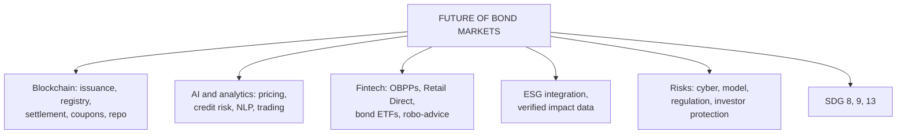

# FB-3: Blockchain Applications and Future Innovations in Bond Markets

Covers: where blockchain fits across the bond value chain, AI and data analytics in fixed income, fintech platforms, ESG data and integration, the likely future shape of bond markets, and the risks of innovation. **(syllabus)**

## Where this fits in the ESE (and CIA3)

A 10-mark "discuss the future of bond markets" or a 5-mark "applications of blockchain in bond markets". The CIA3 brief lists "Fintech Innovations in Bond Analytics" and "Role of AI and Data Analytics in Bond Markets" as themes.

## Blockchain applications across the bond value chain

| Stage | Blockchain application |
|---|---|
| Issuance | Digital book-building, token minting, direct allocation to investor wallets |
| Registry and custody | Shared, tamper-evident ownership ledger; fewer reconciliations |
| Clearing and settlement | Atomic delivery-versus-payment with tokenized cash or CBDC; T+0 |
| Corporate actions | Smart contracts pay coupons, process calls and redemptions automatically |
| Repo and collateral | Instant collateral movement; intraday tokenized repo (several global banks run such platforms) |
| Compliance | Embedded KYC/AML rules; only whitelisted wallets can hold the token |
| ESG reporting | Green bond proceeds and impact data recorded on-chain for verifiable reporting |
| Cross-border | Faster cross-border settlement, multi-currency issues |

## AI and data analytics in bond markets

- **Pricing illiquid bonds:** machine-learning models estimate fair values from comparable trades (many corporate bonds rarely trade).
- **Credit risk prediction:** default and downgrade early-warning models using financial, market and alternative data (news, filings).
- **Yield curve forecasting** and scenario generation for stress tests (Unit 4).
- **Portfolio construction:** optimisation, automated rebalancing, smart beta for fixed income.
- **Natural language processing:** reading central bank statements and RBI policy minutes to gauge rate direction.
- **Trading:** algorithmic and electronic trading, RFQ automation, liquidity scoring.
- **ESG analytics:** scoring issuers and checking green bond impact claims.

## Fintech platforms

- **Online bond platforms (OBPPs)** and apps that let retail investors buy listed bonds in small tickets.
- **RBI Retail Direct** for G-secs.
- **Electronic trading** (NDS-OM, RFQ platforms) and data/analytics terminals (Bloomberg, Unit 3).
- **Robo-advisory** for debt allocation; target-maturity funds and bond ETFs (Bharat Bond ETF).

## Future innovations (what the market may look like)

1. **Tokenized government and corporate bonds** at scale, settled in CBDC or tokenized deposits.
2. **Interoperable networks** linking ledgers (BIS-led projects).
3. **ESG integration everywhere:** standard taxonomies, verified impact data, more SLBs and transition bonds.
4. **24×7 markets and fractional retail access.**
5. **AI-driven pricing and risk management** as standard tools.
6. **Deeper Indian corporate bond market** through digital access, index inclusion and improved liquidity.

## Risks of innovation

- **Cyber risk** and operational failures in new systems.
- **Model risk:** AI models that work in calm markets may fail in stress; opaque "black box" decisions.
- **Regulatory gaps** and uneven global rules; legal recognition of tokens.
- **Concentration risk** in a few tech providers.
- **Data privacy** and data quality.
- **Investor protection:** retail investors buying complex or illiquid bonds through apps without understanding credit risk.
- **Digital divide:** benefits may favour tech-savvy investors.

## SDG link

Innovation in bond markets supports **SDG 9 (industry, innovation and infrastructure)** through cheaper infrastructure finance, **SDG 8 (decent work and growth)** through deeper capital markets, and **SDG 13** through verifiable green finance.

## What to remember

- Blockchain touches issuance, registry, settlement, coupons, repo, compliance, ESG reporting, cross-border.
- AI: pricing illiquid bonds, credit early warning, yield forecasting, NLP on policy, trading, ESG analytics.
- Fintech: OBPPs, Retail Direct, electronic trading, bond ETFs, robo-advice.
- Future: tokenization at scale, CBDC settlement, interoperability, ESG integration, 24×7, AI risk tools.
- Risks: cyber, model, regulatory, concentration, privacy, investor protection.

## Concept map

## Flashcards
Q: Name four stages of the bond value chain where blockchain can be applied.
A: Issuance, registry and custody, clearing and settlement, corporate actions (also repo/collateral, compliance, ESG reporting).

Q: How can AI help price corporate bonds?
A: Machine-learning models estimate fair values for rarely traded bonds from comparable trades and issuer data.

Q: What is NLP used for in bond markets?
A: Reading central bank statements, policy minutes and news to gauge rate direction and credit signals.

Q: Name three fintech developments for retail bond investors in India.
A: RBI Retail Direct, SEBI-regulated online bond platforms, bond ETFs such as Bharat Bond ETF.

Q: Name three risks of innovation in bond markets.
A: Cyber and operational risk, AI model risk, regulatory gaps (also concentration, privacy, investor protection).

Q: Which SDGs does bond market innovation support?
A: SDG 9 (industry, innovation, infrastructure), SDG 8 (growth) and SDG 13 (climate) via green finance.

## Sources
- BBA303F-5 course plan, Unit 5 (blockchain applications and future innovations); CIA3 suggested areas (analytics and innovation)
- BIS and industry public material on tokenization and AI in fixed income
- Previous: [[Bond Market Unit 5 - FB-2 Digital and Tokenized Bonds]] · Next: [[Bond Market Unit 5 - FB-4 Unit 5 Exam Answers]]
- [[Bond Market Unit 5 - Future of Bond Markets MOC (Node Map)]]
