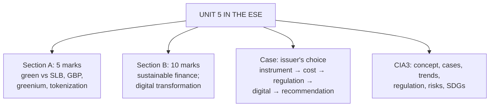

# FB-4: Unit 5 Exam Answers (and CIA3 Structure)

Covers: what the ESE will ask from Unit 5, 5-mark and 10-mark skeletons, a 15-mark case layout with a model answer, and how to structure the CIA3 group presentation from the same material.

## What the test will ask

ESE: Section A 3 × 5, Section B 2 × 10, Section C one compulsory 15-mark question. Unit 5 is CO5 (emerging trends), which carried only 5 ESE marks in the plan's CO table: expect one 5-mark question, or a theory part of a case. CIA3 (group presentation) tests the same content in depth.

## Five-mark answer skeletons

**1. Green vs sustainability-linked bonds (FB-1).** Definitions → table (proceeds, link to sustainability, principles, penalty) → one Indian example (sovereign green bonds 2023) → one risk each.

**2. Green Bond Principles (FB-1).** Four components with one line each + external review.

**3. Greenium (FB-1).** Definition, why it exists, worked numbers (6 bps on ₹8,000 crore = ₹4.8 crore a year), why it is small in India.

**4. Tokenized bonds (FB-2).** Definition, how smart contracts work, three benefits, three risks, one global example.

**5. Applications of blockchain / AI in bond markets (FB-3).** Five applications in a table; two risks.

## Ten-mark answer skeletons

**A. Sustainable finance and bond markets (FB-1).** Labelled bond family → green bonds and GBP → SLBs and SLBP with step-up example → greenium → India (SGrB framework, first issues, SEBI ESG debt framework) → global (EU GBS) → benefits → risks (greenwashing) → SDG link.

**B. Digital transformation of bond markets (FB-2, FB-3).** Definitions → conventional vs tokenized life cycle table → global landmarks → India (Retail Direct, OBPPs, e₹-W pilot) → AI and analytics → benefits → risks → outlook.

## Fifteen-mark case layout (an issuer's choice)

1. **Instrument choice (4):** green bond vs SLB vs conventional, given the issuer's projects and targets.
2. **Cost comparison (4):** greenium saving vs verification and reporting costs; SLB step-up exposure.
3. **Investor and regulatory view (3):** ESG mandates, SEBI framework, greenwashing safeguards.
4. **Digital option (2):** whether to issue as a tokenized bond.
5. **Recommendation and SDG link (2).**

### Model answer (sketch)

**Data (illustrative):** a renewable-energy company needs ₹500 crore for new solar plants. Conventional 5-year yield 8.00%; investors indicate 7.94% for a certified green bond; verification and reporting cost ₹30 lakh a year. Alternatively an SLB at 7.95% with a 25 bps step-up if renewable capacity misses 5 GW by year 3.

1. **Choice:** the money funds identifiable green projects, so a **green bond** fits best; an SLB suits firms without enough eligible projects.
2. **Cost:** greenium 6 bps × 500 crore = **₹30 lakh a year**, roughly equal to the ₹30 lakh annual verification and reporting cost, so the financial gain is about nil; the benefit is the wider ESG investor base and reputation. SLB: saves 5 bps (₹25 lakh) but risks 25 bps (₹1.25 crore a year) if the target is missed.
3. **Investors and regulation:** comply with SEBI's ESG debt framework (disclosures, third-party review, no greenwashing), publish allocation and impact reports.
4. **Digital option:** tokenized issuance is possible only as a pilot in India today (no full legal framework), so issue conventionally on the EBP platform.
5. **Recommendation:** issue a certified green bond; link to SDG 7, 9 and 13.

## CIA3 presentation structure (from the brief)

1. Conceptual explanation → 2. Industry examples / case studies → 3. Current market trends and statistics → 4. Regulatory developments (SEBI, RBI, global) → 5. Risks and future opportunities → 6. SDG linkage (SDG 8, 9) and economic implications → visuals: infographic, trend chart, India vs global comparison table → sources cited.

## What to remember

- Green = proceeds; SLB = performance. GBP 4 components; SLBP 5.
- Greenium 6 bps on ₹8,000 crore = ₹4.8 crore a year; SLB step-up 25 bps on ₹500 crore = ₹1.25 crore a year.
- India: SGrB framework Nov 2022, first auctions Jan–Feb 2023; SEBI ESG debt framework; e₹-W pilot for G-sec settlement.
- Tokenization: T+0, smart contracts, fractional access vs legal, cyber, interoperability risks.

## Concept map

## Flashcards
Q: What are the steps of a Unit 5 issuer-choice case?
A: Instrument choice, cost comparison (greenium vs costs, step-up exposure), investor and regulatory view, digital option, recommendation with SDG link.

Q: When does an SLB suit an issuer better than a green bond?
A: When it lacks enough identifiable green projects but can commit to company-wide sustainability targets.

Q: Six sections of the CIA3 presentation per the brief?
A: Concept, industry cases, market trends and statistics, regulatory developments, risks and opportunities, SDG linkage and economic implications.

## Sources
- BBA303F-5 course plan, Unit 5, CIA3 brief and ESE pattern
- [[Bond Market Unit 5 - Future of Bond Markets MOC (Node Map)]]
