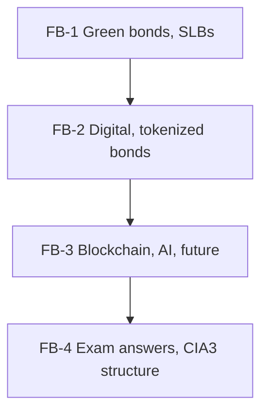

# Bond Market Unit 5: Future of Bond Markets, node map

ESE: 50 marks (3 × 5, 2 × 10, one compulsory 15-mark question). Unit 5 is CO5 (emerging trends: green bonds, fintech), worth about 5 ESE marks, but it is also the whole of **CIA3** (group presentation on a Unit 5 theme). Mostly theory; two small sums (greenium, SLB step-up). Facts are from ICMA, Government of India, RBI, SEBI and issuer announcements; check the latest figures before presenting.

## Nodes

| Node | Topic | Deps | Minutes | Exam focus |
|---|---|---|---|---|
| FB-1 | Green and Sustainability-Linked Bonds | none | 40 | yes |
| FB-2 | Digital and Tokenized Bonds | FB-1 | 35 | yes |
| FB-3 | Blockchain and Future Innovations | FB-2 | 30 | no |
| FB-4 | Unit 5 Exam Answers | FB-1 to FB-3 | 25 | yes |

Total reading time: about 130 minutes.

## Dependency graph

## Headline numbers and facts to know

- Greenium illustration: 7.24% vs 7.30% = 6 bps; ₹4.8 crore a year on ₹8,000 crore; ≈ 0.42% price premium at duration 7.
- SLB step-up: 25 bps on ₹500 crore = ₹1.25 crore a year.
- India: Sovereign Green Bond Framework (Nov 2022); first SGrB auctions Jan–Feb 2023 (₹16,000 crore); SEBI ESG debt securities framework (2023); RBI green deposits framework (2023); e₹-W pilot (Nov 2022) to settle G-sec trades.
- Global: EIB Climate Awareness Bond 2007; World Bank bond-i 2018; EIB €100m digital bond 2021; Hong Kong tokenized green bonds 2023–24; EU Green Bond Standard from Dec 2024.

## Links
- [[Bond Market MOC]]
