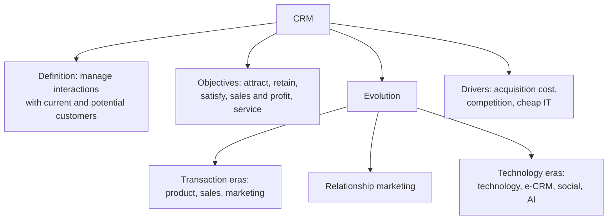

# CF-1: CRM Meaning, Objectives and Evolution

Covers: the faculty definition of CRM, its five objectives, why firms moved from selling products to managing relationships, and the eight eras of CRM. **(syllabus)**

## Where this fits in the ESE

ESE (assumed, no course plan PDF): Section A 3 × 5, Section B 2 × 10, Section C one compulsory 15-mark case, 50 marks. "Define CRM and state its objectives" is a safe 5-marker. The evolution table is a likely 5- or 10-marker. Every case answer in Units 1 to 5 starts from the definition here.

## Definition (class)

**Customer Relationship Management (CRM)** is the process of managing a company's interactions and relationships with current and potential customers. It uses **strategies, processes and technology** to improve customer satisfaction, increase sales and build long-term customer loyalty. **(syllabus)**

Three words carry the marks: *process* (not just software), *current and potential* (acquisition as well as retention), *long-term loyalty* (not one sale).

Background, one line: Buttle and Maklan define CRM as a **core business strategy** that integrates internal processes and external networks to create and deliver value to targeted customers at a profit, grounded in high-quality customer data and enabled by IT. **(textbook)** Use the faculty version first; add this as a closing line if you have time.

## Objectives of CRM (class)

1. Attract new customers.
2. Retain existing customers.
3. Improve customer satisfaction and loyalty.
4. Increase sales and profitability.
5. Provide better customer service.

Memory hook: **A-R-S-S-S**: Attract, Retain, Satisfy and loyalty, Sales and profit, Service. Each objective needs one line of "how": for example, retention through loyalty programmes, service through a single customer record.

## Why firms moved to CRM (drivers)

- Acquiring a new customer costs more than keeping one. Your note quotes 5 to 7 times; the faculty deck (Unit 5) says retaining is about **five times less expensive**. Quote "about five times" in the exam. **[VERIFY]** the 5 to 7 figure; it is a widely repeated estimate, not a measured constant. **(student notes)**
- Mature markets and intense competition reduce the payoff of pure acquisition.
- Cheap IT and data storage made it possible to track individual customers.
- Profit sits mostly with a minority of customers (see CV-4).

## The eight eras of CRM (student notes, course-specific)

The slide text for Unit 1 does not carry this table (it may be an image), so it comes from your notes. Learn it as a sequence of focus words: **Products → Selling → Customer needs → Relationships → Information → Digital channels → Engagement → Intelligence.**

| # | Era | Period | Philosophy | Typical example |
|---|---|---|---|---|
| 1 | Product-oriented | 1950s-70s | Make products and sell them | One standard TV model for everyone |
| 2 | Sales-oriented | 1970s-80s | Sell what we produce | Insurance sold through large sales teams |
| 3 | Marketing-oriented | 1980s-90s | Produce what customers need | Car models for students, families, luxury buyers |
| 4 | Relationship marketing | 1990s | Build relationships, not transactions | Airline frequent-flyer programmes |
| 5 | Technology-based CRM | Late 1990s-2005 | Use technology to manage customer information | Banks using customer data to offer fitting products |
| 6 | e-CRM | 2000s-2010s | Relationships through digital channels | Online shops recommending items from past purchases |
| 7 | Social CRM | 2010s | Engage in social conversations | A restaurant answering complaints on social media at once |
| 8 | AI-driven CRM | 2020s onward | Predict, personalise, act in real time | Streaming platforms recommending shows; chatbots |

Indian touchpoints for era 8, described qualitatively: a spectacles retailer such as Lenskart offers a virtual try-on (the Unit 1 slide uses it as an example), and large Indian e-commerce firms recommend products from browsing history. **(syllabus)** for the Lenskart mention, **(textbook)** for the general pattern.

Trap: the dates are approximate and the eight-era split is this course's version. Some textbooks show only three or four stages (production, sales, marketing, relationship). If a question says "stages of marketing evolution", give the four-era core and mention that CRM adds technology, digital, social and AI layers.

## Worked answer: "Trace the evolution of CRM" (5 marks)

1. Open: CRM moved from product focus to customer focus in eight eras.
2. Group them: *transaction eras* (product, sales, marketing), *relationship era* (relationship marketing), *technology eras* (technology-based, e-CRM, social, AI).
3. Give one example per group (TV maker; airline frequent flyer; recommendation engine).
4. Close with the driver: acquisition cost, competition, cheaper IT.
5. Interpretation line: each era keeps the earlier idea and adds a capability; AI-driven CRM still depends on the relationship idea of era 4.

## What to remember

- Class definition: managing interactions and relationships with current and potential customers using strategies, processes and technology.
- Five objectives: attract, retain, satisfy and build loyalty, increase sales and profit, serve better.
- Eight eras: product, sales, marketing, relationship, technology, e-CRM, social, AI-driven.
- Retention is about five times cheaper than acquisition (class, Unit 5); the 5 to 7 times figure is background only.
- CRM is a process plus technology, never software alone.

## Concept map

## Flashcards
Q: Give the faculty definition of CRM.
A: The process of managing a company's interactions and relationships with current and potential customers, using strategies, processes and technology to improve satisfaction, increase sales and build long-term loyalty.

Q: List the five objectives of CRM.
A: Attract new customers, retain existing customers, improve satisfaction and loyalty, increase sales and profitability, provide better customer service.

Q: Name the eight eras of CRM in order.
A: Product-oriented, sales-oriented, marketing-oriented, relationship marketing, technology-based CRM, e-CRM, social CRM, AI-driven CRM.

Q: What is the focus of the sales-oriented era?
A: Sell what we produce: aggressive selling and advertising, with customer satisfaction largely ignored.

Q: How does the marketing-oriented era differ from the sales-oriented era?
A: It starts from customer needs (research, segmentation, positioning) instead of from what the firm has produced.

Q: Why did firms move from acquisition to retention?
A: Keeping a customer costs far less than winning a new one (about five times less in the faculty deck), markets matured, and IT made individual tracking affordable.

Q: What are the three key words in the faculty definition of CRM?
A: Process (not just software), current and potential customers, long-term loyalty.

Q: What does social CRM add over e-CRM?
A: Two-way conversation on social platforms and customer-generated content, not just websites and email.

## Sources
- Faculty deck CRM Unit 1 (definition, objectives); student notes on objectives and evolution; Buttle & Maklan (textbook)
- Next node: [[CRM Unit 1 - CF-2 Relationship Marketing Theory]]
- [[CRM Unit 1 - Foundations MOC (Node Map)]]
