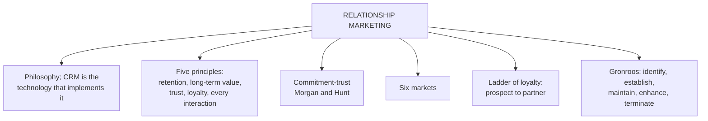

# CF-2: Relationship Marketing Theory

Covers: what relationship marketing is, how it differs from CRM, the theory and its five principles, commitment-trust theory, the six markets model and the ladder of loyalty. **(syllabus)**

## Where this fits in the ESE

"Distinguish relationship marketing from CRM" is a very likely 5-marker because the faculty states the difference on a slide. "Explain relationship marketing theory with its principles" fits 10 marks if you add the models below. The six markets and the ladder are textbook extras that lift a 10-mark answer.

## Relationship marketing and CRM (class)

- The "R" of CRM stands for relationship.
- **Relationship marketing** is an approach that builds long-term relationships with customers rather than one-time sales. It is the process of attracting, maintaining and strengthening long-term, mutually beneficial relationships by understanding needs, delivering value and earning loyalty. **(syllabus)**
- **Relationship marketing is the philosophy or strategy; CRM is the technology and processes used to implement that philosophy.** Write this sentence word for word in the exam.

| Basis | Relationship marketing | CRM |
|---|---|---|
| Nature | Philosophy, strategy | Technology and processes |
| Question it answers | Why build long-term relationships | How to build and manage them |
| Tools | Trust, commitment, loyalty schemes | Databases, SFA, analytics, dashboards |
| Without the other | Good intent, no scale | A database with no purpose |

## The theory and its key principles (class)

The theory says firms succeed in the long run by building, maintaining and enhancing strong relationships, not by chasing individual sales. Retaining existing customers is often more profitable than constantly acquiring new ones. Five principles on the slide:

1. Customer retention matters more than one-time sales.
2. Long-term relationships create greater value for customer and business.
3. Trust, commitment and satisfaction are the foundation.
4. Loyal customers are more profitable: they buy repeatedly and recommend.
5. Every interaction should strengthen the relationship.

## Definition by Gronroos (textbook)

Relationship marketing is the process of **identifying, establishing, maintaining, enhancing and, when necessary, terminating** relationships with customers and other stakeholders, at a profit, so that the objectives of all parties are met through mutual exchange and the keeping of promises. Note the word "terminating": not every customer is worth keeping (see CV-4).

## Commitment-trust theory (Morgan and Hunt, 1994) (textbook)

- **Trust** reduces the perceived risk in an exchange.
- **Commitment** is willingness to invest effort and resources to maintain the relationship.
- High trust and commitment lead to cooperation, lower desire to leave and constructive handling of conflict.
- Use it to diagnose why customers leave: broken trust or broken promises, not only "price".

## The six markets model (Christopher, Payne and Ballantyne) (textbook)

Relationship marketing looks beyond the customer to six markets:

| Market | Who |
|---|---|
| Customer | End buyers |
| Referral | Satisfied customers and intermediaries who spread word of mouth |
| Supplier and alliance | Partners in the value chain |
| Influence | Government, media, analysts, shareholders |
| Recruitment | Sources of talent |
| Internal | Employees, whose buy-in is essential (see SO-5) |

## Ladder of customer loyalty (textbook)

**Prospect → Customer → Client → Supporter → Advocate → Partner.** Effort shifts from broad acquisition at the bottom to individual retention and co-creation at the top. Advocates and partners bring value beyond their own purchases through referrals, which is why referral value appears in CLV extensions (CV-2).

## From the 4Ps to relationships (textbook)

The 4Ps (product, price, place, promotion) assume anonymous, one-off buyers. Relationship marketing adds **trust, empathy, reciprocity and bonding**, because value is co-created over repeated interactions.

## Worked answer: "Distinguish relationship marketing from CRM" (5 marks)

1. Define relationship marketing in the class words (long-term mutually beneficial relationships, needs, value, loyalty).
2. Define CRM (technology and processes to implement that philosophy).
3. Table: nature, purpose, tools, outcome (four rows from the table above).
4. One example: an airline's frequent-flyer idea (relationship marketing) versus the database that tracks miles and triggers offers (CRM).
5. Interpretation: CRM without the philosophy is "merely a database"; the philosophy without CRM cannot scale.

## Traps

- Do not call them the same thing. The faculty slide separates them in one sentence.
- Commitment-trust theory is Morgan and Hunt; the six markets model is Christopher, Payne and Ballantyne. Do not swap the authors.
- The ladder has six rungs starting at **prospect**, not at customer.

## What to remember

- Relationship marketing is the philosophy; CRM is the technology and process that implements it.
- Five principles: retention first, long-term value, trust and commitment, loyal customers are more profitable, every interaction counts.
- Morgan and Hunt: trust plus commitment drive relationship success.
- Six markets: customer, referral, supplier and alliance, influence, recruitment, internal.
- Ladder: prospect, customer, client, supporter, advocate, partner.

## Concept map

## Flashcards
Q: How does the faculty distinguish relationship marketing from CRM?
A: Relationship marketing is the philosophy or strategy; CRM is the technology and processes used to implement it.

Q: State the five key principles of relationship marketing theory.
A: Retention over one-time sales; long-term value for both sides; trust, commitment and satisfaction as the foundation; loyal customers are more profitable; every interaction should strengthen the relationship.

Q: What does commitment-trust theory say?
A: Trust (lower perceived risk) and commitment (willingness to invest in the relationship) are the key variables that decide whether a relationship succeeds.

Q: Name the six markets in the six markets model.
A: Customer, referral, supplier and alliance, influence, recruitment, internal.

Q: List the rungs of the ladder of customer loyalty.
A: Prospect, customer, client, supporter, advocate, partner.

Q: What extra elements does relationship marketing add to the 4Ps?
A: Trust, empathy, reciprocity and bonding, because value is co-created over repeated interactions.

Q: Which word in Gronroos's definition shows that not every customer is kept?
A: "Terminating": relationships are ended when necessary.

## Sources
- Faculty deck CRM Unit 1; student notes; Gronroos, Morgan and Hunt (1994), Christopher, Payne and Ballantyne (textbook)
- Next node: [[CRM Unit 1 - CF-3 CRM Conceptual Frameworks]]
- [[CRM Unit 1 - Foundations MOC (Node Map)]]
