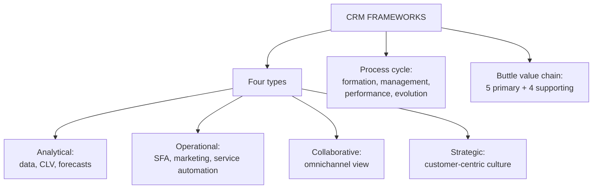

# CF-3: CRM Conceptual Frameworks

Covers: the four types of CRM (analytical, operational, collaborative, strategic), the CRM process framework (formation, management and governance, performance, evolution) and the CRM value chain. **(syllabus)**

## Where this fits in the ESE

The four types of CRM are the most repeated topic in the deck: they return in Unit 2 as "CRM architecture". Expect "Explain the types of CRM with examples" as a 5- or 10-marker. The process framework and value chain are 5-mark add-ons or part of a 10-mark "conceptual framework" answer.

## What a conceptual framework is (class)

A conceptual framework gives a **structural approach** to understanding and implementing the management of customer relationships. It outlines the key components and processes involved in creating and maintaining relationships. The faculty splits it into **four foundational pillars** that drive marketing efficiency and effectiveness. **(syllabus)**

## The four types of CRM (class)

The deck runs one example through all four: a clothing retailer and a repeat customer who bought 5 kurtis in 8 months, always in festival sales, spending about ₹4,000 a visit.

| Type | One-line meaning | Typical tools | Deck example |
|---|---|---|---|
| **Analytical** | Captures, stores and analyses customer data to find patterns, calculate CLV and forecast demand | Data warehouse, data mining | The CRM flags her as ethnic-wear focused, festival driven, high value, and predicts she may spend ₹50,000 over five years |
| **Operational** | Handles front-office, customer-facing processes | Sales force automation, marketing automation, service automation | The salesperson sees past purchases, size, brands, reward points, birthday and greets her; after purchase the invoice, points update and thank-you SMS and email are automatic |
| **Collaborative** | Seamless communication across channels, one omnichannel view of the customer | Email, web, social media, physical store integration | Her store, online and social interactions all feed one view |
| **Strategic** | Builds a customer-centric culture; aligns organisational goals with acquiring, retaining and developing profitable relationships with key segments | Strategy, loyalty design, culture | The firm asks "How can we keep her shopping for the next 10 years?" and adds loyalty programme, birthday wishes, previews for premium customers, quick complaint resolution, feedback-led design |

### Reading the examples correctly

- The deck's "Business decision" box (send festival offers, recommend new ethnic collections, stock more ethnic wear before festivals) sits on the **strategic** slides, after the analytical output. Your Obsidian note places that example under **collaborative CRM**. Follow the slides: use it as the strategic (or analytical-to-action) example, and for collaborative CRM use the channel-integration idea. The deck gives no separate collaborative example.
- The ₹50,000 figure is stated by the deck as the CRM model's output. It cannot be derived from the data shown: 5 visits × ₹4,000 = ₹20,000 in 8 months, which is ₹30,000 a year and ₹1,50,000 over five years at simple extrapolation of revenue. A CLV model that applies margin, falling retention and discounting gives a much lower number (see CV-2). In the exam say "the CRM model predicts about ₹50,000" and do not try to rebuild it.

### Two quick contrasts

| Pair | Difference |
|---|---|
| Analytical vs operational | Analytical works on stored data to produce insight (back office); operational uses insight in live customer contact (front office) |
| Collaborative vs strategic | Collaborative is about channels and sharing; strategic is about culture and long-term goals |

## CRM process framework (student notes, from the slide figure)

The slide heading "CRM Process Framework" carries a figure that the text export lost, so this comes from your notes. It is a cycle: **Formation → Management and Governance → Performance → Evolution**, feeding back into formation.

- **Formation:** *Purpose* (effectiveness, efficiency) shapes the *Program* (features, offerings), informed by *Partners* (selection criteria and process).
- **Management and governance:** the programme runs through team structure, role specification, communication, common bonds, planning process, process alignment, employee motivation and monitoring process.
- **Performance:** measured against strategic, financial and marketing goals (loyalty, satisfaction).
- **Evolution:** results decide whether the programme is enhanced or terminated; the cycle restarts.

Why it matters: it shows CRM as continuous, not a one-time rollout (myth 3 in CF-5, and the iterative view in CI-1).

## CRM value chain (Buttle) (textbook)

- **Primary stages:** customer portfolio analysis → customer intimacy → network development → value proposition development → managing the customer lifecycle.
- **Supporting conditions:** leadership and culture, data and IT, people, processes.

Use it as the alternative framework when a question says "explain any framework for CRM".

## Worked answer: "Explain the four types of CRM with an example" (10 marks)

1. Intro: CRM has four pillars; one retailer example runs through all four.
2. Analytical: data warehouse and mining; patterns, CLV, demand forecast; the customer flagged as festival-driven and high value.
3. Operational: SFA, marketing and service automation; salesperson greets with history and points; automatic invoice and SMS.
4. Collaborative: email, web, social and store channels unified into one omnichannel view.
5. Strategic: customer-centric culture; "keep her for 10 years"; loyalty programme, previews, quick complaint resolution.
6. Table: type, focus, tools, example (as above).
7. Interpretation: the types depend on each other. Analytical insight drives operational action, collaborative integration feeds the data, and strategic intent decides what the other three are for.

## What to remember

- Four types: analytical, operational, collaborative, strategic.
- Analytical = data and insight; operational = front-office automation (SFA, marketing, service); collaborative = omnichannel integration; strategic = customer-centric culture.
- The business-decision example belongs with strategic on the slides, not collaborative.
- Process framework cycle: formation, management and governance, performance, evolution.
- Buttle value chain: five primary stages plus four supporting conditions.

## Concept map

## Flashcards
Q: Name the four types of CRM.
A: Analytical, operational, collaborative and strategic CRM.

Q: What does analytical CRM do?
A: Captures, stores and analyses customer data with data warehouses and data mining to find purchasing patterns, calculate CLV and forecast demand.

Q: What three automations sit under operational CRM?
A: Sales force automation, marketing automation and service automation.

Q: What is collaborative CRM?
A: Seamless communication across channels (email, web, social media, physical retail) to give a unified omnichannel view of the customer.

Q: What is the aim of strategic CRM?
A: A customer-centric culture that aligns organisational goals with acquiring, retaining and developing profitable relationships with key segments.

Q: Give the stages of the CRM process framework.
A: Formation, management and governance, performance, evolution (then back to formation).

Q: What are the primary stages of Buttle's CRM value chain?
A: Customer portfolio analysis, customer intimacy, network development, value proposition development, managing the customer lifecycle.

Q: Where does the slides' "business decision" example sit, and what did your note do?
A: On the slides it follows the analytical output under strategic CRM; your note put it under collaborative CRM, which the slides do not support.

## Sources
- Faculty deck CRM Unit 1 (types of CRM); student notes on frameworks; Buttle and Maklan (textbook)
- Next node: [[CRM Unit 1 - CF-4 Value Pyramid Interaction Cycle and Customer Experience]]
- [[CRM Unit 1 - Foundations MOC (Node Map)]]
