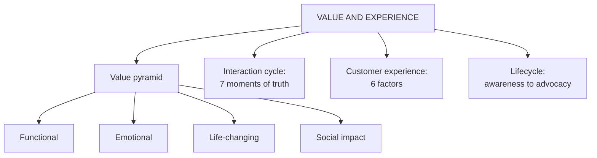

# CF-4: Value Pyramid, Interaction Cycle and Customer Experience

Covers: the four-tier customer value pyramid, the customer interaction cycle and moments of truth, customer experience and its six factors, and the five-stage customer lifecycle. **(syllabus)**

## Where this fits in the ESE

Four separate faculty definitions live here, so this node feeds several 5-markers: "Explain the customer value pyramid", "Define customer experience and list its factors", "Explain the customer lifecycle". The three sequences (lifecycle, interaction cycle, journey in SO-4) are easy to mix up, so a comparison question is possible.

## Customer value pyramid (class)

It explains the levels of value a product or service gives. **The higher you go, the more value the customer perceives, and the stronger and harder to copy the relationship becomes.** The bottom is the basic value every product must give. **(syllabus)**

| Tier (bottom to top) | Question | Meaning |
|---|---|---|
| **Functional value** (foundation) | What does it do? | Does the job, solves the basic problem. Minimum expectation of every customer |
| **Emotional value** | How does it make me feel? | Customer buys for the feeling as well as function |
| **Life-changing value** | How does it improve my life or future? | Helps achieve important personal goals; more than useful |
| **Social impact** | How does it benefit society or environment? | Purchase contributes to something bigger than personal benefit |

Example in your notes: a motorcycle maker that moves its message from engine specifications (functional) to "for people who choose their own path" (emotional and aspirational) builds a deeper bond. This is a qualitative brand illustration. The four-tier pyramid is modelled on Bain and Company's Elements of Value. **(textbook)**

Trap: the pyramid is **value tiers**, not customer segments and not loyalty rungs (that is the ladder in CF-2).

## Customer interaction cycle (class definition, stages from notes)

**Definition (class):** the sequence of interactions between a customer and a business through the customer's journey, from first contact, through purchase and service, to long-term loyalty and advocacy. It is a fundamental CRM concept.

**Stages (student notes, seven):** awareness → consideration → purchase → product use → customer support → loyalty → repeat purchase (cycle renews).

Each contact is a **moment of truth**, an opportunity to build or damage the relationship. The term comes from Jan Carlzon of SAS Airlines. **(textbook)** A single bad moment (a broken checkout) can offset strong value delivered elsewhere, so assess CRM across the whole cycle.

How the two fit: the pyramid says **what** to deliver; the interaction cycle says **where and when**.

## Customer experience (class)

**Customer experience (CX)** is the overall impression and feeling a customer has after interacting with a company across touchpoints before, during and after a purchase.

**Six factors (class):** product quality, employee behaviour (empathy, active listening, first-contact resolution), convenience, speed, personalisation, after-sales service.

**Why it matters (class):** higher satisfaction, repeat purchases, positive reviews, brand loyalty, word-of-mouth.

Example: buying a phone online. Genuine product and honest reviews (quality), polite delivery and support (employee behaviour), shop and track any time (convenience), next-day delivery (speed), accessory suggestions from browsing history (personalisation), easy returns (after-sales). Together they give satisfaction → loyalty → reviews → referrals → repeat purchase.

CX is wider than service: service is one input among many.

## Customer lifecycle (class)

The journey from awareness of a business to becoming a loyal customer and brand advocate. **Five stages (class):** awareness/reach → acquisition/consideration → conversion/purchase → retention/engagement → loyalty/advocacy. It underpins customer lifecycle management and the CLV calculation (CV-2).

Supporting models (student notes, textbook): **AIDA** (attention, interest, desire, action) for top-of-funnel communication; **RACE** (reach, act, convert, engage) for digital workflows.

## Three sequences, do not mix them

| Sequence | Stages | Source |
|---|---|---|
| Customer lifecycle | Awareness, acquisition, conversion, retention, loyalty (5) | CF-4, class |
| Interaction cycle | Awareness, consideration, purchase, product use, support, loyalty, repeat purchase (7) | CF-4, notes |
| Journey phases | Awareness, acquisition, onboarding, engagement, retention, advocacy (6) | SO-4, class |

Managerial use: different stages need different KPIs (acquisition: conversion rate and cost per acquisition; retention: churn and NPS; advocacy: referral rate). Discount-heavy offers aimed at retained customers can erode margin without building loyalty. **(student notes)**

## Worked answer: "Explain customer experience and the factors that shape it" (5 marks)

1. Define CX in the class words (overall impression across touchpoints, before, during, after purchase).
2. List the six factors with a half-line each.
3. One example (online phone purchase) showing the factors working together.
4. Outcome chain: satisfaction, repeat purchase, reviews, loyalty, referrals.
5. Interpretation: CX is broader than service, and the weakest touchpoint sets the experience.

## What to remember

- Pyramid tiers: functional, emotional, life-changing, social impact. Higher means stronger and harder to copy.
- Interaction cycle is the sequence of contacts; each is a moment of truth (Carlzon).
- CX = overall impression across touchpoints; six factors: quality, employee behaviour, convenience, speed, personalisation, after-sales.
- Lifecycle has five stages from awareness to loyalty and advocacy.
- Lifecycle (5), interaction cycle (7) and journey (6) are different lists.

## Concept map

## Flashcards
Q: List the four tiers of the customer value pyramid, bottom to top.
A: Functional value, emotional value, life-changing value, social impact.

Q: What does moving up the value pyramid do?
A: Customers perceive more value and the relationship becomes stronger and harder for competitors to copy.

Q: Define the customer interaction cycle.
A: The sequence of interactions between a customer and a business from first contact, through purchase and service, to long-term loyalty and advocacy.

Q: What is a moment of truth?
A: Any customer contact that can reinforce or damage the relationship (Jan Carlzon, SAS).

Q: Define customer experience.
A: The overall impression and feeling a customer has after interacting with a company across touchpoints before, during and after purchase.

Q: Name the six factors that influence customer experience.
A: Product quality, employee behaviour, convenience, speed, personalisation, after-sales service.

Q: Name the five stages of the customer lifecycle.
A: Awareness/reach, acquisition/consideration, conversion/purchase, retention/engagement, loyalty/advocacy.

Q: What do AIDA and RACE stand for?
A: AIDA: attention, interest, desire, action. RACE: reach, act, convert, engage.

## Sources
- Faculty deck CRM Unit 1; student notes; Bain Elements of Value, Carlzon, Chaffey (textbook)
- Next node: [[CRM Unit 1 - CF-5 CRM Myths and Strategic Challenges]]
- [[CRM Unit 1 - Foundations MOC (Node Map)]]
