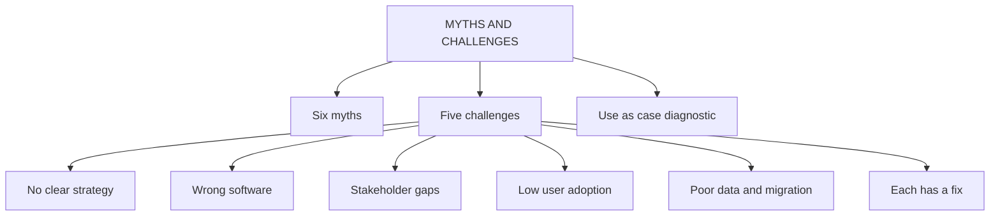

# CF-5: CRM Myths and Strategic Challenges

Covers: the six CRM myths, the five strategic challenges with the faculty's fixes, and how to use both as a diagnostic checklist in a case. **(syllabus)**

## Where this fits in the ESE

This is the node to rehearse for the 15-mark case. The faculty lists exactly six myths and five challenges, each challenge with a fix. A 5-marker "Discuss the challenges in CRM implementation" is likely; a case that asks "why is this CRM failing?" is answered by matching the symptoms to these five.

## Six CRM myths (class)

| Myth | Reality (use as your rebuttal) |
|---|---|
| CRM is only for large enterprises | Modern solutions scale down to small and mid-sized firms (student notes) |
| CRM systems are too complicated and time-consuming | Today's platforms allow phased rollout, though training is still needed |
| CRM implementation is a one-time project | It is continuous and cyclical (formation, management, performance, evolution; CF-3) |
| CRM guarantees instant success | Loyalty and ROI come from consistently delivered value and trust, not installed software |
| CRM software is too expensive | Tiered pricing and free entry versions exist |
| CRM is just for sales teams | Marketing, service and operations use the same data; a sales-only view recreates silos |

Exam use: pick any three or four, state the myth in one line and the reality in one line. Do not just list them.

## Five strategic challenges and fixes (class)

| # | Challenge | What goes wrong | How to overcome (class) |
|---|---|---|---|
| 1 | **Lack of a clear CRM strategy** | Firms start implementing without goals | Define objectives (retention, lead tracking, sales growth) and align with business strategy |
| 2 | **Wrong type of CRM software chosen and implemented** | A poor fit is one of the biggest causes of failure; too little research at selection | Invest research effort in evaluating options against actual requirements (student notes) |
| 3 | **Insufficient stakeholder involvement** | Leadership, department heads and users not engaged, so no direction or support | Involve key stakeholders early and throughout; regular IT, sales, marketing, service meetings; appoint a CRM champion or steering committee |
| 4 | **Low user adoption** | Resistance, no training or a complex interface; the best CRM is useless if unused | User-friendly software, hands-on training and continuous support, communicate the value |
| 5 | **Poor data quality and migration issues** | "Bad data in, bad data out"; incomplete, outdated, inconsistent data moved across | Data audit before migration; cleanse and deduplicate |

Memory hook: **S-W-S-U-D**: Strategy, Wrong software, Stakeholders, User adoption, Data.

## How to use the lists in a case

1. Read the case for symptoms: no stated goal, new system but staff use spreadsheets, two records of one customer, a tool bought on a vendor's pitch.
2. Match each symptom to a challenge (table above). Name the challenge in your answer.
3. Rebut any myth the management holds ("the software will fix it", "CRM is for the sales team").
4. Give the class fix for each, then one measurable KPI to track it (adoption rate, duplicate rate, retention).
5. Close with interpretation: the real problem is rarely "lack of software"; it is strategy, people or data.

Example (fictional): a furniture retailer (fictional) bought a CRM after a vendor demo. Sales staff still log calls in personal sheets and the website, store and call-centre each hold a different record for the same buyer. Diagnosis: challenge 2 (software chosen without research), challenge 4 (low adoption), challenge 5 (duplicate data), challenge 1 (no stated objective).

## Traps

- Myths are **beliefs to rebut**; challenges are **real obstacles to fix**. Do not blur them.
- The wrong-software challenge is about **selection and implementation fit**, not about software being bad.
- Challenges 3 and 4 differ: stakeholders are leaders and managers who sponsor; users are the people who operate the system daily.

## What to remember

- Six myths: large firms only, too complicated, one-time project, instant success, too expensive, sales-only.
- Five challenges: no strategy, wrong software, stakeholder gaps, low adoption, poor data.
- Every challenge comes with a fix: say the fix, not just the problem.
- "Bad data in, bad data out" is the phrase for the data challenge.
- In a case, diagnose first, then prescribe.

## Concept map

## Flashcards
Q: List the six CRM myths.
A: Only for large enterprises; too complicated and time-consuming; a one-time project; guarantees instant success; too expensive; just for sales teams.

Q: Why is "CRM is a one-time project" a myth?
A: CRM is continuous: formation, management and governance, performance and evolution repeat, and needs ongoing measurement.

Q: List the five strategic challenges in CRM implementation.
A: Lack of a clear strategy, wrong software chosen and implemented, insufficient stakeholder involvement, low user adoption, poor data quality and migration issues.

Q: Fix for a lack of clear CRM strategy?
A: Define CRM objectives such as retention, lead tracking and sales growth, and align the CRM with the broader business strategy.

Q: Fix for insufficient stakeholder involvement?
A: Involve key stakeholders early and throughout, hold regular alignment meetings between IT, sales, marketing and service, and appoint a CRM champion or steering committee.

Q: Fix for low user adoption?
A: Choose user-friendly software, give hands-on training and continuous support, and communicate the value of CRM.

Q: Fix for poor data quality and migration issues?
A: Run a data audit before migration, and cleanse and deduplicate the data.

Q: What is the one-line rule for diagnosing a failing CRM in a case?
A: Match each symptom to a challenge, rebut the myth behind it, give the fix and a KPI, and conclude that the problem is rarely just missing software.

## Sources
- Faculty deck CRM Unit 1 (myths, challenges); student notes
- Next node: [[CRM Unit 1 - CF-6 Unit 1 Exam Answers]]
- [[CRM Unit 1 - Foundations MOC (Node Map)]]
