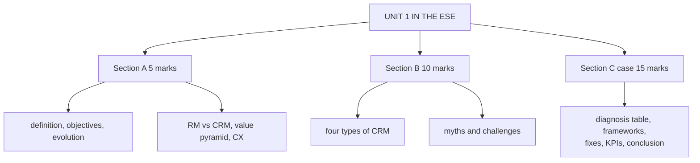

# CF-6: Unit 1 Exam Answers

Covers: what the ESE is likely to ask from Unit 1, 5-mark and 10-mark skeletons, and a 15-mark case layout with a model answer. Content comes from CF-1 to CF-5.

## What the test will ask

Assumed ESE (matching the other subjects; there is no CRM course plan PDF): Section A 3 × 5 with choice, Section B 2 × 10 with choice, Section C one compulsory 15-mark case, 50 marks. Unit 1 is theory only. Expect a definition-plus-types question in Section A or B, and a diagnosis case (why a CRM initiative is failing) in Section C.

## Five-mark answer skeletons

**1. Define CRM and state its objectives (CF-1).** Class definition (interactions, current and potential customers, strategies, processes, technology) → five objectives with a half-line "how" each → one-line closing on process, not software.

**2. Evolution of CRM (CF-1).** Eight eras in three groups (transaction, relationship, technology) → one example each → driver (acquisition cost, competition, IT).

**3. Relationship marketing vs CRM (CF-2).** Philosophy versus technology and process → table of four rows → example → closing line.

**4. Customer value pyramid (CF-4).** Purpose, four tiers with the question each answers, direction of increasing stickiness, one brand example.

**5. Customer experience and its factors (CF-4).** Definition → six factors → outcome chain.

**6. Challenges in CRM implementation (CF-5).** Five challenges, each with its class fix, ending with "problem is rarely software".

## Ten-mark answer skeletons

**A. Four types of CRM with examples (CF-3).** Intro with the running retailer example → analytical, operational, collaborative, strategic (definition, tools, example) → comparison table → how the four depend on each other → close.

**B. Relationship marketing theory and models (CF-2).** Definition and principles → commitment-trust → six markets → ladder of loyalty → link to CRM.

**C. CRM myths and challenges (CF-5).** Four myths with rebuttals → five challenges with fixes → diagnostic use → conclusion on strategy, people, data.

**D. Customer value, interaction cycle and experience (CF-4).** Pyramid → interaction cycle and moments of truth → CX factors → lifecycle → how the four fit together (what to deliver, where and when, how it is perceived).

## Fifteen-mark case layout (diagnose and prescribe)

1. **Facts and diagnosis (5):** list symptoms from the case; map each to a challenge (CF-5) and, where management holds a belief, a myth.
2. **Framework application (4):** name which CRM types are missing or weak (analytical, operational, collaborative, strategic) and where the customer lifecycle breaks.
3. **Recommendations (4):** one fix per diagnosed challenge using class wording, plus phase order.
4. **Measures and conclusion (2):** three KPIs and one interpretation line.

### Model answer, laid out as the exam answer

**Case (fictional):** *UrbanLoom (fictional)*, an online home-textile seller, bought a CRM tool after a vendor demonstration. Six months later the sales team still keeps leads in personal spreadsheets, the website, the stores and the call centre each hold a different record for the same buyer, no one can say what the CRM was meant to achieve, and the owner says "CRM is a sales tool, so only the sales team needs it". Repeat purchases have not improved. Illustrative figures are not needed to answer.

1. **Diagnosis**
| Symptom | Challenge or myth (CF-5) |
|---|---|
| No stated purpose | Challenge 1: lack of a clear CRM strategy |
| Tool bought after a demo | Challenge 2: wrong software chosen without research |
| Staff keep using spreadsheets | Challenge 4: low user adoption |
| Different record in each channel | Challenge 5: poor data quality (duplicates, silos) |
| "Only sales needs it" | Myth 6: CRM is just for sales teams |
| Owner and managers not engaged | Challenge 3: stakeholder involvement |

2. **Frameworks (CF-3, CF-4):** operational CRM is partly in place (the tool exists) but unused; analytical CRM is impossible without a clean single record; collaborative CRM (omnichannel view) is missing because channels hold separate records; strategic CRM (customer-centric aim) is missing because no goal was set. In the lifecycle, the break is at **retention**: customers convert but are not engaged after purchase.
3. **Recommendations (class fixes):**
   - Define objectives (for example repeat-purchase rate) and align with business strategy.
   - Re-evaluate the tool against actual requirements before expanding it.
   - Appoint a CRM champion or steering committee with the owner, sales, marketing, service and IT.
   - Give hands-on training, make the CRM the only place to log leads, and communicate the benefit.
   - Run a data audit, then cleanse and deduplicate before any migration.
4. **Measures:** user adoption rate, duplicate-record rate, repeat-purchase rate (track monthly).

Close with: *the real problem is strategy, people and data, not the absence of software; buying the tool was step one, not the solution.*

## Time rule

In a case, spend the first third on the diagnosis table (it carries the marks), the middle on fixes, and finish with one line of interpretation.

## What to remember

- Unit 1 is all theory: definition, objectives, evolution, relationship marketing, four types, value and experience, myths and challenges.
- Section B favourites: four types of CRM; relationship marketing; myths and challenges.
- Case answer shape: diagnosis table, framework gaps, class fixes, KPIs, interpretation.
- Always state the fix next to the challenge.

## Concept map

## Flashcards
Q: What is the shape of a Unit 1 case answer?
A: Diagnosis table (symptom to challenge or myth), framework gaps, class fixes, KPIs, and a closing interpretation.

Q: Which sentence must appear in a relationship marketing versus CRM answer?
A: Relationship marketing is the philosophy or strategy; CRM is the technology and processes used to implement it.

Q: Skeleton for the 10-mark four types of CRM answer?
A: Intro and running example, analytical, operational, collaborative, strategic (definition, tools, example), comparison table, how they depend on each other, close.

Q: Which challenge does "staff still use personal spreadsheets" map to?
A: Low user adoption (challenge 4).

Q: Which challenge does "different record in each channel" map to?
A: Poor data quality and migration issues (challenge 5), a symptom of data silos.

Q: What closing line works for most Unit 1 cases?
A: The real problem is strategy, people and data, not the absence of software.

## Sources
- Assumed ESE pattern; CF-1 to CF-5
- [[CRM Unit 1 - Foundations MOC (Node Map)]]
