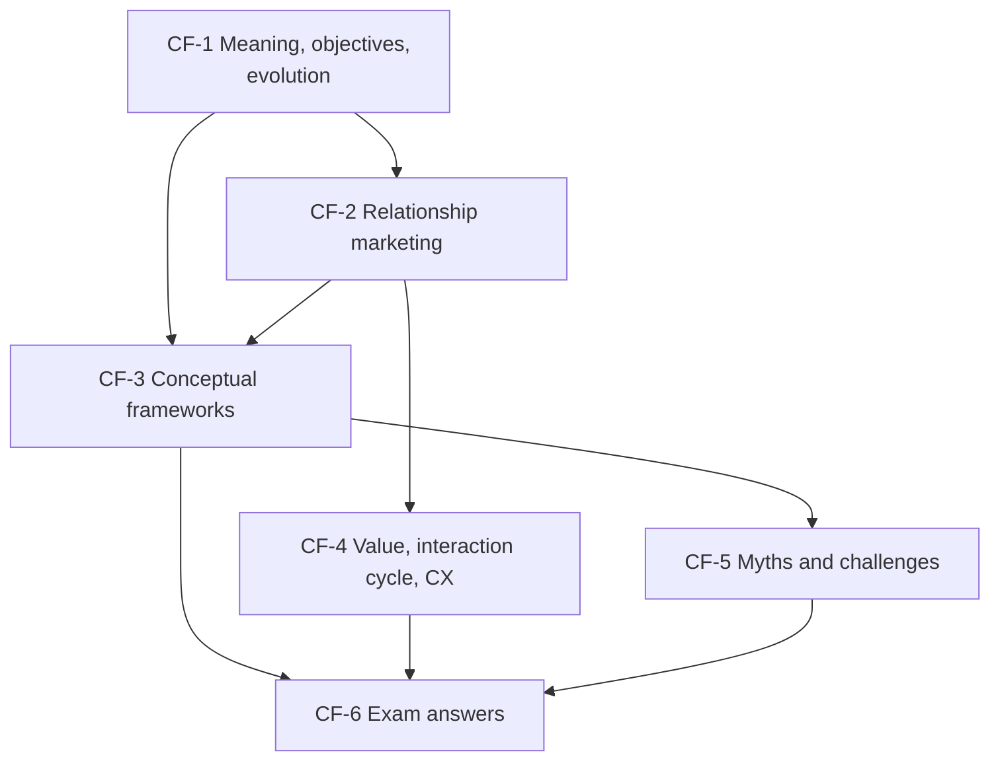

# CRM Unit 1: Foundations of CRM, node map

ESE (assumed, no course plan PDF): 50 marks, Section A 3 × 5, Section B 2 × 10, Section C one compulsory 15-mark case. Unit 1 is theory only: definitions, frameworks and diagnosis. Examples are **illustrative**; fictional firms are marked.

## Nodes

| Node | Topic | Deps | Minutes | Exam focus |
|---|---|---|---|---|
| CF-1 | CRM Meaning, Objectives and Evolution | none | 30 | yes |
| CF-2 | Relationship Marketing Theory | CF-1 | 30 | yes |
| CF-3 | CRM Conceptual Frameworks | CF-1, CF-2 | 35 | yes |
| CF-4 | Value Pyramid, Interaction Cycle and Customer Experience | CF-1, CF-2 | 35 | yes |
| CF-5 | CRM Myths and Strategic Challenges | CF-1, CF-3 | 25 | yes |
| CF-6 | Unit 1 Exam Answers | CF-1 to CF-5 | 25 | yes |

Total reading time: about 180 minutes.

## Dependency graph

## Key frameworks and facts to know

- Class definition: managing interactions and relationships with current and potential customers using strategies, processes and technology.
- Five objectives: attract, retain, satisfy and build loyalty, increase sales and profit, serve better.
- Eight eras: product, sales, marketing, relationship marketing, technology-based, e-CRM, social, AI-driven.
- Relationship marketing is the philosophy; CRM is the technology and processes.
- Four types: analytical, operational, collaborative, strategic.
- Process cycle: formation, management and governance, performance, evolution.
- Value pyramid: functional, emotional, life-changing, social impact. CX factors: six. Lifecycle: five stages.
- Six myths and five challenges with fixes (strategy, software, stakeholders, adoption, data).

## Links
- [[CRM MOC]]
