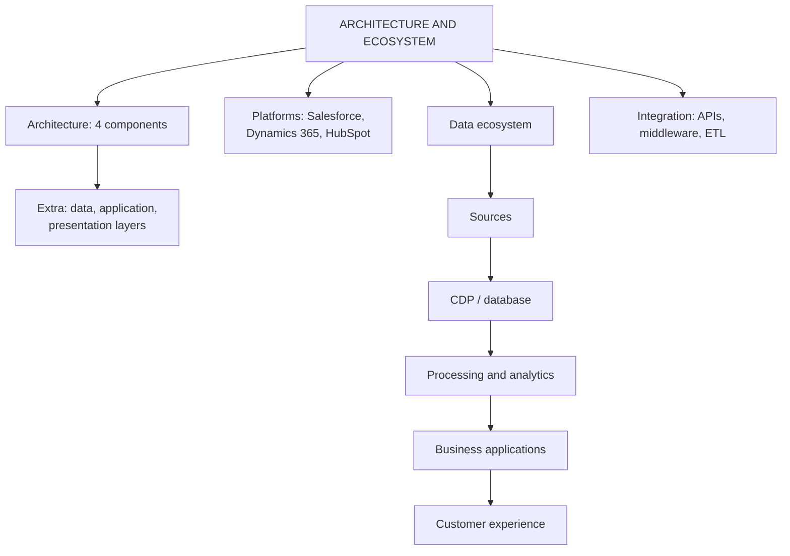

# CD-1: CRM Architecture, Platforms and Data Ecosystem

Covers: CRM architecture and its four components, the three-layer view, popular CRM platforms, the five-component customer data ecosystem and how systems are integrated. **(syllabus)**

## Where this fits in the ESE

ESE (assumed): 3 × 5, 2 × 10, one 15-mark case. Architecture repeats the four types from CF-3, so it is easy marks. "Explain the customer data ecosystem" and "Compare Salesforce, Dynamics 365 and HubSpot" are both 5-mark shapes. In the case, architecture is the lens for "why can the firm not see one customer?".

## CRM architecture (class)

**CRM architecture** is the overall framework or structure of a CRM system that shows how customer information is **collected, stored, analysed and used** by different departments to improve customer relationships. **(syllabus)**

The faculty lists four components: **analytical, operational, collaborative, strategic CRM**. Their definitions are exactly those in CF-3 (same festival-shopper example). Do not re-invent them here; write them in one line each and add the architecture angle:

| Component | Architecture role |
|---|---|
| Analytical | Back-end: data warehouse and mining turn stored data into insight |
| Operational | Front-end: SFA, marketing and service automation used in daily contact |
| Collaborative | Channel layer: email, web, social, store feed one omnichannel view |
| Strategic | Direction: customer-centric goals decide what gets built |

### Three-layer view (student notes, textbook)

Not on the slides. A broader view that places the four types inside one layer:

- **Data layer:** transaction records, interaction logs, third-party data, held in a data warehouse or customer data platform (CDP).
- **Application layer:** the four CRM types.
- **Presentation layer:** dashboards, reports, alerts that carry insight to decision makers (see CD-4).

If a question says "architecture", give the faculty four components first, then add the three layers as an extra. **(textbook)**

## Popular CRM platforms (class)

| Platform | Points on the slide |
|---|---|
| **Salesforce** | Comprehensive, many customisation options; products for sales, service, marketing; strong integration with other tools |
| **Microsoft Dynamics 365** | Integrated suite combining CRM and ERP; works with Office 365 and Azure; AI-driven insights and predictive analytics |
| **HubSpot** | User-friendly; inbound marketing and sales focus; free CRM with paid add-ons; content management and lead nurturing |

Choosing one: match to need (large customisable estate: Salesforce; firms already on Microsoft tools or wanting CRM and ERP together: Dynamics; small team starting inbound marketing: HubSpot). This is the "wrong software" challenge from CF-5 in reverse. **(textbook)** for the selection logic.

## Customer data ecosystem (class)

**Definition (class):** a network of people, technologies, systems and data sources that work together to collect, integrate, store, analyse and use customer data to give a better customer experience. **(syllabus)**

Five components, in flow order:

| # | Component | What it holds or does | Slide examples |
|---|---|---|---|
| 1 | **Customer data sources** | Where information is collected | Website, social media, e-commerce platforms, physical stores |
| 2 | **CDP / CRM database** | All customer information in one central place | Name, age, contact details, search and purchase history, payment method, preferences, complaints, browsing time, wishlist |
| 3 | **Data processing and analytics** | Analyses the stored data | Buying patterns, CLV, segments, churn prediction |
| 4 | **Business applications** | Departments use the analysed data | Marketing: personalised campaigns; sales: selling; service: complaints; operations: inventory planning; management: reports and trends |
| 5 | **Customer experience** | The output the customer receives | Personalised recommendations, faster service, relevant offers |

Memory hook: **Sources → Store → Study → Serve (applications) → Satisfy (experience)**.

## Integration mechanisms (student notes, textbook)

- **APIs:** let systems (an e-commerce platform and the CRM) exchange data in real time.
- **Middleware and ETL (extract, transform, load):** move and standardise data between systems; the "glue" (see CV-1).
- Cloud CRM platforms increasingly offer ready-made integration marketplaces.

## Why architecture matters

A fragmented architecture is among the most common root causes of CRM failure (CI-2). The architecture decides whether the firm reaches analytical capability (prediction) or stays at basic record-keeping.

## Worked answer: "Explain the customer data ecosystem with an example" (5 marks)

1. Define it in the class words (network of people, technology, systems, data sources, to give a better experience).
2. Five components in flow order with one slide example each.
3. Running example: an online fashion store (fictional): data from website, app and stores → central database → analysis finds a festival-buying segment and churn risk → marketing sends a festival offer, operations stocks ahead → customer receives a relevant offer and faster delivery.
4. Interpretation: the chain is only as strong as its weakest component; poor data at step 2 spoils steps 3 to 5.

## Traps

- Architecture (structure of the system) is not the same as the ecosystem (flow of data from source to experience). Both appear in the unit.
- CDP and CRM database are written together on the slide as one component; do not list them as two.
- The three-layer view is not faculty content; present it as an extra.

## What to remember

- Architecture = how customer information is collected, stored, analysed and used; four components = four types of CRM.
- Three layers (extra): data, application, presentation.
- Platforms: Salesforce (customisable, broad), Dynamics 365 (CRM plus ERP, Microsoft, AI), HubSpot (user-friendly, inbound, free tier).
- Ecosystem components: data sources, CDP/CRM database, processing and analytics, business applications, customer experience.
- APIs and middleware or ETL connect the pieces.

## Concept map

## Flashcards
Q: Define CRM architecture.
A: The overall framework of a CRM system showing how customer information is collected, stored, analysed and used by different departments to improve relationships.

Q: Name the four components of CRM architecture.
A: Analytical, operational, collaborative and strategic CRM.

Q: What are the three layers in the broader view of CRM architecture?
A: Data layer, application layer, presentation layer (an extra beyond the faculty slides).

Q: What does Microsoft Dynamics 365 combine?
A: CRM and ERP in one suite, integrated with Office 365 and Azure, with AI-driven insights and predictive analytics.

Q: What is HubSpot known for on the slides?
A: User-friendly CRM focused on inbound marketing and sales, a free CRM with paid add-ons, and lead nurturing.

Q: Name the five components of the customer data ecosystem.
A: Customer data sources, CDP or CRM database, data processing and analytics, business applications, customer experience.

Q: What does the processing and analytics component produce?
A: Customer buying patterns, CLV, customer segments and churn predictions.

Q: What do APIs and middleware do?
A: APIs let systems exchange data in real time; middleware and ETL move and standardise data between systems.

## Sources
- Faculty deck CRM Unit 2; student notes; Buttle and Maklan (textbook)
- Next node: [[CRM Unit 2 - CD-2 Customer Databases and Data Quality]]
- [[CRM Unit 2 - Customer Data MOC (Node Map)]]
