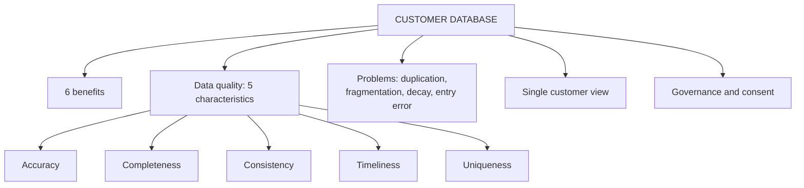

# CD-2: Customer Databases and Data Quality

Covers: what a customer database is and what it gives the firm, the five characteristics of high-quality data, single customer view, common data problems and data governance. **(syllabus)**

## Where this fits in the ESE

"Explain the characteristics of high-quality customer data" is a near-certain 5-marker because the faculty gives a fixed list. In the case, data quality is the most common hidden problem (see CF-5 challenge 5, CI-2). The development and integration of databases is covered in CV-1.

## Customer database (class)

A **customer database** is a centralised collection of customer information that stores all relevant details in one place. It lets the firm understand needs, personalise services and build long-term relationships. **A CRM is only as effective as the quality of the data it holds.** **(syllabus)**

**Benefits (class, six):**
1. Stores all customer information in one place.
2. Helps personalise products and services.
3. Improves customer service.
4. Supports targeted marketing campaigns.
5. Increases customer retention.
6. Helps managers make informed decisions.

Typical contents (student notes): identifying data, transaction history, interaction history, preferences and behaviour. It is the backbone of operational CRM (daily servicing) and analytical CRM (insight).

## Data quality (class)

**Definition (class):** the accuracy, completeness, consistency, reliability and timeliness of data held in the customer database; correct, complete, up to date and reliable so that better decisions can be made.

### Five characteristics of high-quality data (class)

| Characteristic | Meaning | What fails if absent |
|---|---|---|
| **Accuracy** | Information is correct | Wrong address or amount, so wrong action |
| **Completeness** | No important information missing | A missing contact channel blocks follow-up |
| **Consistency** | Same information everywhere across systems | Mismatch between systems signals a data silo |
| **Timeliness** | Data always updated | Stale data sends campaigns to the wrong people |
| **Uniqueness** | Each customer has one record only | Duplicates split history and distort CLV |

Note on the slide wording: the definition uses the word **reliability**, but the list of five characteristics uses **uniqueness** instead. Learn the five in the table for the list. Some data-management books add **validity** (conforms to format rules, such as valid email syntax) as a sixth. **(textbook)** Give the five and mention validity as an extra only if time allows.

Memory hook: **A-C-C-T-U**: Accuracy, Completeness, Consistency, Timeliness, Uniqueness.

## Decay of data (student notes)

A commonly cited estimate is that customer databases **decay by about 2% a month** from changes of address, job and contact details. **[VERIFY]** the figure; it is an industry rule of thumb, not a measured constant. Illustrative arithmetic: a list of 50,000 records losing 2% of the remaining accurate records each month keeps about 39,236 accurate records after 12 months, so about 10,764 (21.5%) have decayed. Simple multiplication (2% × 12 = 24%, 12,000 records) overstates the loss because each month's 2% applies to what is left.

## Single customer view and golden record (student notes)

Consolidating all touchpoints into **one authoritative record per customer**. It is a prerequisite for segmentation, personalisation and omnichannel service. It is reached through deduplication, matching algorithms and master data management. The integration pipeline is in CV-1.

## Common data quality issues (student notes)

| Issue | Cause | Fix |
|---|---|---|
| Duplication | Disconnected entry points (store, web, call centre) | Matching and deduplication |
| Fragmentation | Touchpoints tracked in separate systems | Integration, single customer view |
| Decay | Customers change address, job, contact | Regular updates, annual audit |
| Human entry error | Manual entry at the till or call centre | Validation rules, drop-down fields |

## Data governance (student notes)

Formal policies that assign **ownership, access rights and quality standards** to customer data, increasingly tied to privacy and consent obligations. India's data protection law (the Digital Personal Data Protection Act, 2023) governs consent and use of personal data. **[VERIFY]** current rules and commencement status before quoting it. **(textbook)**

## Worked answer: "Discuss the characteristics of high-quality customer data" (5 marks)

1. Open with the class line: a CRM is only as effective as its data.
2. Table of five characteristics: meaning and consequence of failure (table above).
3. One example per weak point: a duplicate record splits a customer's purchase history and understates value.
4. One-line fix: data audit before migration, cleansing and deduplication, single customer view.
5. Interpretation: poor data undermines every downstream use, from segmentation to dashboards.

## What to remember

- Database = centralised collection of customer information; six benefits.
- Five characteristics: accuracy, completeness, consistency, timeliness, uniqueness.
- Slide definition mentions reliability; the list uses uniqueness.
- Single customer view = one record per customer; duplicates distort CLV.
- Governance = ownership, access and quality standards plus consent.

## Concept map

## Flashcards
Q: Define a customer database.
A: A centralised collection of customer information that stores all relevant details about customers in one place.

Q: Why is data quality the foundation of CRM?
A: A CRM system is only as effective as the quality of the data it contains.

Q: List the five characteristics of high-quality data.
A: Accuracy, completeness, consistency, timeliness, uniqueness.

Q: What does uniqueness mean for customer data?
A: Every customer should have only one record.

Q: What does a mismatch between systems signal?
A: A data silo problem (failure of consistency).

Q: What is a single customer view?
A: One authoritative record per customer that consolidates all touchpoints, reached by deduplication, matching and master data management.

Q: Name four common data quality issues.
A: Duplication, fragmentation, decay, and human entry error.

Q: Why does simple 2% × 12 overstate yearly data decay?
A: Each month's 2% applies only to records still accurate, so 12 months of decay is about 21.5%, not 24%.

## Sources
- Faculty deck CRM Unit 2; student notes; Buttle and Maklan (textbook)
- Next node: [[CRM Unit 2 - CD-3 Customer Profiling and Segmentation Analytics]]
- [[CRM Unit 2 - Customer Data MOC (Node Map)]]
