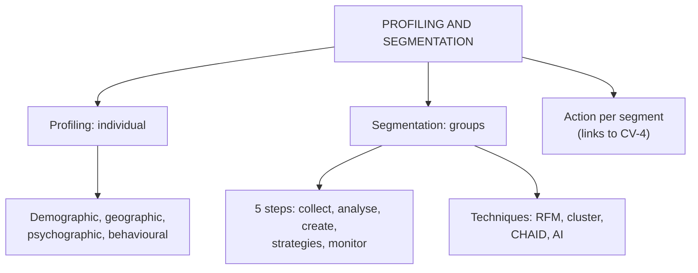

# CD-3: Customer Profiling and Segmentation Analytics

Covers: customer profiling and its four types, customer segmentation and the five-step process, profiling versus segmentation, and the techniques (RFM, clustering, CHAID, AI) with a worked RFM example. **(syllabus)**

## Where this fits in the ESE

"Distinguish customer profiling from customer segmentation" is a classic 5-marker (the deck has the table). "Explain the steps in customer segmentation analytics" is a 5- or 10-marker. RFM is a technique your notes add; a small RFM example is a sure way to show application in the case.

## Customer profiling (class)

**Customer profiling** is creating a detailed description of a customer from characteristics, preferences and buying behaviour. A profile answers: who is the customer, what do they buy, how often, how much do they spend, what are their interests, which products do they prefer.

Deck example: a supermarket studies one shopper: 28 years, software engineer, high income, shops every weekend, favourite products organic food, pays by UPI, uses the mobile app.

**Why profile (class):** understand needs, personalise recommendations, improve satisfaction, increase sales, build long-term relationships, design effective campaigns.

### Four types of profiling (class)

| Type | Data | Role |
|---|---|---|
| **Demographic** | Age, gender, income, education, occupation | Baseline traits |
| **Geographic** | Region, climate, cultural preferences | Local buying habits |
| **Psychographic** | Values, lifestyle, attitudes, interests | Explains **why** customers buy |
| **Behavioural** | Purchase history, browsing, brand engagement | Predicts future actions |

## Customer segmentation (class)

**Customer segmentation** divides customers into groups with similar characteristics, needs or behaviours, so the firm stops treating everyone the same.

### Five steps (class)

| Step | Action | Slide detail |
|---|---|---|
| 1 | Collect customer data | CRM, online purchases, loyalty cards, mobile apps, social media, feedback |
| 2 | Analyse the data | Purchase history, spending patterns, product preferences, visit frequency |
| 3 | Create segments | Group by common traits: premium, regular, discount seekers, new customers |
| 4 | Develop marketing strategies | Premium: exclusive membership; new: welcome discount; loyal: reward points; inactive: re-engagement offers |
| 5 | Monitor results | Sales growth, customer retention, customer satisfaction |

The deck's segment example uses a dollar amount ("spend more than $1,000 annually"). In an Indian exam, restate it in rupees (illustrative threshold such as ₹50,000 a year).

## Profiling versus segmentation (class)

| Customer profiling | Customer segmentation |
|---|---|
| Focuses on an **individual** customer | Focuses on **groups** of customers |
| Detailed description of a customer | Divides customers into similar groups |
| Helps personalise services | Helps design targeted campaigns |
| Example: one shopper's weekend habits | Example: students versus professionals |

Link: profiling data (demographic, geographic, psychographic, behavioural) is the input; segmentation aggregates it into actionable groups. **(student notes)**

## Segmentation techniques (student notes, textbook)

- **RFM analysis:** score customers on **R**ecency (how recently), **F**requency (how often), **M**onetary value (how much). Simple, widely used to find high-value customers.
- **Cluster analysis (for example k-means):** statistically groups similar customers with no preset categories.
- **CHAID / decision trees:** split customers by the variables that best predict an outcome such as churn or response.
- **AI and machine learning:** algorithms on large behavioural data find segments and predict responses at fine detail.

### Worked example: RFM scoring (illustrative)

Rule for the example (fictional firm, scores 1 to 5, 5 is best): total score = R + F + M. Segment: 12 to 15 high value; 8 to 11 core; below 8 low value.

| Customer | R | F | M | Total | Segment by total |
|---|---|---|---|---|---|
| C1 | 5 | 5 | 4 | 14 | High value |
| C2 | 4 | 3 | 3 | 10 | Core |
| C3 | 2 | 5 | 5 | 12 | High value |
| C4 | 1 | 1 | 2 | 4 | Low value |
| C5 | 5 | 1 | 1 | 7 | Low value |

**Decision and interpretation:**
1. C1 is the model customer: retain and reward.
2. C3 scores 12 only because of past frequency and spend; R = 2 means no recent purchase. Treat C3 as **high value at risk**: run a win-back offer first.
3. C5 bought recently but rarely and little: likely a new or trial customer; nurture with a second-purchase offer.
4. Lesson: **read R, F and M separately; the total alone hides risk**. Thresholds are set by the firm, not fixed.

## From segmentation to strategy

Segments create value only when each gets different action: distinct message, channel, offer or service level. They feed value-based segmentation (CV-4) and journey design (SO-4). Good segmentation needs good data and a single customer view (CD-2). Ethical use matters: avoid discriminatory targeting and respect consent. **(student notes)**

## Worked answer: "Explain the steps in customer segmentation analytics" (5 marks)

1. Define segmentation (grouping customers by similar characteristics, needs or behaviour).
2. Five steps with the slide sources and actions.
3. One example per segment (premium, new, loyal, inactive) and its strategy.
4. Mention RFM as a technique for step 3.
5. Interpretation: segmentation is useful only when each segment receives a different action and results are monitored.

## What to remember

- Profiling = one customer in detail; segmentation = groups for targeting.
- Four profiling types: demographic, geographic, psychographic (why), behavioural (predicts).
- Five steps: collect, analyse, create segments, develop strategies, monitor.
- RFM = recency, frequency, monetary; read the three scores separately.
- Techniques beyond RFM: clustering, CHAID, AI and machine learning.

## Concept map

## Flashcards
Q: Define customer profiling.
A: Creating a detailed description of a customer based on their characteristics, preferences and buying behaviour.

Q: Name the four types of customer profiling.
A: Demographic, geographic, psychographic and behavioural.

Q: Which profiling type explains why customers buy?
A: Psychographic profiling (values, lifestyle, attitudes, interests).

Q: List the five steps of customer segmentation analytics.
A: Collect data, analyse data, create segments, develop marketing strategies, monitor results.

Q: Distinguish profiling from segmentation in one line.
A: Profiling describes an individual customer; segmentation divides customers into groups with similar traits for targeted campaigns.

Q: What does RFM stand for?
A: Recency, frequency, monetary value.

Q: In the RFM example, why is customer C3 (R 2, F 5, M 5) treated as at risk?
A: The total of 12 hides a low recency score: the customer has not bought recently, so a win-back offer is needed.

Q: What makes a segmentation worthwhile?
A: Each segment receives different action (message, channel, offer or service) and results are monitored.

## Sources
- Faculty deck CRM Unit 2; student notes; Buttle and Maklan (textbook)
- Next node: [[CRM Unit 2 - CD-4 Business Intelligence and Dashboards]]
- [[CRM Unit 2 - Customer Data MOC (Node Map)]]
