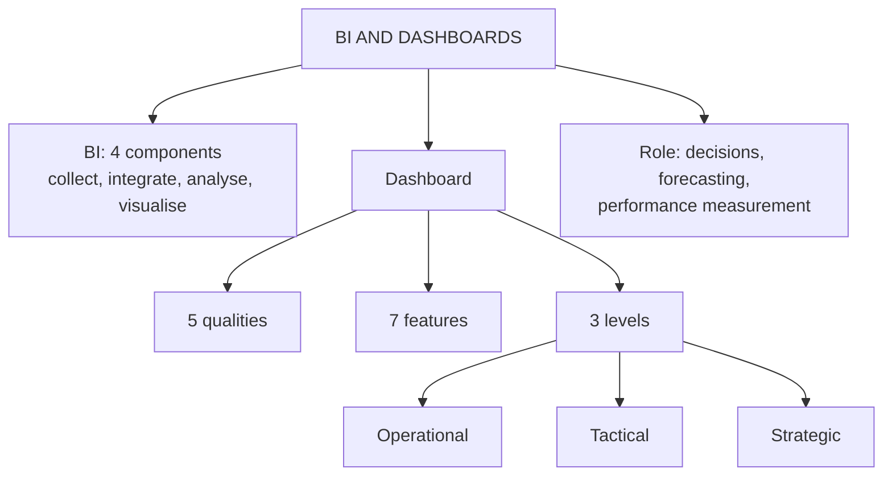

# CD-4: Business Intelligence and Dashboards

Covers: business intelligence and its four components, dashboards and their qualities and features, the role of BI, the three dashboard levels and the CRM KPIs a dashboard tracks. **(syllabus)**

## Where this fits in the ESE

The deck is detailed here, so expect a 5-marker on "Explain the qualities and features of a dashboard" or "Role of BI in CRM", and a table question on operational, tactical and strategic dashboards. In the 15-mark case, a dashboard design ("which KPIs for which manager") is a good recommendation.

## Business intelligence (class)

**BI** is a technology-driven process that analyses and presents business data to support better decisions. It transforms raw business data into meaningful information for **strategic, tactical and operational** decision making. **(syllabus)**

**Components (class, four):** data collection → data integration → data analysis → data visualisation.

**Tools (class):** Microsoft Power BI, Tableau, Qlik Sense, SAP BusinessObjects, IBM Cognos, Google Looker Studio. Your note adds BI embedded in CRM platforms (for example Salesforce CRM Analytics, HubSpot reporting). **(student notes)**

In the architecture, BI sits where analytical CRM meets the presentation layer (CD-1): it is how insight reaches decision makers.

## Dashboard (class)

A **dashboard** is a visual display of the most important business information that helps managers monitor performance quickly. It gives real-time updates, KPI tracking and interactive reports.

### Qualities of a good dashboard (class: five)

Easy to understand, interactive, visually attractive, accurate, user-friendly. Your note lists four (it leaves out **user-friendly**). Follow the slide and give five.

### Features of dashboards (class)

1. **Monitor KPIs:** revenue, profit, sales growth, website visitors, conversion rate.
2. **Real-time monitoring:** live updates.
3. **Easy visualisation:** bar, pie and line charts, maps, gauges, cards.
4. **Faster decisions:** no waiting for lengthy reports.
5. **Better communication:** a common view for everyone.
6. **Early problem detection:** declining sales, inventory shortages.
7. **Strategic planning support:** annual goals, department performance, growth.

## Role of BI and dashboards (class)

Better decision-making (facts, not assumptions) · improved customer understanding (preferences, behaviour) · market trend identification (demand, seasonality) · financial planning (revenue, expenses, profit; loss-making products, profitable branches) · improved sales performance (monthly, salesperson, product, regional) · forecasting (sales, demand, inventory) · performance measurement (actual against targets).

## Three dashboard levels (class)

| | **Operational** | **Tactical** | **Strategic** |
|---|---|---|---|
| Purpose | Monitor daily activity | Monitor departmental performance | Support long-term decisions |
| Examples | Daily sales, inventory, customer complaints | Marketing campaign results, employee productivity, monthly sales | Annual revenue, market share, customer retention, profit growth |
| Used by | Supervisors, team leaders | Department managers | CEOs, directors, top management |

Some BI books call the middle tier "analytical". Use **tactical**, the faculty word.

## CRM KPIs on dashboards (student notes)

CLV, churn rate, NPS and CSAT, conversion rate by funnel stage, customer acquisition cost and the CLV to CAC ratio, share of wallet and cross-sell ratio. Formulas are in CV-2 and CI-3.

## Strategic value (student notes)

Dashboards enable **management by exception**: surface anomalies (a sudden spike in complaints) instead of making managers read raw data. Poor dashboards (too many metrics, no owner, failing the five qualities) are a common reason analytics investment does not change decisions.

## Worked answer: "Explain dashboards and the levels at which they support decisions" (5 marks)

1. Define a dashboard (visual display of key information, real time KPIs).
2. State the five qualities in one line.
3. Table: operational, tactical, strategic with purpose, example, user.
4. Example (fictional): a telecom retailer's operational dashboard shows daily complaints per store, the tactical one monthly campaign results, the strategic one annual customer retention.
5. Interpretation: matching the dashboard to the decision level avoids overload, and management by exception saves time.

## Traps

- BI is the **process**; a dashboard is one **interface** of BI.
- Operational dashboards track **today**, strategic dashboards track **years**.
- Do not call the middle tier "analytical" in this course.

## What to remember

- BI: raw data to meaningful information for strategic, tactical, operational decisions; four components.
- Dashboard: visual KPI display; five qualities (easy, interactive, attractive, accurate, user-friendly).
- Three levels: operational (daily, supervisors), tactical (department, managers), strategic (long term, top management).
- BI roles include forecasting and measuring actual against target.
- Management by exception: act on anomalies.

## Concept map

## Flashcards
Q: Define business intelligence.
A: A technology-driven process that analyses and presents business data to support better strategic, tactical and operational decisions.

Q: Name the four components of BI.
A: Data collection, data integration, data analysis, data visualisation.

Q: Name three BI tools from the slides.
A: Microsoft Power BI, Tableau and Qlik Sense (also SAP BusinessObjects, IBM Cognos, Google Looker Studio).

Q: List the five qualities of a good dashboard.
A: Easy to understand, interactive, visually attractive, accurate, user-friendly.

Q: Who uses an operational dashboard and for what?
A: Supervisors and team leaders, to monitor daily activities such as daily sales, inventory and complaints.

Q: What does a strategic dashboard track and who uses it?
A: Long-term measures such as annual revenue, market share, customer retention and profit growth, used by CEOs, directors and top management.

Q: What is the faculty name for the middle dashboard level?
A: Tactical (some books say analytical).

Q: What is management by exception?
A: Using dashboards to surface anomalies, such as a spike in complaints, so managers act on them instead of reading all raw data.

## Sources
- Faculty deck CRM Unit 2; student notes
- Next node: [[CRM Unit 2 - CD-5 Unit 2 Exam Answers]]
- [[CRM Unit 2 - Customer Data MOC (Node Map)]]
