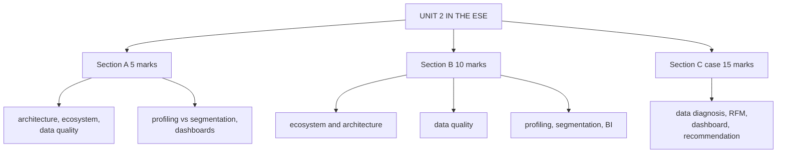

# CD-5: Unit 2 Exam Answers

Covers: what the ESE is likely to ask from Unit 2, 5-mark and 10-mark skeletons, and a 15-mark case layout with a model answer. Content comes from CD-1 to CD-4.

## What the test will ask

Assumed ESE: Section A 3 × 5, Section B 2 × 10, Section C one compulsory 15-mark case, 50 marks, no phone calculators. Unit 2 is mostly theory with lists the faculty fixed (five data quality characteristics, five ecosystem components, five segmentation steps, three dashboard levels). One small calculation (an RFM table) is possible in a case.

## Five-mark answer skeletons

**1. CRM architecture and its components (CD-1).** Definition → four components with one line each → the three-layer view as an extra.

**2. Compare Salesforce, Dynamics 365 and HubSpot (CD-1).** Three-row table: strength, integration, best fit.

**3. Customer data ecosystem (CD-1).** Definition → five components with examples → interpretation on weakest link.

**4. Characteristics of high-quality data (CD-2).** Five characteristics with the consequence of failure, plus the fix.

**5. Profiling vs segmentation (CD-3).** Four-row table from the deck → one example each.

**6. Steps in segmentation analytics (CD-3).** Five steps and the strategy for each segment, with RFM mentioned.

**7. Dashboard qualities and levels (CD-4).** Five qualities → three levels table.

## Ten-mark answer skeletons

**A. Customer data ecosystem and architecture (CD-1, CD-2).** Architecture definition and four components → flow of five ecosystem components → integration (APIs, middleware) → data quality as the gate → conclusion.

**B. Data quality and its management (CD-2).** Definition → five characteristics → issues (duplication, fragmentation, decay, entry error) → single customer view → governance → impact on CLV and segmentation.

**C. Profiling and segmentation analytics (CD-3).** Profiling and four types → segmentation and five steps → profiling vs segmentation table → techniques (RFM, clustering, CHAID, AI) → from segmentation to action.

**D. Role of BI and dashboards in CRM (CD-4).** BI and four components → dashboard qualities and features → role of BI → three dashboard levels → CRM KPIs → management by exception.

## Fifteen-mark case layout (data to decision)

1. **Data diagnosis (4):** which ecosystem component is broken; which quality characteristic fails.
2. **Analytics (4):** profile and segment, with an RFM table if numbers are given.
3. **Dashboard design (4):** KPIs and levels for named managers.
4. **Recommendation and interpretation (3):** sequence of actions and expected effect.

### Model answer, laid out as the exam answer

**Case (fictional):** *KiranaKart (fictional)* is a neighbourhood grocery delivery start-up. Orders come from its app, WhatsApp and phone. The three channels keep separate customer lists, so one household often appears twice. The founders want to know whom to target with a weekly offer. An analyst scored five customers on recency (R), frequency (F) and monetary value (M), each from 1 to 5 (5 best). Illustrative scores: C1 (5,5,4), C2 (4,3,3), C3 (2,5,5), C4 (1,1,2), C5 (5,1,1). Rule: total 12 to 15 high value, 8 to 11 core, below 8 low value.

1. **Data diagnosis:**
| Symptom | Component or characteristic |
|---|---|
| Three separate lists | Ecosystem: CDP or CRM database is not unified; consistency fails |
| Same household twice | Uniqueness fails (duplicate records) |
| Orders arrive in three channels | Collaborative CRM view missing (no omnichannel record) |

2. **Analytics:** totals are C1 14, C2 10, C3 12, C4 4, C5 7. Segments: C1 and C3 high value, C2 core, C4 and C5 low value. Reading the scores separately: C3 has R = 2, so it is high value at risk; C5 has R = 5 but F = 1 and M = 1, so it is probably new.
3. **Dashboard design:** operational (supervisor): daily orders by channel and late deliveries; tactical (marketing manager): weekly offer response rate and repeat orders; strategic (founders): monthly retention and CLV. Qualities: accurate, user-friendly, interactive.
4. **Recommendation:**
   - First merge the three lists into one record per household (deduplicate, match on phone number), because segmentation on duplicates misleads.
   - Weekly offer: win-back for C3, second-purchase nudge for C5, loyalty rewards for C1, cross-sell for C2, low-cost reminders for C4.
   - Track the offer on the tactical dashboard.

Close with: *clean, unified data comes first; segmentation and dashboards are only as good as the single customer record underneath them.*

## Time rule

In a case: label the failing component first (30 seconds), then show the arithmetic table, then recommend.

## What to remember

- Unit 2 lists to know cold: 4 architecture components, 5 ecosystem components, 5 data quality characteristics, 5 segmentation steps, 5 dashboard qualities, 3 dashboard levels.
- Profiling is individual; segmentation is group.
- Total RFM score hides recency risk: read R, F, M separately.
- Fix data (uniqueness, consistency) before analytics.

## Concept map

## Flashcards
Q: Which lists should be learned word for word in Unit 2?
A: Four architecture components, five ecosystem components, five data quality characteristics, five segmentation steps, five dashboard qualities, three dashboard levels.

Q: Skeleton for a 10-mark data quality answer?
A: Definition, five characteristics, common issues, single customer view, governance, impact on CLV and segmentation.

Q: In the RFM case, what are the totals for C1 to C5?
A: 14, 10, 12, 4 and 7, giving high value, core, high value, low value and low value.

Q: Why is C3 flagged as at risk although its total is 12?
A: Its recency score is 2, so the high total comes from past frequency and spend; a win-back offer is needed.

Q: What should come before segmentation in a messy-data case?
A: Merging and deduplicating records into one customer view.

Q: Which dashboard level fits a marketing manager?
A: Tactical: weekly campaign response and repeat orders.

## Sources
- Assumed ESE pattern; CD-1 to CD-4
- [[CRM Unit 2 - Customer Data MOC (Node Map)]]
