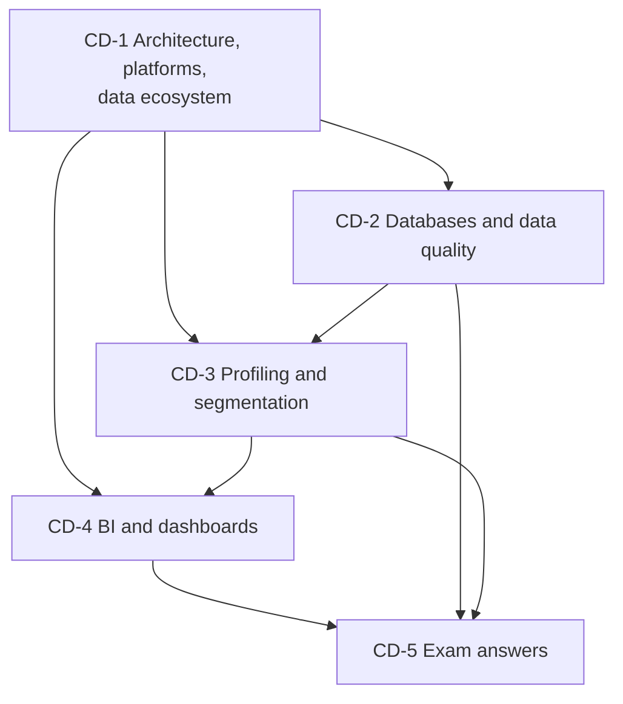

# CRM Unit 2: Customer Data, Analytics and CRM Platforms, node map

ESE (assumed, no course plan PDF): 50 marks, Section A 3 × 5, Section B 2 × 10, Section C one compulsory 15-mark case. Unit 2 is theory with fixed lists and one small RFM table. Examples are **illustrative**; fictional firms are marked.

## Nodes

| Node | Topic | Deps | Minutes | Exam focus |
|---|---|---|---|---|
| CD-1 | CRM Architecture, Platforms and Data Ecosystem | none | 35 | yes |
| CD-2 | Customer Databases and Data Quality | CD-1 | 30 | yes |
| CD-3 | Customer Profiling and Segmentation Analytics | CD-1, CD-2 | 35 | yes |
| CD-4 | Business Intelligence and Dashboards | CD-1, CD-3 | 30 | yes |
| CD-5 | Unit 2 Exam Answers | CD-1 to CD-4 | 25 | yes |

Total reading time: about 155 minutes.

## Dependency graph

## Key frameworks and facts to know

- Architecture: four components (analytical, operational, collaborative, strategic); extra three layers (data, application, presentation).
- Platforms: Salesforce, Microsoft Dynamics 365, HubSpot.
- Data ecosystem: sources, CDP or CRM database, processing and analytics, business applications, customer experience.
- Data quality: accuracy, completeness, consistency, timeliness, uniqueness.
- Profiling types: demographic, geographic, psychographic, behavioural. Segmentation steps: collect, analyse, create, strategies, monitor. RFM scoring.
- Dashboards: five qualities; operational, tactical, strategic levels.
- Illustrative arithmetic: 2% monthly decay is about 21.5% a year, not 24%.

## Links
- [[CRM MOC]]
