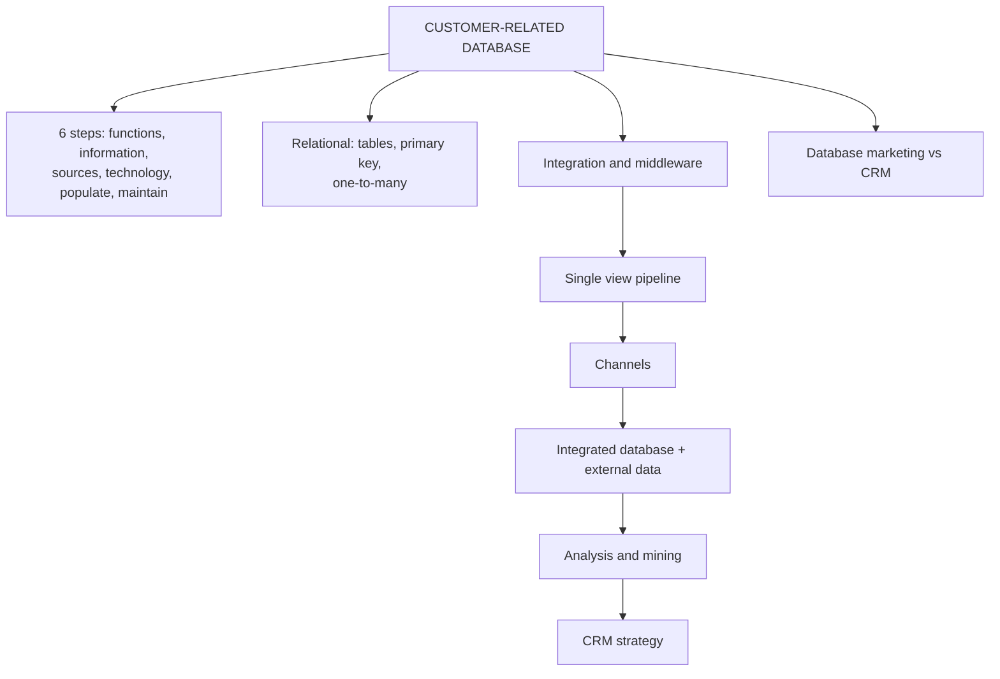

# CV-1: Customer-Related Databases and Single View

Covers: customer-related databases, the six steps to develop one, relational databases, data integration and middleware, the single view of the customer pipeline, external data, and database marketing versus CRM. **(syllabus)**

## Where this fits in the ESE

ESE (assumed): 3 × 5, 2 × 10, one 15-mark case. The deck spends many slides here, so "Explain the steps in developing a customer-related database" (5) and "Explain single view of the customer with the integration pipeline" (5 or 10) are both likely. This node builds on the quality ideas in CD-2.

## Customer-related database (class)

An organised digital collection of data about a company's **past, current and potential buyers**: names, contact information, purchase history, product preferences. It helps the firm understand behaviour and build better relationships. **(syllabus)**

Databases usually sit in several functional areas, each recording different data:

| Function | Records |
|---|---|
| Sales | Opportunities |
| Marketing | Campaigns |
| Service | Enquiries |
| Logistics | Deliveries |
| Accounts | Billing |

## Six steps to develop a customer-related database (class)

1. **Define the database functions:** the database supports the four forms of CRM (strategic, operational, analytical, collaborative).
2. **Define information requirements:** typical fields: products, contact data, contact history, transactional history, current pipeline, communication preferences.
3. **Identify information sources:** internal or external.
4. **Select technology and hardware platform:** usually a relational database.
5. **Populate the database:** source, verify, validate, **de-duplicate**, and **merge and purge** data from two or more sources.
6. **Maintain the database:** insert new transactions, campaigns and communications at once; de-duplicate regularly; audit files every year; purge customers inactive for a set period; drip-feed the database.

Memory hook: **F-I-S-T-P-M**: Functions, Information needs, Sources, Technology, Populate, Maintain.

## Relational database (class)

- Stores data in **two-dimensional tables** (rows and columns).
- One or more fields uniquely identify each record: the **primary key**. In a sales database each customer usually has a unique number in the first column.
- Deck example: you buy a book online. The *Customer* table gets a record with a unique ID. The *Orders received* table records the purchase and delivery choice. The *Inventory* table records the stock reduction (and can trigger re-ordering). The *Payment* table records the card payment. There are **one-to-many links** between the customer record and these tables.

One customer, many orders: that is what "one-to-many" means.

## Data integration and middleware (class)

- **Data integration:** combining and harmonising data from multiple sources into a unified format for analysis, operations and decisions. It relies on **standardisation** across databases.
- A coherent single view is often a significant hurdle that must be crossed **before** marketing, sales or service CRM applications go live.
- Legacy systems may need integration software; sometimes **middleware** must be written.
- **Middleware** is software that connects parts of a system that could not otherwise communicate. It acts as a **broker**: it receives data from source systems and passes it to destination systems in a format they understand. Often called the "glue" of a network.

## Single view of the customer (class)

Having all important information about a customer in **one place** instead of separately in different systems.

Deck illustration: one customer buys from a retail store, orders on the website, responds to a catalogue, takes part in a party plan and buys through home shopping. Without integration the firm holds **five separate records**; with integration it sees one complete picture.

**Pipeline (class):** sources (retail store, party plan, catalogue, website, home shopping) → integrated customer database (plus external data) → data analysis and mining → CRM strategy development and implementation.

Numeric illustration from the deck: store purchase ₹2,000 (a dress), website purchase ₹3,000 (cosmetics), a catalogue order (a handbag, no amount given). After integration: total purchases, products bought, channels used, purchase frequency. Known spend so far ₹2,000 + ₹3,000 = ₹5,000 plus the handbag.

Slide inconsistency to handle: the deck first says **five** records (five channels listed) and then says the firm sees **three** different customers (three illustrated purchases). In the exam write: "one record per channel, for example five channels give five records; in this illustration three purchases looked like three customers".

### External data (class)

Demographic, market research, geographic, industry, credit and social media information, added to the customer database to understand customers better.

### Data analysis and mining; strategy (class)

Patterns the firm may find: this customer buys cosmetics every two months; customers aged 25 to 35 prefer online shopping; high-value customers buy premium products; buyers of Product A also buy Product B (association). Actions: personalised offers, recommending new cosmetics, loyalty rewards, birthday offers, personalised communication.

## Database marketing and CRM (student notes, textbook)

**Database marketing** uses customer databases to find prospects with the highest response probability, for targeted rather than mass communication. It was the forerunner of CRM.

| Aspect | Database or direct marketing | CRM |
|---|---|---|
| Scope | Campaign level | Enterprise wide |
| Horizon | Short-term response | Long-term value (CLV) |
| Channel | Mostly mail, phone, email | Omnichannel |
| Objective | Immediate sale or response | Retention, loyalty, advocacy |

**Closed-loop marketing:** campaign response data flows back into the customer record, sharpening the next campaign.

### Case in your notes: American Heart Association (student notes)

A US not-for-profit with data spread over more than 150 separate databases adopted an organisation-wide CRM to integrate them. Reported results: better staff productivity and response times, more personalised service, and donations up by over 20%. This case is not on the slides. **[VERIFY]** the figures before quoting them in an exam.

## Worked answer: "Explain the steps in developing a customer-related database" (5 marks)

1. One-line definition (organised digital collection of past, current and potential buyers' data).
2. Six steps in order, one line each (functions, information, sources, technology, populate, maintain).
3. Detail the two heavy steps: populate (source, verify, validate, de-duplicate, merge and purge) and maintain (immediate update, regular de-duplication, annual audit, purge inactive).
4. Example: an online retailer's Customer, Orders, Inventory and Payment tables linked by customer ID.
5. Interpretation: a poorly populated database fails at step 5, and CRM applications built on it give wrong answers (CD-2).

## What to remember

- Customer-related database holds past, current and potential buyers' data across sales, marketing, service, logistics and accounts.
- Six steps: functions, information requirements, sources, technology (relational), populate, maintain.
- Relational database: tables, primary key, one-to-many links.
- Middleware is the broker or "glue"; integration relies on standardisation.
- Single view pipeline: sources, integrated database plus external data, analysis and mining, CRM strategy.

## Concept map

## Flashcards
Q: Define a customer-related database.
A: An organised digital collection of data about a company's past, current and potential buyers: names, contact information, purchase history and product preferences.

Q: List the six steps in developing a customer-related database.
A: Define functions, define information requirements, identify sources, select technology (relational), populate, maintain.

Q: What does "populate the database" involve?
A: Source the data, verify it, validate it, de-duplicate it, and merge and purge data from two or more sources.

Q: Name four maintenance actions.
A: Insert new data at once, de-duplicate regularly, audit files every year, purge long-inactive customers (and drip-feed the database).

Q: What is a primary key?
A: A field that uniquely identifies each record, for example a unique customer number in the first column.

Q: What is middleware?
A: Software that connects systems that could not otherwise communicate, receiving data from sources and passing it to destinations in an understandable format; the "glue" of a network.

Q: Give the single-view-of-the-customer pipeline.
A: Channels, integrated customer database (plus external data), data analysis and mining, CRM strategy development and implementation.

Q: Name four types of external data.
A: Demographic, market research, geographic, industry, credit and social media information (any four).

## Sources
- Faculty deck CRM Unit 3; student notes; Buttle and Maklan (textbook)
- Next node: [[CRM Unit 3 - CV-2 Customer Lifetime Value]]
- [[CRM Unit 3 - Customer Value MOC (Node Map)]]
