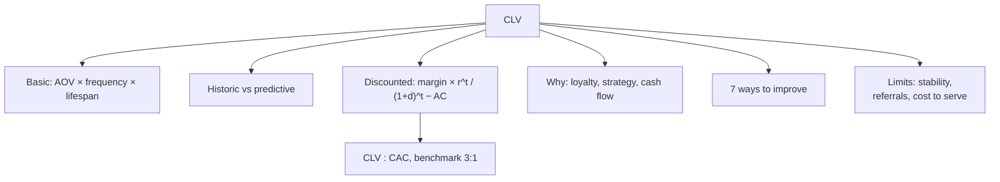

# CV-2: Customer Lifetime Value

Covers: the CLV definition, the basic class formula with two worked examples, historic versus predictive CLV, why CLV matters, the discounted CLV formula with a worked table, CLV to CAC, the seven ways to raise CLV and the limits of CLV. **(syllabus)**

## Where this fits in the ESE

This is the main numerical topic of Unit 3. The class formula is a one-line multiplication, so a CLV sum in Section A or inside the case is very likely. Know the class formula cold, then the discounted version as the "better answer". The slides leave the coffee-shop sum unsolved; it is solved below.

## Definition (class)

A CLV model predicts the **total net profit or revenue** a business will earn from a customer over the **entire relationship**. It looks at all transactions a customer has made or will make over their lifespan, not individual sales. It is key to understanding retention and loyalty. **(syllabus)**

## Basic formula (class)

**CLV = Average purchase value × Purchase frequency × Customer lifespan**

The deck also writes it as **CLV = customer value × average customer lifespan**, where customer value = average purchase value × purchase frequency (per year).

- Average purchase value = total revenue ÷ number of purchases.
- Purchase frequency = number of purchases ÷ number of unique customers in a period.
- Customer lifespan = average years the customer keeps buying.

Trap: the formula uses **revenue per purchase**, so the answer is a **revenue CLV**. The definition says "net profit or revenue". To get a **profit CLV**, multiply by the margin percentage. State which you computed.

### Worked example 1 (class): subscription service

Data from the slide: average spend USD 20 a month, monthly payments, customer stays 4 years.

| Step | Working | Result |
|---|---|---|
| 1. Average purchase value | USD 20 | 20 |
| 2. Purchase frequency | 12 per year | 12 |
| 3. Lifespan | 4 years | 4 |
| 4. CLV | 20 × 12 × 4 | **USD 960** |

Interpretation: this customer is worth USD 960 in revenue over four years, so the firm should spend well below that on acquiring and retaining the customer.

### Worked example 2 (class question, solved here): coffee shop

Data from the slide: a typical customer visits twice a week, average sale USD 5, 50 weeks a year, average of 5 years.

| Step | Working | Result |
|---|---|---|
| 1. Average purchase value | USD 5 | 5 |
| 2. Purchase frequency per year | 2 visits × 50 weeks | 100 |
| 3. Lifespan | 5 years | 5 |
| 4. CLV | 5 × 100 × 5 | **USD 2,500** |

Interpretation: a regular customer is worth USD 2,500 in revenue; one lost customer costs far more than one coffee, so retention effort is justified. At an illustrative 60% gross margin the profit CLV would be USD 1,500 (2,500 × 0.60). The margin is not given on the slide, so state it as an assumption if you use it.

Common error: using 2 × 5 × 5 and forgetting the 50 weeks, which gives 50, not 2,500.

## Historic versus predictive CLV (class)

| | Historic CLV | Predictive CLV |
|---|---|---|
| What | What an existing customer has already spent; looks backward at actual revenue and costs | Estimate of what a customer might spend; uses past data with machine learning or statistical formulas to forecast spend and churn risk |
| Pros | Simple | Shows where in the journey to invest |
| Cons | Cannot predict future behaviour | Needs an algorithmic process; complex |

Examples of predictive methods: regression, probabilistic models such as BG/NBD. **(student notes)**

## Why CLV is important (class)

- Gauge customer loyalty and average churn.
- Decisions based on real values, not guesswork; invest in loyal customers.
- Build strategy on how long customers buy and how much they spend.
- Improves product and service quality, decision making and customer lifespan.
- Should shape overall strategy (retain or acquire).
- Stabilises cash flow, supports growth, lowers churn.

## Discounted CLV (student notes, textbook)

Money received later is worth less, and not every customer stays. The fuller formula:

**CLV = Σ [ (margin_t × retention_t) ÷ (1 + d)^t ] − acquisition cost**

Correction to your note: it writes R_t as "retention rate in period t". For the formula to be right, **retention_t must be the cumulative probability that the customer is still active in year t, that is r^t**, not the one-year rate r. Using r alone in every year would overstate later years.

### Worked example 3 (illustrative): discounted CLV

Data (illustrative): yearly margin ₹4,000; yearly retention rate 80%; discount rate 10%; horizon 5 years; acquisition cost ₹2,000. Margin arrives at the end of each year.

| Year t | Cumulative retention 0.8^t | Expected margin ₹4,000 × retention | DF = 1/1.1^t (3 d.p.) | PV ₹ |
|---|---|---|---|---|
| 1 | 0.800 | 3,200.00 | 0.909 | 2,908.80 |
| 2 | 0.640 | 2,560.00 | 0.826 | 2,114.56 |
| 3 | 0.512 | 2,048.00 | 0.751 | 1,538.05 |
| 4 | 0.410 | 1,638.40 | 0.683 | 1,119.03 |
| 5 | 0.328 | 1,310.72 | 0.621 | 813.96 |
| **Total** | | | | **₹8,494.39** |

1. Present value of expected margins = **₹8,494** (₹8,496 with unrounded discount factors; the ₹2 gap is rounding).
2. Net CLV = 8,494 − 2,000 = **₹6,494** (₹6,496 exact).
3. CLV to CAC = 8,494 ÷ 2,000 = **4.25 : 1**.

**Decision and interpretation:** 4.25 : 1 is above the commonly cited 3 : 1 benchmark, so acquiring this customer at ₹2,000 is justified. The firm could pay up to about ₹2,831 (8,494 ÷ 3) and still meet 3 : 1. The 3 : 1 benchmark is a rule of thumb. **[VERIFY]** before presenting it as a standard. If retention fell to 70%, the PV would fall sharply, so retention is the lever to watch (CV-3).

Optional check (textbook): over an unlimited horizon the same inputs give margin × r ÷ (1 + d − r) = 4,000 × 0.8 ÷ 0.3 = ₹10,667, so five years captures about 80% of the total.

## Customer distribution by value (student notes)

Customers tend to fall into roughly **20% low CLV, 60% medium CLV, 20% high CLV**. This split is in your notes only, not on the slides; use it as an illustration, not a law (see CV-4).

## Seven ways to improve CLV (class)

| Lever | Class example |
|---|---|
| Build a loyalty programme | Discount code on reaching a spend threshold |
| Increase average order value | Free shipping above a spend level |
| Create personalised experiences | Search results highlighting discounts on favourites |
| Streamline experiences | Ad message matches landing page; support knows the offer |
| Optimise onboarding | Delivery, set-up, support and returns explained after purchase |
| Improve customer service | Trained, knowledgeable support staff |
| Use omnichannel support | Phone, email, social; chatbots for 24/7 response |

Each lever moves a term in the formula: AOV raises purchase value, loyalty and service raise frequency and lifespan.

## Limits (student notes)

Assumes stable behaviour (weak for fashion or big discretionary purchases); excludes referral and review value unless modelled as **customer referral value**; revenue CLV ignores cost to serve.

## Worked answer: "Explain CLV and calculate it for a customer" (10 marks)

1. Define CLV (class words) and state the formula.
2. Calculate with a table (steps 1 to 4, as in examples 1 or 2).
3. Say whether the result is revenue or profit CLV.
4. Distinguish historic and predictive CLV.
5. Give the discounted version in one line and explain why it is better.
6. Interpretation line: CLV guides how much to spend to acquire and keep the customer, and which segment gets priority.

## What to remember

- Class formula: average purchase value × purchase frequency × lifespan (revenue CLV).
- Subscription: 20 × 12 × 4 = USD 960. Coffee shop: 5 × (2 × 50) × 5 = USD 2,500.
- Historic looks back; predictive forecasts.
- Discounted CLV needs cumulative retention r^t, not r; the illustrative result is ₹8,494 PV, ₹6,494 net, 4.25 : 1.
- Seven improvement levers: loyalty, AOV, personalisation, streamlined experience, onboarding, service, omnichannel.

## Concept map

## Flashcards
Q: State the class formula for CLV.
A: CLV = average purchase value × purchase frequency × customer lifespan.

Q: Compute CLV: USD 20 a month, 4 years.
A: 20 × 12 × 4 = USD 960.

Q: Compute CLV for a coffee shop customer: 2 visits a week, USD 5, 50 weeks a year, 5 years.
A: 5 × (2 × 50) × 5 = USD 2,500.

Q: Historic versus predictive CLV?
A: Historic looks backward at actual spend and cannot predict; predictive uses past data with statistical or machine learning methods to forecast spend and churn.

Q: What is wrong with writing the retention term as the one-year rate in discounted CLV?
A: It must be cumulative retention r^t; using r in every year overstates later years.

Q: Illustrative discounted CLV: margin ₹4,000, retention 80%, discount 10%, 5 years, acquisition cost ₹2,000. Net CLV?
A: PV of expected margins ₹8,494, so net CLV about ₹6,494 and CLV to CAC 4.25 : 1.

Q: Name the seven ways to improve CLV.
A: Loyalty programme, higher average order value, personalised experiences, streamlined experiences, optimised onboarding, better customer service, omnichannel support.

Q: How do you turn the class revenue CLV into a profit CLV?
A: Multiply by the margin percentage (state it as an assumption if the data does not give it).

## Sources
- Faculty deck CRM Unit 3; student notes; Buttle and Maklan (textbook)
- Next node: [[CRM Unit 3 - CV-3 Retention Loyalty Profit Chain]]
- [[CRM Unit 3 - Customer Value MOC (Node Map)]]
