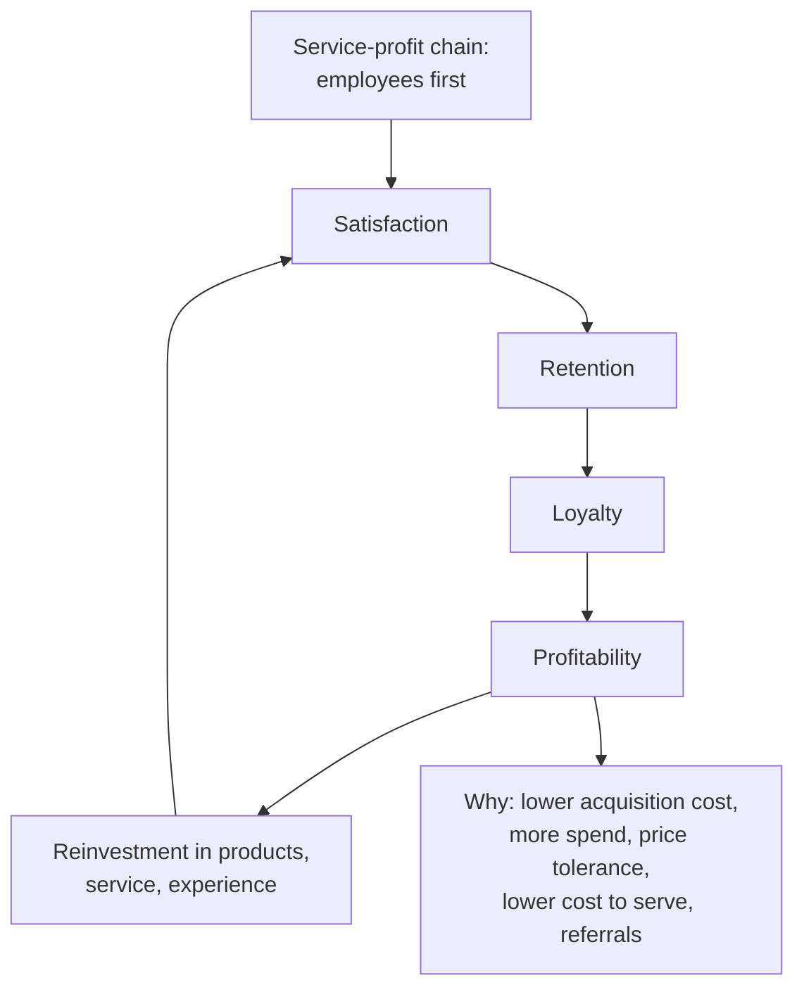

# CV-3: Retention-Loyalty-Profit Chain

Covers: the satisfaction, retention, loyalty and profitability chain, the faculty definition and importance of each link, how it operates as a virtuous cycle, why retention drives profit, and the broader service-profit chain. **(syllabus)**

## Where this fits in the ESE

The chain is a favourite 5-marker ("Explain the retention-loyalty-profit chain"). In a case it is the justification for any retention recommendation. The service-profit chain is an extra that turns a 5-mark answer into a 10-mark one.

## The chain (class)

The retention-loyalty-profit chain is a core component of the broader **service-profit chain**. It says: **customer satisfaction drives retention, which deepens loyalty, which directly unlocks high-margin revenue growth and profitability.**

**Customer satisfaction → Customer retention → Customer loyalty → Profitability**

## Four definitions with importance (class)

| Link | Definition | Why it matters |
|---|---|---|
| **Customer satisfaction** | Degree to which customers are pleased with products, services and overall experience | Satisfied customers hold better perceptions and keep doing business, so satisfaction drives retention and loyalty |
| **Customer retention** | Ability of a company to keep its customers over a period of time | Keeping customers is often more cost-effective than acquiring new ones; retained customers tend to spend more over time |
| **Customer loyalty** | Extent to which customers consistently choose a brand over others and are willing to repurchase and recommend | Loyal customers become advocates, spreading word of mouth and attracting new customers; built on satisfaction and retention |
| **Profitability** | Ability of a company to generate profit from its operations | Loyal, retained customers buy more often, buy more products and need less marketing and sales spending |

Trap: **retention** is behaviour over time (a customer stays); **loyalty** adds attitude and advocacy (prefers and recommends). A customer can be retained through lack of choice and still not be loyal.

## How the chain operates (class)

1. **Satisfaction leads to retention:** satisfied customers keep buying.
2. **Retention enhances loyalty:** continuing good experiences build trust and connection.
3. **Loyalty drives profitability:** repeat purchases, higher spend per transaction, trying new products, and advocacy that brings in customers at lower acquisition cost.
4. **Profitability fuels growth:** profit is reinvested in products, services and experience, creating a **virtuous cycle**.

## Why retention drives profit (student notes, textbook)

- Lower acquisition cost: no repeated spend to win the same customer.
- Rising purchase volume: long-tenured customers consolidate spending.
- Price premium tolerance: loyal customers are less price sensitive.
- Lower cost to serve: familiarity reduces support costs.
- Referral value: advocates reduce acquisition cost for new customers.

**Reichheld and Sasser (Bain, 1990):** a 5% increase in retention can raise profits by 25% to 95%, depending on the industry. **[VERIFY]** the exact range; it is widely quoted but varies by source. Use it as the one-line economic justification.

### Illustration: why a small retention gain matters (textbook, illustrative)

Expected lifespan ≈ 1 ÷ (1 − retention rate).

| Retention rate | Churn | Expected lifespan |
|---|---|---|
| 80% | 20% | 1 ÷ 0.20 = 5.0 years |
| 85% | 15% | 1 ÷ 0.15 = 6.67 years |

A 5-point gain in retention lengthens expected lifespan by about 33% (6.67 ÷ 5.0), and the basic CLV formula (CV-2) multiplies by lifespan, so CLV rises by about a third with no other change. This is the arithmetic behind the chain.

## Service-profit chain (Heskett et al.) (student notes)

A broader model starting with employees:

**Internal service quality → Employee satisfaction → Employee retention and productivity → External service value → Customer satisfaction → Customer loyalty → Revenue growth and profitability.**

Message: CRM outcomes depend on frontline employees, not on technology alone (see SO-5, CI-5).

## Application in CRM strategy

It justifies CLV-based decisions and retention programmes (loyalty schemes, proactive service recovery) over indiscriminate acquisition spend, and it builds the business case for CRM investment when presenting ROI (CI-3). **(student notes)**

## Worked answer: "Explain the retention-loyalty-profit chain" (5 marks)

1. Draw the four-link chain.
2. One line each: definition and importance of satisfaction, retention, loyalty, profitability.
3. Explain the virtuous cycle (profit reinvested in products, service, experience).
4. One example: a bank's customer satisfied with fast service stays, buys a loan and insurance, recommends the bank; the extra profit funds better service.
5. Interpretation: the chain is the economic reason CRM shifts spending from acquisition to retention.

## What to remember

- Chain: satisfaction → retention → loyalty → profitability, then reinvestment (virtuous cycle).
- It is a core component of the service-profit chain.
- Retention is cheaper than acquisition; loyal customers spend more and advocate.
- Reichheld and Sasser: 5% more retention can lift profit by 25% to 95% (verify).
- Retention 80% to 85% lifts expected lifespan from 5 to 6.67 years (about 33%).

## Concept map

## Flashcards
Q: State the retention-loyalty-profit chain.
A: Customer satisfaction leads to customer retention, which deepens customer loyalty, which unlocks profitability.

Q: Define customer retention.
A: A company's ability to keep its customers over a period of time.

Q: Define customer loyalty.
A: The extent to which customers consistently choose a brand over others and are willing to repurchase and recommend it.

Q: How does loyalty drive profitability?
A: Loyal customers repeat purchases, spend more per transaction, try new products and bring new customers at lower acquisition cost.

Q: What is the virtuous cycle in the chain?
A: Profit is reinvested in products, services and customer experience, which raises satisfaction again.

Q: What did Reichheld and Sasser find?
A: A 5% increase in retention can raise profits by 25% to 95%, depending on the industry (verify the range).

Q: If retention rises from 80% to 85%, how does expected lifespan change?
A: From 1 ÷ 0.20 = 5 years to 1 ÷ 0.15 = 6.67 years, about 33% longer.

Q: How does the service-profit chain extend the retention-loyalty-profit chain?
A: It starts earlier with internal service quality and employee satisfaction, which lead to external service value, customer satisfaction, loyalty and profit.

## Sources
- Faculty deck CRM Unit 3; student notes; Reichheld and Sasser (1990), Heskett et al. (1994) (textbook)
- Next node: [[CRM Unit 3 - CV-4 Value-Based Segmentation]]
- [[CRM Unit 3 - Customer Value MOC (Node Map)]]
