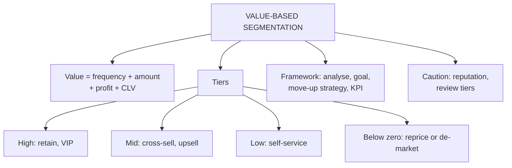

# CV-4: Value-Based Segmentation

Covers: what value-based segmentation is, what determines customer value, the three tiers and the strategy for each, the Pareto idea, below-zero customers, and the segment strategy framework used in the poster activity. **(syllabus)**

## Where this fits in the ESE

"Explain value-based segmentation and the strategy for each segment" is a standard 5- or 10-marker. The segment strategy framework is also the shape of a case answer when customer data by segment is given. It links back to RFM (CD-3) and CLV (CV-2).

## Definition (class)

Value-based segmentation divides customers according to **how much value they bring to the company**, rather than by age, gender or location alone. Guiding question: *which customers are most valuable to our business, and how should we treat each group?*

**What determines customer value (class):** purchase frequency + amount spent + profit generated + customer lifetime value.

## Why: the Pareto idea (student notes)

- Often a small share of customers (around 20%) generates a large share of profit (around 80%). Treat the 80/20 split as a tendency, not a law.
- Some customers are **value destroying**: cost to acquire and serve exceeds the revenue they bring.
- So a "treat everyone the same" CRM programme wastes money.

## Three tiers (class) and the fourth from the textbook

| Tier | Meaning (class) | Focus | Action (class) |
|---|---|---|---|
| **High value** (VIP, tier 1) | Highest revenue and margin, low relative service cost | Retention and exclusive VIP treatment to prevent churn | Dedicated account managers, early access, customised premium support channels |
| **Mid value** (core, tier 2) | Steady, reliable revenue; standard maintenance | Cross-selling and upselling to raise average order value or upgrade tier | Automated email campaigns recommending complementary products or volume discounts |
| **Low value** (transactional, tier 3) | Minimal revenue or high support overhead relative to return | Cost-to-serve minimisation, self-service | Shift support to chatbots, knowledge bases, community forums; avoid heavy direct sales cost |
| **Below-zero** (student notes, textbook) | Cost more to acquire or serve than they return | Reprice or de-market | Raise fees or prices, or consciously reduce service |

Textbook labels: most valuable customers (MVC), most growable customers (MGC) and below-zero customers (BZ). **(textbook)**

## Segment strategy framework (class)

This table is the faculty's answer template for the poster activity (a Kaggle customer dataset segmented into high, mid and low value).

| Segment | What to analyse | Main goal | Strategy to move up | Expected KPI |
|---|---|---|---|---|
| High value | Spending, frequency, recency, AOV, preferred products | Retain and deepen loyalty | None (hold) | Retention rate, CLV |
| Mid value | Spending and frequency patterns, gaps compared with high value | Raise purchase value and frequency | Mid to high | AOV, purchase frequency, CLV |
| Low value | Low spending, low frequency, long gaps, engagement | Increase engagement and purchase | Low to mid | Conversion rate, repeat-purchase rate, frequency |
| Inactive or dormant (if identifiable) | Last purchase date, length of inactivity | Reactivate | Reactivation offer, purchase, satisfaction, retention | Reactivation rate, repeat-purchase rate |

Poster task in the deck: segment a dataset into high, mid and low value by a clear method, compare with tables and charts, give different strategies, suggest actions to move low to mid and mid to high, explain how satisfaction leads to retention, loyalty and profit, and state measurable KPIs.

## Inputs and cautions (student notes)

- Built from RFM and predictive CLV (CD-3, CV-2) combined with **cost-to-serve** data.
- Ethical and reputational risk: visibly poor service to low-value customers can create negative word of mouth.
- Review tiers regularly: customers move as their life situation changes.

## Worked answer: "Explain value-based segmentation and suggest strategies" (10 marks)

1. Define value-based segmentation and the guiding question.
2. State what determines value (frequency, amount, profit, CLV).
3. Pareto rationale and value-destroying customers.
4. Table of tiers: meaning, focus, action (class).
5. Add the movement strategies (low to mid, mid to high) and dormant reactivation.
6. KPIs for each tier (retention and CLV, AOV and frequency, conversion and repeat purchase, reactivation).
7. Caution: do not damage the brand by neglecting low-value customers; review tiers periodically.
8. Interpretation: value-based segmentation puts spending where it earns the most while still moving customers up.

## Traps

- Segmenting by value is **different** from demographic segmentation; it uses behaviour and profit.
- "Low value" does not mean "ignore". The class strategy is low-cost self-service plus moving customers up.
- The Pareto 80/20 is an observed tendency; your own data may show a different split (see the case in CV-5).

## What to remember

- Value-based segmentation = grouping by value to the firm; determinants: frequency, amount, profit, CLV.
- Three tiers with strategies: high (retain, VIP), mid (cross-sell, upsell), low (cost to serve, self-service); below-zero customers are repriced or de-marketed.
- Framework columns: what to analyse, goal, move-up strategy, KPI.
- Review tiers over time; avoid reputation damage.
- Pareto is a tendency, not a law.

## Concept map

## Flashcards
Q: Define value-based segmentation.
A: Dividing customers by how much value they bring to the company, not just by demographics.

Q: What determines customer value on the slides?
A: Purchase frequency, amount spent, profit generated and customer lifetime value.

Q: What is the strategy for high-value customers?
A: Retention and exclusive VIP treatment: dedicated account managers, early access, premium support channels.

Q: What is the strategy for mid-value customers?
A: Cross-selling and upselling to raise average order value or upgrade tiers, with automated campaigns recommending complements or volume discounts.

Q: What is the strategy for low-value, high-cost customers?
A: Minimise cost to serve with self-service: chatbots, knowledge bases, community forums, and avoid heavy direct sales cost.

Q: Which KPIs go with the mid-value segment?
A: Average order value, purchase frequency and CLV.

Q: Who are below-zero customers and what do you do with them?
A: Customers who cost more to acquire or serve than they return; reprice them or consciously de-market them.

Q: Why is the 80/20 rule a caution, not a fact?
A: It is a common tendency; real customer data can show a different split.

## Sources
- Faculty deck CRM Unit 3; student notes; Peppers and Rogers MVC, MGC, BZ labels (textbook)
- Next node: [[CRM Unit 3 - CV-5 Unit 3 Exam Answers]]
- [[CRM Unit 3 - Customer Value MOC (Node Map)]]
