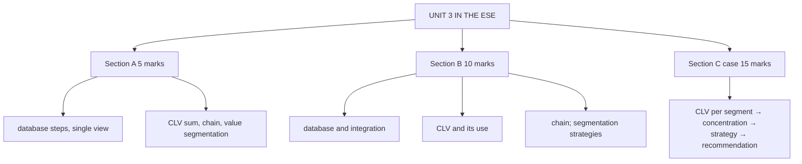

# CV-5: Unit 3 Exam Answers

Covers: what the ESE is likely to ask from Unit 3, 5-mark and 10-mark skeletons, and a 15-mark case layout with a model answer that uses CLV and value-based segmentation. Numbers are recomputed here and in CV-2.

## What the test will ask

Assumed ESE: Section A 3 × 5, Section B 2 × 10, Section C one compulsory 15-mark case, 50 marks, no phone calculators. Unit 3 mixes theory (database, chain, segmentation) with one numerical topic (CLV). A CLV sum is likely in Section A or inside the case, so practise the class formula until it takes under a minute.

## Five-mark answer skeletons

**1. Steps in developing a customer-related database (CV-1).** Definition → six steps → detail on populate and maintain → relational example.

**2. Single view of the customer (CV-1).** Definition → five-channel illustration → pipeline → external data → one benefit.

**3. CLV with a calculation (CV-2).** Formula → table of steps → revenue versus profit → interpretation. Quick numbers: USD 960 (subscription), USD 2,500 (coffee shop).

**4. Historic vs predictive CLV (CV-2).** Two-column table → one example each.

**5. Retention-loyalty-profit chain (CV-3).** Four links, definition and importance each, virtuous cycle, example.

**6. Value-based segmentation (CV-4).** Definition → three tiers with strategy → framework KPIs.

**7. Ways to improve CLV (CV-2).** Seven levers with one example each, mapped to formula terms.

## Ten-mark answer skeletons

**A. Customer database development and integration (CV-1).** Definition → six steps → relational database → integration and middleware → single view pipeline → database marketing versus CRM → conclusion.

**B. CLV: calculation and use (CV-2).** Definition, formula, worked sum, historic versus predictive, discounted CLV with the r^t correction, CLV to CAC, seven levers, limits.

**C. Retention-loyalty-profit chain and its link to CRM investment (CV-3).** Chain and definitions → how it operates → why retention pays (with the 80% to 85% lifespan arithmetic) → service-profit chain → implication for CRM spending.

**D. Value-based segmentation strategies (CV-4).** Definition, Pareto rationale, tiers and strategies, segment framework table, movement strategies, KPIs, cautions.

## Fifteen-mark case layout (value and strategy)

1. **CLV by segment (5):** compute CLV for each segment with the class formula and CLV to CAC.
2. **Segment concentration (3):** revenue and lifetime value shares; compare with the 80/20 idea.
3. **Strategy per segment (4):** class strategy plus movement actions and KPIs.
4. **Recommendation (3):** where to put the retention budget, with the sizing of one upside.

### Model answer, laid out as the exam answer

**Case (fictional):** *FitNest (fictional)* is a chain of neighbourhood gyms with 1,000 members. A value analysis (illustrative) gives three segments. Customer acquisition cost is ₹6,000 for every segment.

| Segment | Members | Spend per year | Average lifespan |
|---|---|---|---|
| High | 200 | ₹36,000 | 5 years |
| Mid | 600 | ₹18,000 | 3 years |
| Low | 200 | ₹6,000 | 1.5 years |

1. **CLV per customer** (class formula: purchase value × frequency × lifespan equals yearly spend × lifespan; revenue CLV):

| Segment | Working | CLV | CLV : CAC |
|---|---|---|---|
| High | 36,000 × 5 | ₹1,80,000 | 30 : 1 |
| Mid | 18,000 × 3 | ₹54,000 | 9 : 1 |
| Low | 6,000 × 1.5 | ₹9,000 | 1.5 : 1 |

2. **Concentration:** lifetime revenue = High 200 × 1,80,000 = ₹3,60,00,000; Mid 600 × 54,000 = ₹3,24,00,000; Low 200 × 9,000 = ₹18,00,000; total ₹7,02,00,000. High-value members are 20% of members and produce **51.3%** of lifetime revenue (46.2% from mid, 2.6% from low). On yearly revenue the high share is 37.5% (₹72,00,000 of ₹1,92,00,000). The pattern is concentrated but **not 80/20**, so say "a Pareto-type tendency" rather than the rule.
3. **Strategy:**
   - High: retention and VIP treatment (dedicated trainer, early access to new classes); KPI: retention rate, CLV.
   - Mid: cross-sell personal training and upgrade to annual plans; KPI: AOV, frequency, CLV.
   - Low: self-service app bookings, low-cost reminders; move to mid by improving engagement; KPI: repeat visits and conversion to longer plans. Low CLV : CAC of 1.5 : 1 is below the commonly cited 3 : 1 benchmark, so stop paying ₹6,000 to acquire this profile.
4. **Recommendation and sizing:** shifting 10% of mid members (60 members) to high adds 60 × (1,80,000 − 54,000) = 60 × 1,26,000 = **₹75,60,000** of lifetime revenue. Prioritise mid-to-high conversion and retention of the high tier before spending on broad acquisition.

**Caveats to state:** CLV here is **revenue**, not profit (apply a margin to get profit); no discounting; lifespans are assumed constant. A discounted, margin-based CLV would be lower, but the ranking of segments would not change.

Close with: *CLV shows that the high and mid tiers carry most of the value; the budget should move from acquiring low-value members to retaining and upgrading the top two tiers.*

## Time rule

CLV per segment first (5 marks of arithmetic), then one line of interpretation per segment, then the recommendation with one number.

## What to remember

- Unit 3 numerical: the class CLV formula; always say revenue or profit.
- Quick numbers: USD 960, USD 2,500; discounted illustration ₹8,494 PV, ₹6,494 net, 4.25 : 1.
- Case numbers: CLV ₹1,80,000 / ₹54,000 / ₹9,000; ratios 30 : 1, 9 : 1, 1.5 : 1; total lifetime revenue ₹7,02,00,000; upside ₹75,60,000.
- Segment strategy and KPIs from the class framework.
- Say "Pareto-type tendency", not "exactly 80/20".

## Concept map

## Flashcards
Q: What is the likely numerical in Unit 3?
A: CLV by the class formula (average purchase value × frequency × lifespan), possibly by segment with CLV to CAC.

Q: In the FitNest case, what is the CLV of a high-value member?
A: ₹36,000 × 5 years = ₹1,80,000, a CLV to CAC of 30 : 1.

Q: What share of lifetime revenue do FitNest's high-value members produce?
A: ₹3,60,00,000 of ₹7,02,00,000, which is 51.3%, from 20% of members.

Q: What does moving 60 mid members to high add in the case?
A: 60 × (1,80,000 − 54,000) = ₹75,60,000 of lifetime revenue.

Q: Why is the low segment's 1.5 : 1 a warning?
A: It is below the commonly cited 3 : 1 benchmark, so acquiring that profile at ₹6,000 is not justified.

Q: Which caveats must a CLV case answer state?
A: CLV is revenue not profit, there is no discounting, and lifespan is assumed constant.

## Sources
- Assumed ESE pattern; CV-1 to CV-4
- [[CRM Unit 3 - Customer Value MOC (Node Map)]]
