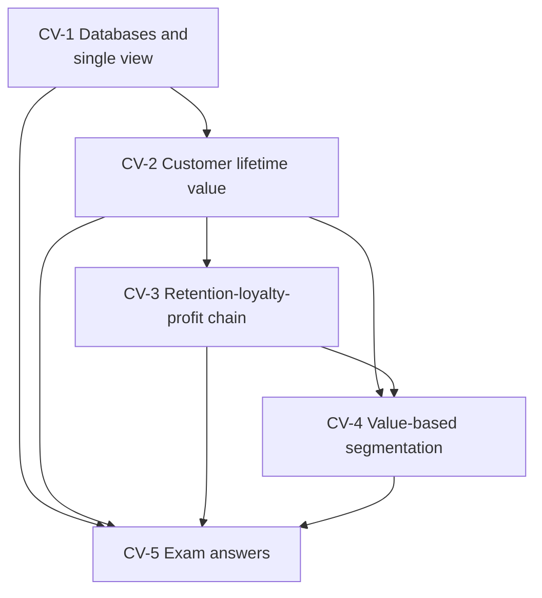

# CRM Unit 3: Relationship Marketing and Customer Value Management, node map

ESE (assumed, no course plan PDF): 50 marks, Section A 3 × 5, Section B 2 × 10, Section C one compulsory 15-mark case; no phone calculators. Unit 3 is theory plus one numerical topic, CLV. Examples are **illustrative**; fictional firms are marked.

## Nodes

| Node | Topic | Deps | Minutes | Exam focus |
|---|---|---|---|---|
| CV-1 | Customer-Related Databases and Single View | none | 40 | yes |
| CV-2 | Customer Lifetime Value | CV-1 | 45 | yes |
| CV-3 | Retention-Loyalty-Profit Chain | CV-2 | 30 | yes |
| CV-4 | Value-Based Segmentation | CV-2, CV-3 | 30 | yes |
| CV-5 | Unit 3 Exam Answers | CV-1 to CV-4 | 30 | yes |

Total reading time: about 175 minutes.

## Dependency graph

## Key formulas and numbers to know

- Class CLV = average purchase value × purchase frequency × customer lifespan (revenue CLV; multiply by margin for profit).
- Subscription: 20 × 12 × 4 = USD 960. Coffee shop: 5 × (2 × 50) × 5 = USD 2,500.
- Discounted CLV = Σ margin × r^t ÷ (1 + d)^t − acquisition cost. Illustration (₹4,000 margin, 80%, 10%, 5 years, ₹2,000 cost): PV ₹8,494, net ₹6,494, CLV to CAC 4.25 : 1.
- Retention 80% to 85%: expected lifespan 5.00 to 6.67 years (about 33% longer).
- Chain: satisfaction, retention, loyalty, profitability.
- Database development in six steps; single view pipeline; value tiers high, mid, low (plus below-zero).
- FitNest case: CLV ₹1,80,000, ₹54,000, ₹9,000; ratios 30 : 1, 9 : 1, 1.5 : 1; upside ₹75,60,000.

## Links
- [[CRM MOC]]
