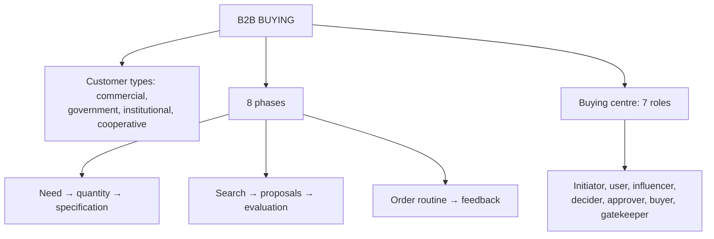

# SO-1: B2B Buying Process and Buying Centre

Covers: what B2B marketing is, the four types of business customers, the eight phases of the organisational buying process, and the seven buying centre roles, with the faculty's two applied questions answered in full. **(syllabus)**

## Where this fits in the ESE

ESE (assumed): 3 × 5, 2 × 10, one 15-mark case. The deck sets two practice questions here (a college buying computers; a hospital buying an MRI scanner). Both are ready-made exam questions, so rehearse the answers below. The comparison with B2C is in SO-2.

## B2B marketing (class)

B2B marketing sells products or services **to other businesses**. It usually has a **longer sales cycle, multiple stakeholders and a focus on long-term value**.

Key characteristics (class): target audience of decision makers (procurement managers, executives, team leaders); trust built through thought leadership, in-depth content and direct communication; decisions made collectively; tactics such as email marketing and lead generation through LinkedIn and webinars; higher-value contracts that make buying longer and more complex.

## Types of business customers (class)

| Type | Examples on the slide |
|---|---|
| Commercial enterprises | Distributors and dealers, original equipment manufacturers (OEMs), users |
| Government customers | Central and state government undertakings |
| Institutional customers | Hospitals, schools, colleges, universities (public and private) |
| Cooperative societies | Part of India's cooperative movement: cooperative sugar mills, cooperative banks, cooperative housing societies |

## Eight phases of the B2B buying decision process (class)

| # | Phase | What happens (class) |
|---|---|---|
| 1 | Recognition of a problem or need | For example the current supplier's material quality is poor, material is late, or machines break down often |
| 2 | Determination of characteristics and quantity | What product, how much |
| 3 | Development of specifications | A precise statement of the product or service needed |
| 4 | Search for and qualification of potential suppliers | Collect information on all available suppliers; decide which qualify |
| 5 | Obtaining and analysing supplier proposals | Send enquiries to qualified suppliers; a proposal is a formal quotation covering specification, price, delivery period, payment terms, taxes and duties, freight, transit insurance and other costs or free services |
| 6 | Evaluation of proposals and selection of suppliers | Attributes: product quality, service quality, price, reputation |
| 7 | Selection of an order routine | Placement of orders, quantity, frequency and delivery schedule, inventory levels, payment terms |
| 8 | Performance feedback and post-purchase evaluation | Formal or informal review; the user department says whether the purchase solved the problem |

Slide typo: phase 4 says "obtain information on all available **buyers**". It should be **suppliers**. Write suppliers.

Memory hook: **Need, Spec-quantity, Spec-detail, Search, Proposals, Pick, Routine, Review.**

## Buying centre (class)

In organisational decisions, the choice is **almost never made by one person**. Seven roles:

| Role | Who (class) |
|---|---|
| **Initiators** | First recognise the problem or need |
| **Users** | Use the product or service daily |
| **Influencers** | Technical experts or executives who help define specifications and evaluation criteria |
| **Deciders** | Formal or informal power to select or approve the final supplier |
| **Approvers** | Individuals or boards (board of directors, finance committee) giving final sign-off |
| **Buyers** | Formal authority to coordinate with the supplier and arrange terms |
| **Gatekeepers** | Control the flow of information to others (administrative assistants, purchasing agents) |

One person can hold more than one role, and one role can be held by several people. **(textbook)**

## Applied question 1 (class): a college buys new computers

Situation: the computer laboratory machines are old and slow, hurting teaching. Answer as a member of the purchase committee.

1. **Need:** old, slow machines hamper student learning and classes.
2. **Characteristics and quantity:** processor, memory, display; for example 60 machines (illustrative) for two labs.
3. **Specifications:** a written specification fixed with faculty and the IT head, plus warranty and software.
4. **Supplier search and qualification:** shortlist branded makers and authorised dealers with proven institutional supply.
5. **Proposals:** invite quotations covering price, delivery date, payment terms, taxes, freight, insurance and free installation.
6. **Evaluation and selection:** compare quality, service (on-site support), price and reputation; choose the best overall supplier, not the cheapest.
7. **Order routine:** one order or phased delivery, installation schedule, payment terms, spares inventory.
8. **Feedback:** the lab faculty and students report whether speed and reliability improved; the review guides the next purchase.

Interpretation: the process is long and rational because many people are accountable for public or institutional funds.

## Applied question 2 (class): a hospital buys an MRI scanner

| Role | Example (hospital) |
|---|---|
| Initiator | Radiologist who notices long waiting lists and ageing equipment |
| User | Radiology technicians and radiologists |
| Influencer | Biomedical engineer or medical physicist who sets technical specifications |
| Decider | Hospital administrator or medical director who picks the supplier |
| Approver | Finance committee or board giving final sign-off on the large outlay |
| Buyer | Procurement officer who negotiates and places the order |
| Gatekeeper | Secretary or purchasing agent who controls supplier access to doctors and administrators |

Your note puts the radiologist as initiator or user, the administrator as decider, the finance committee as approver, the procurement officer as buyer and a secretary as gatekeeper; the table adds the influencer, which the note's example omitted. **(student notes, textbook)**

CRM link: a B2B CRM must record **every role at the account**, not just one contact, so the sales team can reach all seven (see SO-2).

## What to remember

- B2B: other businesses; longer cycle, more stakeholders, long-term value.
- Four customer types: commercial enterprises, government, institutional, cooperative societies.
- Eight phases from need to performance feedback; phase 4 is about suppliers.
- Seven buying centre roles: initiators, users, influencers, deciders, approvers, buyers, gatekeepers.
- Apply each phase or role to the case in the question; do not just list them.

## Concept map

## Flashcards
Q: Define B2B marketing.
A: Selling products or services to other businesses, usually with a longer sales cycle, multiple stakeholders and a focus on long-term value.

Q: Name the four types of business customers.
A: Commercial enterprises, government customers, institutional customers, cooperative societies.

Q: List the eight phases of the B2B buying decision process.
A: Problem recognition, characteristics and quantity, specifications, supplier search and qualification, proposals, evaluation and selection, order routine, performance feedback.

Q: What must a supplier proposal include?
A: Specification, price, delivery period, payment terms, taxes and duties, freight, transit insurance and any other costs or free services.

Q: Which attributes are used to evaluate proposals?
A: Product quality, service quality, price and reputation.

Q: Name the seven buying centre roles.
A: Initiators, users, influencers, deciders, approvers, buyers, gatekeepers.

Q: Who is a gatekeeper in a hospital MRI purchase?
A: A secretary or purchasing agent who controls supplier access to the doctors and administrators.

Q: Who are influencers?
A: Technical experts or executives who help define specifications and give criteria for evaluating alternatives.

## Sources
- Faculty deck CRM Unit 4; student notes; Buttle and Maklan (textbook)
- Next node: [[CRM Unit 4 - SO-2 B2B and B2C CRM Strategies]]
- [[CRM Unit 4 - Strategic and Operational MOC (Node Map)]]
