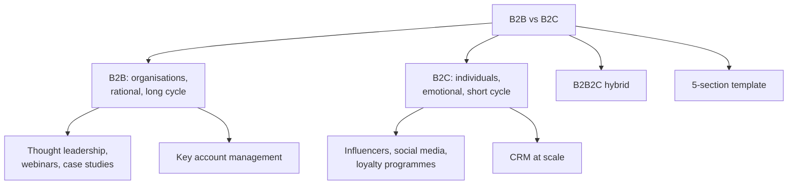

# SO-2: B2B and B2C CRM Strategies

Covers: B2C marketing, the twelve-point B2B versus B2C comparison, effective B2B and B2C strategies, the "sell the same product two ways" activity with its five-section answer template, key account management and B2B2C. **(syllabus)**

## Where this fits in the ESE

The twelve-row table is a natural 10-mark "Distinguish B2B and B2C customer strategies" (pick eight rows and present). The activity template is a ready-made case answer. This node builds on the buying centre in SO-1.

## B2C marketing (class)

B2C marketing engages **individual consumers** using emotional storytelling, incentives and memorable campaigns to encourage quick purchase. Characteristics: personal value as the target; emotional connection builds loyalty; strategies such as social media campaigns, influencer marketing and e-commerce optimisation; short sales cycles, often impulse driven; incentives such as promotions, discounts and loyalty programmes.

## B2B versus B2C: twelve points (class)

| # | Aspect | B2B | B2C |
|---|---|---|---|
| 1 | Target customer | Other businesses or organisations | Individual consumers |
| 2 | Decision making | Several people: manager, finance, procurement, CEO | One person or a small household |
| 3 | Buying decision | Logical and rational: cost, quality, ROI, efficiency | Emotion, convenience, brand, personal preference |
| 4 | Relationship | Long-term focus | Short or long term, by product |
| 5 | Personalisation | Customised solution for a business | Personalised offers from behaviour and preference |
| 6 | Communication | Professional, detailed, information-oriented | Simple, attractive, emotional, engaging |
| 7 | Price strategy | Negotiation, contracts, volume discounts, customised pricing | Fixed prices, discounts, coupons, promotional pricing |
| 8 | Sales process | Longer, several people involved | Shorter, especially everyday products |
| 9 | Customer acquisition | Personal selling, meetings, demonstrations, trade shows, LinkedIn, referrals | Advertising, social media, influencers, websites, apps, retail stores |
| 10 | Customer retention | Contracts, service, relationship and account management | Loyalty programmes, rewards, personalised offers, good CX |
| 11 | Customer value | Long-term business value, contract value, profitability | Repeat purchases, AOV, CLV |
| 12 | Main focus | Trust + relationship + business value | Experience + emotion + convenience |

Memory hook for the last row: B2B = trust, relationship, business value; B2C = experience, emotion, convenience.

## Effective B2B strategies (class)

- **Thought leadership:** publish whitepapers, blogs and eBooks on industry challenges; share expertise on LinkedIn; speak at conferences and webinars; collaborate with experts on guest blogs, podcasts and co-authored content.
- **Webinars and case studies:** host webinars on relevant topics with Q&A; develop case studies of customer success; use infographics and video testimonials; promote across website, email and social media. They build trust by showing real ROI.

## Popular B2C strategies (class)

- **Influencer marketing:** choose influencers whose audience fits; insist on authenticity over scripts; use several platforms; track engagement and conversions.
- **Social media campaigns:** visual content, polls and contests, hashtags, and analysis of impressions, clicks and engagement.
- **Brand loyalty programmes:** attractive rewards (discounts, cashback, points); personalised perks; keep the design simple; promote consistently.

## CRM at scale versus CRM by account (student notes)

| | B2B CRM: key account management (KAM) | B2C CRM at scale |
|---|---|---|
| Approach | Dedicated relationship managers for strategic accounts; joint business planning; co-creation of value | Loyalty programmes, personalisation engines and marketing automation replace one-to-one managers |
| What the CRM tracks | Organisation hierarchy, buying centre roles, contract and renewal dates | Individual transactions and behaviour, segmented in bulk |
| Value emphasis | Rational and functional | Emotional and experiential (value pyramid, CF-4) |
| Data need | One account view across sales, service and account teams (CV-1) | Segmentation analytics across millions of customers (CD-3) |

**B2B2C:** a maker selling through retailers but also engaging end consumers needs a CRM with both depth (B2B) and scale (B2C). **(student notes)**

## Activity: sell the same product in two ways (class)

The group prepares two strategies for one product. Pairs on the slide: laptop to an IT company; mattress to a hospital; chocolate to a supermarket; printer to a university; water purifier to a corporate office; air conditioner to a shopping mall; stationery to a school; CCTV cameras to a bank; chairs and inverter to a corporate office. Scenario B is the same product sold directly to an individual.

**Five-section answer template (class):**

| Section | Questions to answer |
|---|---|
| 1. Product and customer context | What is the product; who is the B2B customer; who is the B2C customer; why would each buy |
| 2. Customer decision analysis | Who decides; who influences; what factors affect the purchase |
| 3. Strategic justification | Why is the B2B approach suitable; why is the B2C approach suitable |
| 4. Strategic adaptation | What changes in offering, selling approach, promotion and engagement |
| 5. Managerial recommendation | Which strategy for B2B and for B2C, and why |

### Worked example (water purifier)

| Section | B2B: corporate office | B2C: household |
|---|---|---|
| Context | Facilities head wants safe water for staff; buys many units | Family wants safe drinking water at home |
| Decision | Facilities manager (initiator), finance (approver), procurement (buyer) | Mostly one adult, with family influence |
| Justification | Rational: cost per litre, service contract, bulk discount | Emotional and practical: health, design, price offers |
| Adaptation | Quotation, demonstration, annual maintenance contract | Online and store display, EMI offers, free installation |
| Recommendation | Key account approach with a service contract | Digital marketing plus a loyalty and referral scheme |

Interpretation: same product, different buying logic, so the CRM approach (account manager versus automated campaigns) must differ.

## Worked answer: "Distinguish B2B and B2C customer strategies" (10 marks)

1. Define both in one line.
2. Table with eight to twelve rows, ending with main focus.
3. Add the strategy sets (thought leadership and case studies; influencers, social and loyalty).
4. Add the CRM implication (KAM versus scale).
5. Mention B2B2C as the hybrid.
6. Interpretation: choose the CRM design by buying centre size and relationship depth.

## What to remember

- B2C: individuals, emotion, short cycles, loyalty programmes. B2B: organisations, rational, long cycles, account management.
- Twelve rows; the last row is trust + relationship + business value versus experience + emotion + convenience.
- B2B strategies: thought leadership, webinars and case studies. B2C: influencer, social media, loyalty programmes.
- Five-section template for the same-product activity.
- KAM for B2B, scale tools for B2C, both for B2B2C.

## Concept map

## Flashcards
Q: What is B2C marketing?
A: Marketing that engages individual consumers with emotional storytelling, incentives and memorable campaigns to encourage quick purchase decisions.

Q: Give the main focus of B2B and of B2C.
A: B2B: trust, relationship and business value. B2C: experience, emotion and convenience.

Q: How do price strategies differ?
A: B2B uses negotiation, contracts, volume discounts and customised pricing; B2C uses fixed prices, discounts, coupons and promotional pricing.

Q: Name two effective B2B strategies.
A: Thought leadership and webinars with case studies.

Q: Name three popular B2C strategies.
A: Influencer marketing, social media campaigns and brand loyalty programmes.

Q: What does key account management involve?
A: Dedicated relationship managers for strategic accounts, joint business planning, co-creation of value and contract-based relationships.

Q: What are the five sections of the "sell the same product in two ways" template?
A: Product and customer context, customer decision analysis, strategic justification, strategic adaptation, managerial recommendation.

Q: What is a B2B2C model?
A: A maker sells through retailers but also engages end consumers directly, so the CRM needs both B2B depth and B2C scale.

## Sources
- Faculty deck CRM Unit 4; student notes; Buttle and Maklan (textbook)
- Next node: [[CRM Unit 4 - SO-3 Sales Marketing and Service Integration]]
- [[CRM Unit 4 - Strategic and Operational MOC (Node Map)]]
