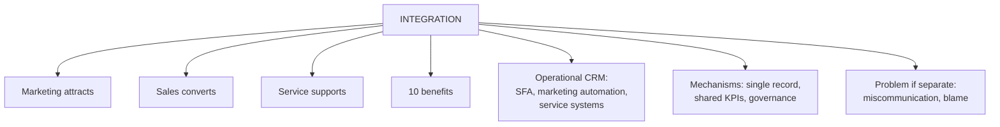

# SO-3: Sales, Marketing and Service Integration

Covers: what integration means, why it matters, the targeted-marketing flow, the ten benefits, the telecom plan launch question answered in full, and the operational CRM components and mechanisms behind integration. **(syllabus)**

## Where this fits in the ESE

The deck sets the telecom question ("Evaluate the importance of integrating sales, marketing and customer service"), so expect it, or a variant, as a 5- or 10-marker. The ten benefits are a list to learn. In a case, integration is the usual fix for "customer gets conflicting messages".

## Definition (class)

Sales, marketing and service integration means making the three departments **work together and share customer information** instead of working separately. Each owns a part of the customer journey:

- **Marketing** attracts potential customers.
- **Sales** converts them into paying customers.
- **Service** supports customers after the sale and maintains satisfaction.

They are closely linked: marketing is ineffective without leads and sales; sales depends on attracting the right customers; both are undermined by poor after-sale service. All three must share information to attract, acquire, satisfy and retain customers.

When they work separately, information is not shared, leading to **miscommunication, poor customer experience and blame between departments**. **(syllabus)**

## Example flow: more targeted marketing (class)

1. Marketing attracts potential customers.
2. Sales tells marketing which leads are more likely to buy.
3. Service shares common complaints, needs and feedback.
4. Marketing uses this to create better-targeted campaigns and content.
5. Sales gets better-quality leads; service prepares to support customers better.

It is a feedback loop, not a one-way hand-off.

## Ten benefits (class)

| # | Benefit | Meaning |
|---|---|---|
| 1 | Better understanding of customers | Shared needs, preferences, feedback |
| 2 | Better quality leads | Sales feedback sharpens marketing |
| 3 | Higher sales | Better leads and better information |
| 4 | Better customer service | Service knows what the customer bought |
| 5 | Improved customer experience | Consistent from first advertisement to after-sales |
| 6 | Higher customer retention | Good service and relevant communication |
| 7 | Less miscommunication | Fewer mistakes between departments |
| 8 | Better decision making | Combined information for managers |
| 9 | Reduced costs and effort | No duplicate work |
| 10 | Higher profitability | Better leads, more sales, loyal customers |

Memory hook: group them as **customer** (1, 5, 6), **sales** (2, 3), **service** (4), **organisation** (7, 8, 9, 10).

## Applied question (class): telecom plan launch

Situation: a telecom company launches a new mobile plan through marketing, but the sales team does not know its features and customer service cannot answer queries. Evaluate the importance of integration.

| Benefit of integration | Effect in the situation |
|---|---|
| Consistent information | Marketing, sales and service state the same features, price and benefits |
| Better sales performance | Sales staff understand the plan and explain benefits confidently |
| Better customer service | Service answers questions accurately and resolves issues fast |
| Better customer experience | Same message from advertisement, sales staff and service team |
| Faster communication | New-plan information reaches all departments quickly |
| Improved satisfaction | Accurate information and quick support build trust |
| Higher retention | Satisfied subscribers stay |
| Better coordination | One shared goal instead of three separate ones |

Interpretation: without integration, the advertising spend produces confusion and complaints, and customers may leave; with it, the same spend produces sign-ups and fewer service calls.

## Operational CRM components (student notes)

- **Sales force automation (SFA):** leads, opportunities, pipeline tracking, quote generation.
- **Marketing automation:** campaign execution, lead scoring and nurturing, triggered communications.
- **Customer service and support systems:** tickets, case histories, service-level agreement (SLA) tracking.

## "Smarketing" and mechanisms for integration (student notes, textbook)

- **Smarketing:** tight alignment of sales and marketing goals and definitions (for example a shared definition of a "qualified lead"), with shared dashboards. It reduces lead leakage.
- **Unified customer record** (single view, CV-1): all three functions read and write the same data.
- **Shared KPIs:** link lead quality (marketing) to close rate (sales) and post-sale satisfaction (service).
- **Cross-functional governance:** joint planning cycles and shared account reviews, especially for key accounts.

Link to the journey: inconsistent hand-offs between functions are among the commonest causes of a poor moment of truth (CF-4, SO-4).

## Worked answer: "Why is integration of sales, marketing and service important?" (5 marks)

1. Define integration and each function's role.
2. State the problem when separate (miscommunication, poor experience, blame).
3. Give five benefits with one example each (telecom plan).
4. Describe the feedback loop in the targeted-marketing example.
5. Interpretation: integration protects both the advertising spend and the customer's trust.

## What to remember

- Integration = marketing, sales, service share customer information and goals.
- Marketing attracts, sales converts, service supports and retains.
- Separate working causes miscommunication, poor experience and blame.
- Ten benefits include better leads, consistent experience, higher retention, lower cost, higher profit.
- Mechanisms: single customer record, shared KPIs, joint governance, smarketing.

## Concept map

## Flashcards
Q: Define sales, marketing and service integration.
A: Making the three departments work together and share customer information instead of working separately.

Q: What does each function do in the customer journey?
A: Marketing attracts potential customers, sales converts them into paying customers, service supports them after the sale and maintains satisfaction.

Q: What goes wrong when the three work separately?
A: Miscommunication, poor customer experience and blame between departments.

Q: Describe the targeted-marketing example.
A: Marketing attracts, sales says which leads are likely to buy, service shares complaints and needs, marketing builds better-targeted campaigns, sales gets better leads and service prepares better support.

Q: Name five benefits of integration.
A: Better customer understanding, better quality leads, higher sales, better service, improved experience (also higher retention, less miscommunication, better decisions, lower cost, higher profit).

Q: In the telecom plan case, what does integration give?
A: Consistent information, better sales and service performance, a consistent customer experience, faster communication, higher satisfaction and retention, better coordination.

Q: What is smarketing?
A: Tight alignment of sales and marketing goals and definitions, such as a shared definition of a qualified lead, with shared dashboards.

Q: What does sales force automation manage?
A: Leads, opportunities, pipeline tracking and quote generation.

## Sources
- Faculty deck CRM Unit 4; student notes
- Next node: [[CRM Unit 4 - SO-4 CRM-Driven Customer Journey Design]]
- [[CRM Unit 4 - Strategic and Operational MOC (Node Map)]]
