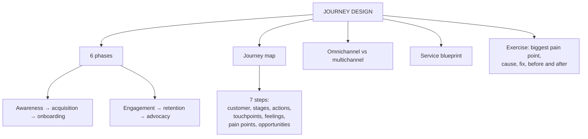

# SO-4: CRM-Driven Customer Journey Design

Covers: the definition of CRM-driven journey design, the six journey phases, the customer journey map, the seven-step mapping approach, the worked journey table with the "biggest pain point" exercise, and the omnichannel and service blueprint extras. **(syllabus)**

## Where this fits in the ESE

The deck ends this topic with a consultant exercise (find the one biggest problem in a mapped journey and redesign that moment), so it is a likely case task. "Explain the steps in mapping a customer journey" is a 5- or 10-marker. Keep the three sequences from CF-4 apart: lifecycle (5), interaction cycle (7), journey phases (6).

## Definition (class)

CRM-driven customer journey design uses CRM **data, technology, analytics and customer insights** to design and manage **every interaction** a customer has with the organisation, from first hearing about the brand through purchase, post-purchase service, repeat purchase, loyalty and advocacy. In one line: **use customer data and CRM systems to understand what customers need at each stage and deliver the right experience at the right time through the right channel.** **(syllabus)**

A **customer journey** is the complete series of experiences and touchpoints from initial awareness to post-purchase advocacy. Mapping it shows friction and where to improve satisfaction and loyalty.

Deck example, buying a laptop: awareness, consideration, purchase, onboarding, usage, service, loyalty, advocacy, across an Instagram advertisement, website, YouTube review, salesperson, mobile app, email, WhatsApp and the store. CRM connects information from all of them.

## Six journey phases (class)

1. **Awareness:** the consumer first meets the brand.
2. **Acquisition:** the consumer becomes a lead through some interaction.
3. **Onboarding:** just-bought customers are at peak interest in the brand.
4. **Engagement:** keep them buying and up to date; personalised content keeps the relationship fresh.
5. **Retention:** spot customers at risk of leaving, find out why, prevent churn or make it easy to return.
6. **Advocacy:** how the customer speaks about the brand to others.

Slide inconsistency: the laptop example lists eight steps and the worked table uses "consideration" and "usage", while the phase list has six named phases. Use the six phases as the framework and treat the eight-step list as an illustration.

## Customer journey map (class)

A diagram showing each typical point of interaction across the six stages. It must reflect **what actually happens, not what should happen**. It shows what the customer does, thinks and feels, where the customer meets the brand, and pain points and opportunities.

**Why map (class):** see the customer's view; find pain points and moments of delight; find gaps across touchpoints; improve experience; personalise; build satisfaction, loyalty and long-term relationships.

## Seven-step approach (class)

| Step | Action | Prompt |
|---|---|---|
| 1 | Identify your customer | Who, needs and goals, frustrations, channels, how they decide |
| 2 | Define the journey stages | Awareness, acquisition, onboarding, engagement, retention, advocacy |
| 3 | Identify customer actions | Search, visit website, compare, add to cart, buy, use, contact service, review |
| 4 | Identify touchpoints | Social media, website, app, salesperson, store, email, payment, support, review site |
| 5 | Understand thoughts and feelings | What is the customer thinking and feeling |
| 6 | Identify pain points | Hard navigation, many checkout steps, payment failure, late delivery, poor support, complicated returns |
| 7 | Find opportunities | What can we do better; pain point, opportunity, expected outcome |

Memory hook: **Who, Stages, Actions, Touchpoints, Feelings, Pain, Opportunity.**

Framework flow (class): customer → journey stages → customer actions → touchpoints → thoughts and emotions → pain points → opportunities.

## Worked example and the consultant exercise (class table, solved)

| Stage | Customer action | Touchpoint | Feeling | Pain point | Improvement |
|---|---|---|---|---|---|
| Awareness | Sees Instagram advertisement | Instagram | "Looks interesting" | Too much information | Clearer message |
| Consideration | Compares options | Website or app | "Which one?" | Too many choices | Better recommendations |
| Purchase | Places order | App or payment | Excited | Payment failure | Simplify payment |
| Usage | Uses product | Product or app | Satisfied | None | Personalisation |
| Retention | Considers buying again | Email or app | Interested | Irrelevant offers | Personalised offers |
| Advocacy | Recommends brand | Social media | Happy | None | Referral rewards |

**Exercise: find the ONE biggest problem and redesign that moment.**

1. **Circle the worst pain point:** **payment failure at purchase.** It is the only pain point that stops a customer who has already decided, so it directly loses a sale and hurts the moment of truth.
2. **Why it occurs:** payment gateway time-outs, too many steps, limited payment options.
3. **Solution:** offer several options (UPI, cards, wallets), save payment details securely, retry automatically, and trigger a follow-up message with a one-tap link if payment fails.
4. **Before and after:**
   - Before: customer pays, payment fails, no message, order lost, customer frustrated.
   - After: customer pays, failed payment triggers an instant retry option and a reminder; order completes; confirmation arrives.
5. **Measure:** payment success rate, abandoned-cart rate, conversion rate.

Interpretation (a defensible alternative choice is acceptable if argued): awareness and consideration pain points reduce attention; payment failure destroys a purchase already in progress.

## Omnichannel versus multichannel (student notes)

- **Multichannel:** many channels (store, web, app, call centre) working independently; the customer repeats information.
- **Omnichannel:** channels integrated around a single customer view (CV-1) so context follows the customer; the mature form of multichannel.

## Service blueprinting (student notes, textbook)

Adds the **backstage**: the internal processes, systems and employees supporting each customer-facing touchpoint, split by the **line of visibility**. It exposes where sales, marketing and service hand-offs break (SO-3).

## Designing the CRM-enabled journey (student notes)

- Triggered, personalised journeys through automation rules (abandoned-cart email, renewal reminder from contract data).
- Design by value tier: high-value customers get more human, high-touch journeys; low-value customers are guided to self-service (CV-4).

## Worked answer: "Explain the steps in mapping a customer journey" (5 marks)

1. Define the journey and the map (what actually happens).
2. Seven steps with one line each.
3. Example table row (purchase: payment failure, simplify payment).
4. Link to CRM data: touchpoint data from CRM feeds the map.
5. Interpretation: map the actual journey, find the biggest pain point, and fix that first.

## What to remember

- CRM-driven journey design: right experience, right time, right channel using CRM data.
- Six phases: awareness, acquisition, onboarding, engagement, retention, advocacy.
- Map what actually happens; seven steps from customer to opportunities.
- Pick the single biggest pain point, explain the cause, propose a fix, show before and after.
- Omnichannel needs a single customer view; blueprinting adds the backstage.

## Concept map

## Flashcards
Q: Define CRM-driven customer journey design.
A: Using CRM data, technology, analytics and insights to design and manage every interaction from first hearing about the brand through purchase, service, repeat purchase, loyalty and advocacy.

Q: Name the six phases of the customer journey.
A: Awareness, acquisition, onboarding, engagement, retention, advocacy.

Q: What must a customer journey map reflect?
A: What actually happens, not what should happen.

Q: What five things does a journey map show?
A: What the customer does, thinks, feels, where the customer interacts with the brand, and pain points and opportunities.

Q: List the seven steps of mapping a journey.
A: Identify the customer, define stages, identify actions, identify touchpoints, understand thoughts and feelings, identify pain points, find opportunities.

Q: How do you answer the consultant exercise?
A: Circle the worst pain point, explain why it occurs, suggest a solution, and show the before and after experience.

Q: Difference between multichannel and omnichannel?
A: Multichannel channels work independently; omnichannel channels are integrated around a single customer view so context follows the customer.

Q: What does a service blueprint add to a journey map?
A: The backstage processes, systems and employees behind each touchpoint, split by the line of visibility.

## Sources
- Faculty deck CRM Unit 4; student notes; Nielsen Norman Group service blueprinting (textbook)
- Next node: [[CRM Unit 4 - SO-5 Organizational Alignment and Change Management]]
- [[CRM Unit 4 - Strategic and Operational MOC (Node Map)]]
