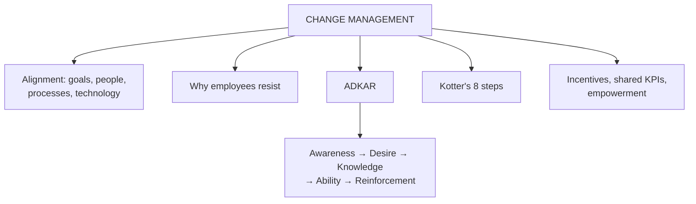

# SO-5: Organizational Alignment and Change Management

Covers: organisational alignment and change management, why employees resist, how change management creates alignment, the ADKAR model with the faculty's platform-transition answer, and Kotter's eight steps as an add-on. **(syllabus)**

## Where this fits in the ESE

The deck ends with a ready-made question ("Propose a suitable change management approach for the transition to a technology-enabled customer relationship platform"). ADKAR is the faculty model, so it is the answer to give; Kotter is your note's extra. Expect a 5- or 10-marker, and use it in any case about low adoption.

## Definitions (class)

- **Organisational alignment:** making sure goals, strategy, people, structure, processes and technology all work toward the same objectives.
- **Organisational change management:** a structured approach to preparing, equipping and enabling people to adopt and use change effectively in their daily work. **(syllabus)**

CRM is organisational change, not an IT project: technology-only implementations fail when structure, incentives and culture are not realigned to the customer (CF-5). **(student notes)**

## Why employees resist (class)

When management announces "from Monday everyone will use a new system", employees think:

- "Why are we changing?"
- "Will this increase my workload?"
- "Will I lose my job?"
- "I don't know how to use it."
- "The old system was easier."

## How change management creates alignment (class)

It connects individual adoption with organisational goals. Management should: **explain why**, communicate benefits, listen to concerns, provide training, give chances to practise, provide support, and reinforce the new behaviour.

## ADKAR model (class)

ADKAR describes the **individual employee's journey** through change.

| Letter | Stage | Question | What management does |
|---|---|---|---|
| A | **Awareness** | Why is the change necessary? | Explain the need and the weakness of the old way |
| D | **Desire** | Do employees want to support it? | Understanding is not enough; involve, address concerns, show personal benefit |
| K | **Knowledge** | Do employees know how to change? | Training: "how do I use the new CRM?" |
| A | **Ability** | Can they actually do it? | Practice, coaching, support; knowing is not doing |
| R | **Reinforcement** | How do we make it last? | Feedback, recognition, performance measures, follow-up, continued support |

### Applied question (class): moving to a new CRM platform, solved

Situation: a company moves to a technology-enabled customer relationship platform; employees resist and keep their old ways.

| Step | Action | Purpose |
|---|---|---|
| 1. Create awareness | Explain why the platform is introduced, its benefits and the limits of the old system | Show the need |
| 2. Build desire | Involve employees in discussions, address concerns, show how it improves their work and customer service | Reduce resistance, create willingness |
| 3. Provide knowledge | Hands-on training and demonstrations on features, customer information management, new processes | Teach how to use it |
| 4. Develop ability | Practice time, coaching, mentoring, technical support teams | Build confidence in daily use |
| 5. Reinforce | Monitor adoption and usage, recognise effective users, collect feedback, continuous support | Sustain the change |

Interpretation: skipping desire is the usual failure; people who know how but do not want to will keep using the old method.

Measures to add: adoption rate (share of staff logging activity daily), data completeness, support tickets raised.

## Kotter's eight steps (student notes, textbook)

1. Create urgency (the cost of poor relationships, for example churn data).
2. Build a guiding coalition (sales, marketing, service, IT sponsors).
3. Form a strategic vision (what customer-centricity means here).
4. Enlist a volunteer army (early adopters and champions).
5. Enable action by removing barriers (conflicting KPIs, legacy systems).
6. Generate short-term wins (pilot in one team or region).
7. Sustain acceleration (expand using pilot learning).
8. Institute change (embed in job descriptions, incentives, onboarding).

**How ADKAR and Kotter fit:** Kotter sequences the **organisation-wide** leadership steps; ADKAR diagnoses where a **particular person or team** is stuck. In the exam use ADKAR as the main answer and mention Kotter as the wider frame.

## Structure, incentives and culture (student notes)

- **Incentive misalignment:** sales paid only for new-customer volume resist retention work. Fix with shared, cross-functional KPIs (SO-3).
- **Frontline behaviour:** employees enact the moments of truth (CF-4); behaviour depends on culture, training and **empowerment** (authority to resolve issues).
- Service-profit chain logic: satisfied, aligned employees come before satisfied customers (CV-3).

## Worked answer: "Propose a change management approach for a CRM platform rollout" (10 marks)

1. Define alignment and change management; state why CRM is change, not IT.
2. List the resistance thoughts (why, workload, job, skills, old system easier).
3. Present ADKAR with the five-step table above.
4. Add Kotter's steps in two lines (urgency, coalition, pilot wins, embed).
5. Add incentive alignment (shared KPIs) and empowerment.
6. Measures: adoption rate, data quality, customer metrics.
7. Interpretation: adoption is won person by person, and reinforcement keeps it.

## What to remember

- Alignment = goals, strategy, people, structure, processes and technology all pointing the same way.
- Change management = prepare, equip and enable people to adopt change.
- ADKAR: awareness, desire, knowledge, ability, reinforcement (individual level).
- Kotter: eight organisation-level steps from urgency to institutionalising.
- Incentives and culture decide whether CRM is used.

## Concept map

## Flashcards
Q: Define organisational alignment.
A: Making sure the organisation's goals, strategy, people, structure, processes and technology all work toward the same objectives.

Q: Define organisational change management.
A: A structured approach to preparing, equipping and enabling people to adopt and use change effectively in their daily work.

Q: Name three thoughts employees have when a new system is announced.
A: "Why are we changing?", "Will this increase my workload?", "Will I lose my job?", "I don't know how to use it", "The old system was easier."

Q: Expand ADKAR.
A: Awareness, desire, knowledge, ability, reinforcement.

Q: What is the difference between knowledge and ability in ADKAR?
A: Knowledge is knowing how to change (training); ability is being able to perform the new behaviour (practice, coaching, support).

Q: How is reinforcement done?
A: Feedback, recognition, performance measures, follow-up and continued support.

Q: How do ADKAR and Kotter differ?
A: Kotter gives organisation-wide leadership steps; ADKAR diagnoses where an individual or team is stuck.

Q: Which step of Kotter's model is "pilot the CRM in one team or region"?
A: Step 6, generate short-term wins.

## Sources
- Faculty deck CRM Unit 4; student notes; Kotter (1996), Prosci ADKAR (textbook)
- Next node: [[CRM Unit 4 - SO-6 Unit 4 Exam Answers]]
- [[CRM Unit 4 - Strategic and Operational MOC (Node Map)]]
