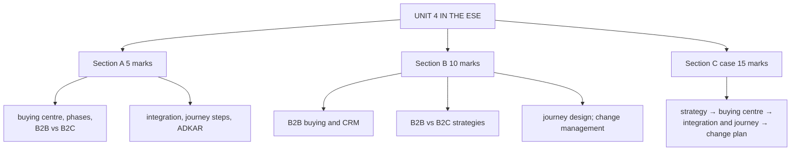

# SO-6: Unit 4 Exam Answers

Covers: what the ESE is likely to ask from Unit 4, 5-mark and 10-mark skeletons, and a 15-mark case layout with a model answer. Content comes from SO-1 to SO-5.

## What the test will ask

Assumed ESE: Section A 3 × 5, Section B 2 × 10, Section C one compulsory 15-mark case, 50 marks. Unit 4 is theory with applied scenarios the faculty already set: the college computers purchase, the hospital MRI roles, the telecom plan integration, the journey pain point and the platform-transition change plan. Practise those five and you have most of the unit.

## Five-mark answer skeletons

**1. Buying centre roles (SO-1).** Seven roles with a one-line meaning each, mapped to a hospital MRI purchase.

**2. Phases of the B2B buying process (SO-1).** Eight phases applied to the college buying computers.

**3. B2B vs B2C (SO-2).** Table of six to eight rows, ending with main focus.

**4. B2B or B2C strategies (SO-2).** Thought leadership and webinars; influencer, social media and loyalty.

**5. Why integrate sales, marketing and service (SO-3).** Roles, problem when separate, five benefits, telecom example.

**6. Steps in mapping a customer journey (SO-4).** Six phases, seven steps, one table row.

**7. ADKAR model (SO-5).** Five stages with one management action each.

## Ten-mark answer skeletons

**A. B2B buying behaviour and CRM implications (SO-1, SO-2).** B2B characteristics → eight phases → buying centre → implication for CRM (record all roles, key account management) → contrast with B2C.

**B. Distinguish B2B and B2C customer strategies (SO-2).** Definitions → twelve-point table (pick eight) → strategies → KAM versus scale → B2B2C.

**C. Customer journey design with a worked map (SO-4).** Definition → phases → seven steps → completed table → biggest pain point and redesign → omnichannel and service blueprint.

**D. Change management for CRM adoption (SO-5, SO-3).** Alignment and change definitions → resistance → ADKAR table → Kotter → incentives and shared KPIs → measures.

## Fifteen-mark case layout (operational CRM in a mixed B2B and B2C firm)

1. **Customer strategy (4):** classify the customer types and give B2B and B2C strategies using the table.
2. **Buying centre (3):** identify roles in the B2B deal.
3. **Integration and journey (4):** find the integration gap and the biggest journey pain point; give the fix.
4. **Change plan (4):** ADKAR actions, measures, conclusion.

### Model answer, laid out as the exam answer

**Case (fictional):** *CareCot Industries (fictional)* makes hospital beds. It sells to hospital chains (B2B) and, since last year, to families for home care through an online store (B2C). Problems: marketing ran a "free installation" offer but the sales team and the call centre did not know, so buyers were told different things; hospital deals stall because the sales team deals only with the purchase officer; online buyers abandon the cart at payment; and after the company introduced a new CRM platform, most staff still keep their own spreadsheets.

1. **Customer strategy**

| Basis | Hospital chains (B2B) | Families (B2C) |
|---|---|---|
| Decision | Several people, long cycle, rational | One or two people, short cycle, emotional and practical |
| Strategy | Key account manager, demonstrations, case studies, contract and service terms | Social media, reviews, easy online payment, loyalty or referral offer |
| Retention | Annual service contract, account reviews | Reminders, rewards, good after-sales service |

2. **Buying centre (hospital bed purchase):** initiator: ward manager; user: nurses; influencer: biomedical engineer; decider: medical director; approver: finance committee; buyer: procurement officer; gatekeeper: administrative assistant. The sales team reaches only the buyer, so the decider and influencer are missing. Fix: record all roles in the CRM and plan contact with each.
3. **Integration and journey:**
   - Integration gap: marketing, sales and service did not share the offer, so the customer got conflicting messages. Fix: one customer record, a shared launch briefing before every campaign, shared KPIs (lead quality, close rate, post-sale satisfaction).
   - Biggest journey pain point: **payment failure at purchase** in the online store, because it loses a customer who has already decided. Fix: more payment options, auto retry and a recovery message. Before: failed payment, no message, lost sale. After: instant retry, reminder, confirmed order.
4. **Change plan (ADKAR):** awareness (explain why spreadsheets cause lost leads); desire (involve staff, show less admin work); knowledge (hands-on training); ability (practice sessions, coaching, support desk); reinforcement (track adoption, recognise users, review monthly). Measure: adoption rate, duplicate-record rate, payment success rate, repeat orders.

Close with: *B2B needs depth (account management and every buying centre role), B2C needs scale (a smooth journey), and both fail if the three functions and the staff do not move together.*

## Time rule

Case first line: classify B2B or B2C. Then use a table for each part. Finish with one interpretation line.

## What to remember

- Unit 4 scenarios already set by the faculty: college computers, hospital MRI, telecom plan, journey pain point, platform transition.
- Seven buying centre roles; eight buying phases.
- B2B: depth, account management. B2C: scale, experience.
- Integration gaps show as conflicting messages; fix with a single record and shared KPIs.
- Change: ADKAR for individuals, Kotter for the organisation.

## Concept map

## Flashcards
Q: Which five faculty scenarios in Unit 4 should be practised as exam answers?
A: College buying computers, hospital buying an MRI scanner, telecom plan launch, the journey pain point exercise, and the CRM platform transition.

Q: In a mixed B2B and B2C case, how do you open?
A: Classify the customer types and give a strategy for each from the B2B versus B2C table.

Q: Why does a hospital sale stall if sales only meets the procurement officer?
A: The decider, influencer and approver are not reached; all buying centre roles must be recorded and engaged.

Q: What fixes conflicting messages between marketing, sales and service?
A: A single customer record, a shared briefing before campaigns, and shared KPIs.

Q: What is the usual biggest pain point in an online purchase journey?
A: Payment failure at purchase, because it loses a customer who has already decided.

Q: Which ADKAR stage is most often skipped?
A: Desire; people who know how but do not want to change keep the old method.

## Sources
- Assumed ESE pattern; SO-1 to SO-5
- [[CRM Unit 4 - Strategic and Operational MOC (Node Map)]]
