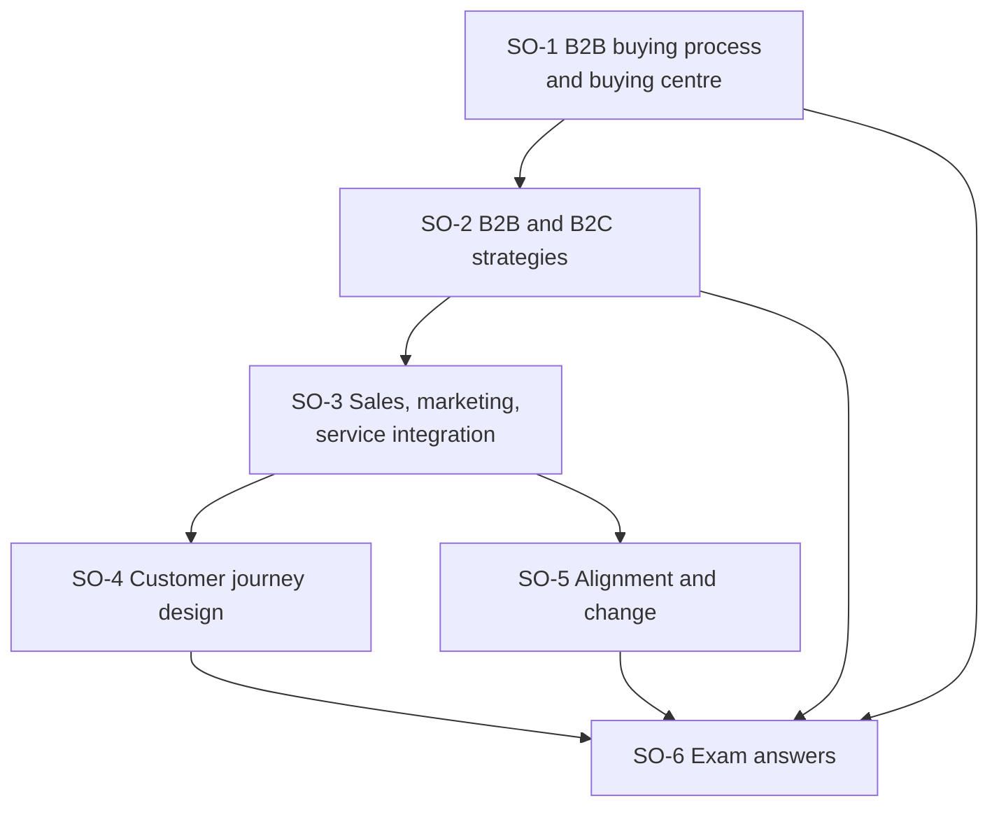

# CRM Unit 4: Strategic and Operational CRM, node map

ESE (assumed, no course plan PDF): 50 marks, Section A 3 × 5, Section B 2 × 10, Section C one compulsory 15-mark case. Unit 4 is theory with scenarios the faculty already set. Examples are **illustrative**; fictional firms are marked.

## Nodes

| Node | Topic | Deps | Minutes | Exam focus |
|---|---|---|---|---|
| SO-1 | B2B Buying Process and Buying Centre | none | 35 | yes |
| SO-2 | B2B and B2C CRM Strategies | SO-1 | 35 | yes |
| SO-3 | Sales, Marketing and Service Integration | SO-2 | 30 | yes |
| SO-4 | CRM-Driven Customer Journey Design | SO-3 | 35 | yes |
| SO-5 | Organizational Alignment and Change Management | SO-3 | 30 | yes |
| SO-6 | Unit 4 Exam Answers | SO-1 to SO-5 | 25 | yes |

Total reading time: about 190 minutes.

## Dependency graph

## Key frameworks to know

- B2B buying: eight phases (need, quantity, specification, supplier search, proposals, evaluation, order routine, feedback); seven buying centre roles; four business customer types.
- B2B vs B2C: twelve-row table; main focus trust + relationship + business value versus experience + emotion + convenience; five-section same-product template.
- Integration: marketing attracts, sales converts, service supports; ten benefits; telecom plan case.
- Journey: six phases; seven mapping steps; biggest pain point exercise.
- Change: ADKAR (awareness, desire, knowledge, ability, reinforcement); Kotter's eight steps as an extra.

## Links
- [[CRM MOC]]
