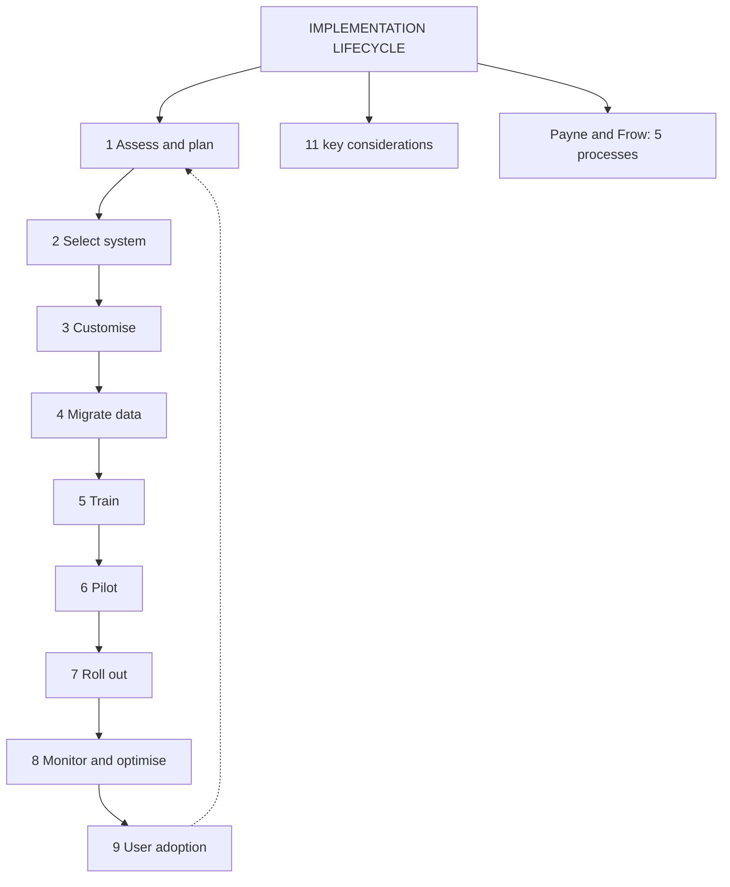

# CI-1: CRM Implementation Lifecycle

Covers: the definition of the implementation lifecycle, the eleven key considerations, the nine-stage life cycle with objective and activities, and Payne and Frow's five-process framework as an extra. **(syllabus)**

## Where this fits in the ESE

"Explain the stages of CRM implementation" is a near-certain 10-marker because the faculty gives nine stages with objective and activities. It also supplies the order of actions for any case recommendation. Stage 9 (user adoption) links to SO-5; stage 8 links to CI-3 (KPIs).

## Definition (class)

The CRM implementation lifecycle is the **end-to-end, structured process of planning, configuring, deploying and adopting** a CRM system in a business. **(syllabus)**

## Eleven key considerations (class)

1. **Define clear goals and objectives**, aligned with business goals.
2. **Understand user needs** of different user groups.
3. **Data migration and integration** with other systems.
4. **User training** at all levels to maximise use and reduce resistance.
5. **Customisation and configuration** to the firm's workflows.
6. **Ensure data quality:** cleansing and validation.
7. **Establish KPIs:** acquisition rates, conversion rates, satisfaction scores.
8. **Change management:** address resistance, communicate, ease the transition.
9. **Continuous improvement:** ongoing evaluation and user feedback.
10. **User adoption:** monitor and encourage; ongoing support.
11. **Cost control:** make sure the system delivers value for the money.

Treat these as the "threads" that run through every stage below.

## Nine-stage CRM implementation life cycle (class)

| # | Stage | Objective | Main activities |
|---|---|---|---|
| 1 | **Assessment and planning** | Understand business needs and goals | Analyse current customer management processes; define objectives; identify stakeholders and requirements; build the implementation plan |
| 2 | **Selection of CRM system** | Choose a system that fits requirements | Evaluate solutions in the market (for example Salesforce, HubSpot, Dynamics 365; CD-1); weigh features, scalability, integration; pick the best fit for needs and budget |
| 3 | **Customisation and configuration** | Tailor to business processes | Customise workflows; set user roles, permissions, access levels; integrate with other business systems |
| 4 | **Data migration** | Move existing data accurately | Cleanse and validate data; develop a migration strategy (what moves first, field mapping from old to new format, who is responsible, timeline); execute while minimising downtime |
| 5 | **Training** | Make users proficient | Role-based training programme; sessions at all levels; ongoing support and resources |
| 6 | **Pilot testing** | Test in a controlled setting | Limited rollout; gather feedback and adjust; confirm requirements are met |
| 7 | **Rollout and deployment** | Organisation-wide implementation | Deploy to all departments; monitor performance and fix issues; communicate and support the transition |
| 8 | **Monitoring and optimisation** | Continuously improve | Track KPIs; gather feedback; implement optimisations and updates |
| 9 | **User adoption** | Widespread acceptance and use | Evaluate CRM performance comprehensively; encourage and incentivise use; address resistance; foster continuous improvement and learning |

Memory hook (nine letters): **A-S-C-D-T-P-R-M-U**: Assess, Select, Customise, Data, Train, Pilot, Rollout, Monitor, Use.

Observations that earn marks:
- Data migration (4) comes before training (5): staff should train on real data.
- Pilot (6) comes before rollout (7): errors are cheaper to fix in a small group.
- Stages 8 and 9 do not end the project; they feed back to stage 1 (iterative, as in the process cycle in CF-3).

## Payne and Frow's five-process framework (student notes, textbook)

A strategic frame that treats implementation as five interlocking processes, not one linear IT rollout:

| Process | What it covers |
|---|---|
| Strategy development | Business strategy and customer strategy |
| Value creation | Value the customer receives and the value the firm receives in return |
| Multichannel integration | Channel mix and consistent experience (SO-4) |
| Information management | Data, IT systems, analytics capability (CD-1) |
| Performance assessment | Shareholder results and performance monitoring (CI-3) |

Use it as the "strategic view" in a 10-mark answer after the nine stages. **(textbook)**

## Worked answer: "Explain the CRM implementation life cycle" (10 marks)

1. Define it (end-to-end, structured process of planning, configuring, deploying, adopting).
2. Name the nine stages in order.
3. Table: objective and two key activities for each stage.
4. Highlight migration before training, pilot before rollout.
5. Add the eleven threads in one line (goals, user needs, data, training, KPIs, change management, cost control).
6. Add Payne and Frow as the strategic frame.
7. Interpretation: implementation is iterative, and stages 8 and 9 restart the loop.

## What to remember

- Definition: end-to-end process of planning, configuring, deploying and adopting CRM.
- Nine stages: assessment and planning, selection, customisation, data migration, training, pilot, rollout, monitoring and optimisation, user adoption.
- Eleven considerations run across all stages (goals, users, data, training, KPIs, change, cost).
- Pilot before rollout; clean data before training.
- Payne and Frow: strategy, value creation, multichannel integration, information management, performance assessment.

## Concept map

## Flashcards
Q: Define the CRM implementation lifecycle.
A: The end-to-end, structured process of planning, configuring, deploying and adopting a CRM system in a business.

Q: List the nine stages of the CRM implementation life cycle.
A: Assessment and planning, selection of CRM system, customisation and configuration, data migration, training, pilot testing, rollout and deployment, monitoring and optimisation, user adoption.

Q: What is the objective of the assessment and planning stage?
A: Understand business needs and goals.

Q: What does a data migration strategy contain?
A: What data moves first, how it is mapped from the old format to the new, who is responsible, and the timeline.

Q: Why run a pilot before rollout?
A: To test in a controlled setting, collect feedback, adjust, and confirm business requirements are met before going organisation-wide.

Q: What activities belong to the user adoption stage?
A: Comprehensive performance evaluation, encouraging and incentivising use, addressing resistance, and fostering continuous improvement and learning.

Q: Name Payne and Frow's five CRM processes.
A: Strategy development, value creation, multichannel integration, information management, performance assessment.

Q: Name four of the eleven key considerations.
A: Clear goals, user needs, data migration and integration, user training, data quality, KPIs, change management, continuous improvement, user adoption, cost control (any four).

## Sources
- Faculty deck CRM Unit 5; student notes; Payne and Frow (2005) (textbook)
- Next node: [[CRM Unit 5 - CI-2 Success Factors and Failure Risks]]
- [[CRM Unit 5 - Implementation and Performance MOC (Node Map)]]
