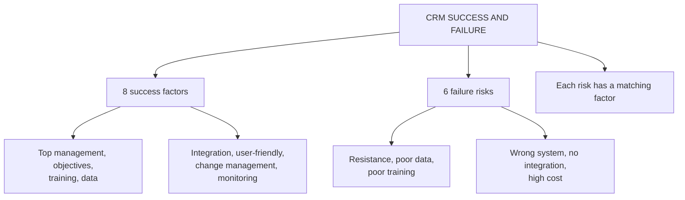

# CI-2: Success Factors and Failure Risks

Covers: why CRM implementation is not just software, the eight success factors, the six failure risks with the faculty's examples, how the two lists mirror each other, and how to use them in a case. **(syllabus)**

## Where this fits in the ESE

"Discuss the critical success factors and failure risks in CRM implementation" is a standard 10-marker, and a 5-marker if split. In the case, this list is the diagnostic lens for any failing implementation. It overlaps with the five challenges in CF-5; keep both lists but do not confuse them.

## Not just software (class)

CRM implementation is **not simply installing CRM software**; it involves **technology, people, processes, data and organisational culture**.

Failure is common. Industry estimates often quoted range from about 30% to 70% of CRM projects failing to meet objectives. **[VERIFY]** the range; it varies widely by source and definition of "failure". **(student notes)** Use it as "a substantial share", not as a statistic.

## Eight success factors (class)

| # | Factor | Meaning | Class example |
|---|---|---|---|
| 1 | **Top management support** | Budget, resources, training, clear direction, organisational backing | Managers who keep using spreadsheets signal that the CRM is optional |
| 2 | **Clear CRM objectives** | Know why: satisfaction, retention, sales, faster service, understanding preferences | Objective stated before software is chosen |
| 3 | **Employee training** | How to use the system, enter and retrieve data, use analytics, and how CRM helps them | Sales staff trained to record leads, follow-ups, interactions |
| 4 | **High-quality customer data** | Accurate, complete, updated, consistent, relevant | A wrong or missing purchase history leads to wrong decisions |
| 5 | **Integration with other systems** | Link to sales, marketing, service, finance, e-commerce, inventory | Service sees purchase and service data without searching multiple systems |
| 6 | **User-friendly technology** | Easy to use; not too complicated, slow, hard to navigate, or cluttered | Technology should support employees, not add difficulty |
| 7 | **Effective change management** | Explain benefits, involve employees, support the transition | Move from personal Excel files to logging in the CRM |
| 8 | **Continuous monitoring and improvement** | Evaluate satisfaction, adoption, data quality, system performance, sales and service outcomes | Improve the system from feedback after launch |

## Six failure risks (class)

| # | Risk | What happens | Class example |
|---|---|---|---|
| 1 | **Employee resistance** | Comfortable with old methods; CRM used only partly | "Why enter this when I can use my own Excel sheet?" |
| 2 | **Poor data quality** | Incorrect, duplicate or outdated data makes CRM ineffective | A customer bought several products but the CRM shows one |
| 3 | **Poor training** | Wrong data entered, system avoided, dependence on colleagues, return to old methods | Staff do not understand the system |
| 4 | **Choosing the wrong CRM system** | Mismatch with requirements, budget, skills, customer needs, existing systems; wasted investment | Software bought for features the firm never uses |
| 5 | **Lack of integration** | Same information entered several times; duplicate work, errors, delays, frustration | CRM does not talk to inventory or billing |
| 6 | **High implementation cost** | Software, hardware or cloud, customisation, training, migration, maintenance, support; budget overrun if not planned | Costs not planned across years |

## Broader risks (student notes)

- Treating CRM as a pure IT project.
- Unrealistic expectations and scope creep (expecting instant ROI, automating ill-defined processes).
- Migration of uncleaned legacy data, carrying old errors across (CD-2).
- No clear metrics up front, so ROI cannot be shown later and executive support fades (CI-3).

## Success factors mirror the risks

| Failure risk | Matching success factor |
|---|---|
| Employee resistance | Effective change management; top management support |
| Poor data quality | High-quality customer data |
| Poor training | Employee training |
| Wrong system | Clear objectives (and a selection process that follows them) |
| Lack of integration | Integration with other systems |
| High cost | Clear objectives and continuous monitoring (cost control, CI-1) |

Use this table to turn a diagnosis into a fix in a case: name the risk, then prescribe its matching factor.

## Diagnostic use in a case

1. Underline the symptoms in the case.
2. Name the failure risk for each (table above).
3. Give the matching success factor as the fix.
4. Add a KPI (adoption rate, duplicate-record rate, cost against budget).
5. Close with the point that the problem is organisational, not just technical.

## Worked answer: "Discuss the success factors and failure risks in CRM implementation" (10 marks)

1. State that CRM is technology, people, processes, data and culture, not software alone.
2. Table of eight success factors with one example each.
3. Table of six failure risks with one example each.
4. Show the mirror table (risk to factor).
5. Add the broader risks (pure IT project, unrealistic expectations, no metrics).
6. Interpretation: most failures trace to people and data, so spend time on training, data and change management before features.

## What to remember

- Success needs technology, people, process, data and culture.
- Eight success factors: top management support, clear objectives, training, data quality, integration, user-friendly technology, change management, continuous monitoring.
- Six failure risks: resistance, poor data, poor training, wrong system, lack of integration, high cost.
- Each risk has a matching success factor.
- The 30% to 70% failure range is an unverified estimate.

## Concept map

## Flashcards
Q: What does CRM implementation involve beyond software?
A: Technology, people, processes, data and organisational culture.

Q: List the eight success factors of CRM implementation.
A: Top management support, clear CRM objectives, employee training, high-quality customer data, integration with other systems, user-friendly technology, effective change management, continuous monitoring and improvement.

Q: List the six failure risks.
A: Employee resistance, poor data quality, poor training, choosing the wrong CRM system, lack of integration, high implementation cost.

Q: What is the class example for top management support?
A: If managers keep using spreadsheets after a CRM is introduced, employees will not take the CRM seriously.

Q: What does lack of integration cause?
A: Duplicate data entry, errors, delays and employee frustration.

Q: Which success factor answers poor training?
A: Employee training: how to use the system, enter and retrieve data, use analytics and understand how CRM helps their work.

Q: Name two broader failure risks.
A: Treating CRM as a pure IT project; unrealistic expectations or scope creep; no clear metrics up front (any two).

Q: How should the 30% to 70% failure rate be quoted?
A: As "a substantial share of projects", since it is a widely repeated estimate that needs verification.

## Sources
- Faculty deck CRM Unit 5; student notes
- Next node: [[CRM Unit 5 - CI-3 CRM ROI and the Four-Stage KPI Framework]]
- [[CRM Unit 5 - Implementation and Performance MOC (Node Map)]]
