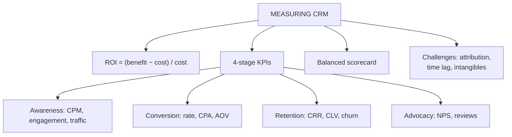

# CI-3: CRM ROI and the Four-Stage KPI Framework

Covers: CRM effectiveness and ROI with worked examples, the four-stage customer journey KPI framework (awareness, conversion, retention, advocacy), every KPI formula with a check sum, NPS step by step, and the balanced scorecard and measurement challenges. **(syllabus)**

## Where this fits in the ESE

This is the main numerical topic of Unit 5. The ROI formula and the seven KPI formulas are short and mechanical, so a calculation question (Section A or inside the case) is very likely. The GlowCart case that applies all of them is in CI-4.

## Effectiveness and ROI (class)

- **CRM effectiveness:** how successfully the CRM helps the company achieve its objectives.
- **ROI:** how much benefit the company received for the money invested; did the CRM generate enough benefit to justify the investment?

**CRM ROI (%) = [(Financial benefit − Cost) ÷ Cost] × 100**

### Worked example 1 (class)

Cost ₹1,00,000; additional benefit ₹1,50,000.

| Step | Working | Result |
|---|---|---|
| 1. Net gain | 1,50,000 − 1,00,000 | ₹50,000 |
| 2. Divide by cost | 50,000 ÷ 1,00,000 | 0.50 |
| 3. ROI | 0.50 × 100 | **50%** |

Interpretation: every ₹1 spent returned ₹1.50 in benefit, a 50% return on the investment cost.

### Worked example 2 (illustrative): itemised ROI

Costs: licence ₹3,00,000 + implementation ₹2,50,000 + training ₹1,00,000 + maintenance ₹1,50,000 = **₹8,00,000**. Benefits (incremental, one year): extra repeat-sales margin ₹6,00,000 + cross-sell margin ₹3,50,000 + service cost saving ₹1,50,000 = **₹11,00,000**.

ROI = (11,00,000 − 8,00,000) ÷ 8,00,000 × 100 = 3,00,000 ÷ 8,00,000 × 100 = **37.5%**. If the benefit accrues evenly, simple payback is 8,00,000 ÷ 11,00,000 × 12 = about **8.7 months**. **(textbook)** for payback.

Traps:
- **Benefit must be incremental profit or saving, not total revenue.** Counting revenue overstates ROI.
- **Cost must include everything** (licence, implementation, integration, training, maintenance).
- ROI looks at one period; relationship benefits arrive over longer periods, so short-term ROI understates value.

## Four-stage KPI framework (class)

A customer typically goes through four stages with any brand: **awareness, conversion, retention, advocacy**. Define KPIs for all four to get a 360-degree view of omnichannel performance, rather than watching one stage.

| Stage | KPIs |
|---|---|
| 1. Brand awareness | Cost per impression (CPM), social media engagement, website traffic |
| 2. Conversion | Conversion rate, cost per acquisition (CPA), average order value (AOV) |
| 3. Retention | Customer retention rate (CRR), customer lifetime value (CLV), churn rate |
| 4. Brand advocacy | Net promoter score (NPS), online reviews and mentions |

## Stage 1: awareness KPIs

**Cost per impression = advertising cost ÷ impressions. CPM = cost per impression × 1,000** (cost per 1,000 impressions).

Check sum (class): ₹10,000 ÷ 5,00,000 = ₹0.02 per impression, so CPM = **₹20**. Slide question (1,25,000 impressions): ₹10,000 ÷ 1,25,000 = **₹0.08**, CPM **₹80**. Slide comparison: an Instagram campaign at ₹0.02 versus a YouTube one at ₹0.08: Instagram is the more cost-efficient for exposure, **4 times cheaper** per impression. A lower cost per impression generally means more cost-efficient exposure.

Slide wording trap: the deck writes "Cost per impression is advertising cost ÷ impressions × 1,000". With the × 1,000 this is **CPM**. Write both clearly: cost per impression (no × 1,000) and CPM (× 1,000).

**Social media engagement:** likes, shares, mentions, comments; sometimes called vanity metrics, but they show engagement with the brand.

**Website traffic growth rate = (current visits − previous visits) ÷ previous visits × 100.** Check: 40,000 to 46,000 visits is 6,000 ÷ 40,000 = **15%**. Read it with bounce rate and time on site.

## Stage 2: conversion KPIs

- **Conversion rate** = conversions ÷ prospects (visitors or leads) × 100. **(textbook)** The slide formula is an image that did not extract.
- **CPA = total campaign cost ÷ number of conversions (acquisitions).**
- **AOV = total revenue ÷ total number of orders.** Check (class): ₹2,00,000 ÷ 500 = **₹400**.

## Stage 3: retention KPIs

Retention matters because selling to an existing customer is about 40% more likely to succeed than selling to a new one and about five times less expensive than acquiring a new customer (class). **[VERIFY]** both figures; they are industry claims.

- **Customer retention rate (CRR)** = [(E − N) ÷ S] × 100, where S = customers at start, E = customers at end, N = new customers acquired in the period. **(textbook)** The slide formula is an image; the question wording (beginning, new and ending customers) matches this version.
- **Churn rate** = customers lost ÷ customers at start × 100. When data are consistent, CRR + churn = 100%.
- **CLV** = AOV × purchase frequency × lifespan (CV-2).

Check sum (illustrative, consistent data): start 1,000, new 100, lost 80, so end = 1,000 + 100 − 80 = 1,020. CRR = (1,020 − 100) ÷ 1,000 × 100 = **92%**. Churn = 80 ÷ 1,000 × 100 = **8%**. Total 100%.

## Stage 4: advocacy KPIs

**NPS = % promoters − % detractors**, a score from −100 to +100.

1. Ask: "How likely are you to recommend us to a friend or colleague?" on a 0 to 10 scale.
2. Group: **detractors 0 to 6**, **passives 7 to 8** (ignored in the calculation), **promoters 9 to 10**.
3. Convert each group to a percentage of **total respondents**.
4. Subtract: NPS = % promoters − % detractors.

Class check: 70% promoters, 20% passives, 10% detractors gives NPS = 70 − 10 = **60**. Reading: negative means more detractors than promoters; zero means equal; positive means more promoters; higher means stronger advocacy and loyalty.

Slide typo: passives are described as "satisfied but enthusiastic"; it should be satisfied but **not** enthusiastic.

Online reviews and mentions: monitor and fix problems quickly.

## Other CRM performance metrics (student notes)

- **Customer acquisition cost (CAC)** = total sales and marketing spend ÷ new customers acquired.
- **CLV : CAC** about 3 : 1 is a commonly cited healthy benchmark; near or below 1 : 1 signals unsustainable acquisition. **[VERIFY]** the benchmark.
- **CSAT** (satisfaction with a transaction), **share of wallet and cross-sell ratio**.

## Balanced scorecard view (student notes, textbook)

Four perspectives (adapting Kaplan and Norton): **financial** (revenue growth, ROI, cost to serve); **customer** (satisfaction, retention, NPS); **internal process** (response time, first-contact resolution, hand-off efficiency); **learning and growth** (CRM adoption rate, training completion, system usage).

## Challenges in measuring CRM ROI (student notes)

- **Attribution:** isolating CRM's contribution from market conditions or other marketing.
- **Time lag:** loyalty and referral benefits accrue slowly, so short-term ROI understates value.
- **Intangibles:** productivity and brand equity are hard to quantify.

## Worked answer: "Explain the KPIs used to measure CRM effectiveness across the customer journey" (10 marks)

1. State effectiveness and ROI, with the ROI formula and the 50% example.
2. Four stages and the KPIs in each (table).
3. Formulas: CPM, CPA, AOV, CRR, churn, CLV, NPS, with one check sum each.
4. Balanced scorecard as the wider frame.
5. Challenges: attribution, time lag, intangibles.
6. Interpretation: measure all four stages, because strength at one stage can hide weakness at another.

## What to remember

- ROI % = (benefit − cost) ÷ cost × 100; example 50%; benefit means incremental profit.
- Four stages: awareness, conversion, retention, advocacy, each with its KPIs.
- CPM = cost ÷ impressions × 1,000; CPA = cost ÷ conversions; AOV = revenue ÷ orders.
- CRR = (E − N) ÷ S × 100; churn = lost ÷ S × 100.
- NPS = % promoters − % detractors; passives (7 to 8) are ignored.

## Concept map

## Flashcards
Q: State the CRM ROI formula and the class example.
A: ROI % = (financial benefit − cost) ÷ cost × 100; cost ₹1,00,000 and benefit ₹1,50,000 give 50%.

Q: Name the four stages of the customer journey KPI framework with their KPIs.
A: Awareness (CPM, engagement, website traffic); conversion (conversion rate, CPA, AOV); retention (CRR, CLV, churn); advocacy (NPS, reviews).

Q: Compute CPM: ₹10,000 spent, 5,00,000 impressions.
A: Cost per impression ₹0.02, so CPM = ₹20 per 1,000 impressions.

Q: Compute AOV: ₹2,00,000 revenue from 500 orders.
A: ₹400.

Q: Compute CRR: start 1,000, new 100, end 1,020.
A: (1,020 − 100) ÷ 1,000 × 100 = 92%.

Q: How is NPS calculated and which group is ignored?
A: % promoters (9 to 10) minus % detractors (0 to 6); passives (7 to 8) are ignored.

Q: Compute NPS: 70% promoters, 20% passives, 10% detractors.
A: 70 − 10 = 60.

Q: Which campaign is more cost-efficient: ₹0.02 or ₹0.08 per impression?
A: ₹0.02 per impression, four times cheaper.

Q: Why must ROI "benefit" be incremental profit, not revenue?
A: Revenue overstates the return because it ignores the cost of earning it.

Q: Name three challenges in measuring CRM ROI.
A: Attribution difficulty, time lag of relationship benefits, intangible benefits.

## Sources
- Faculty deck CRM Unit 5; student notes; Kaplan and Norton, NetSuite CAC guide (textbook)
- Next node: [[CRM Unit 5 - CI-4 GlowCart KPI Worked Case]]
- [[CRM Unit 5 - Implementation and Performance MOC (Node Map)]]
